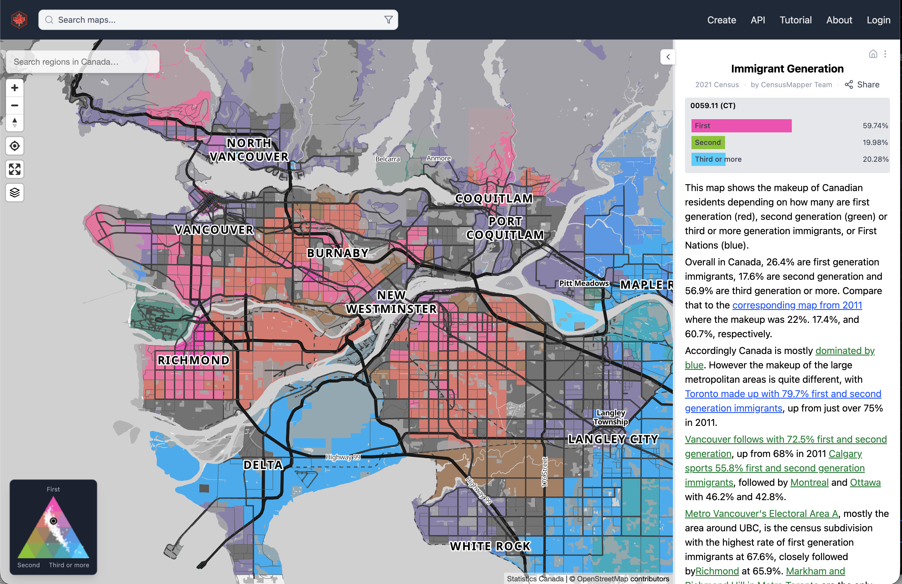
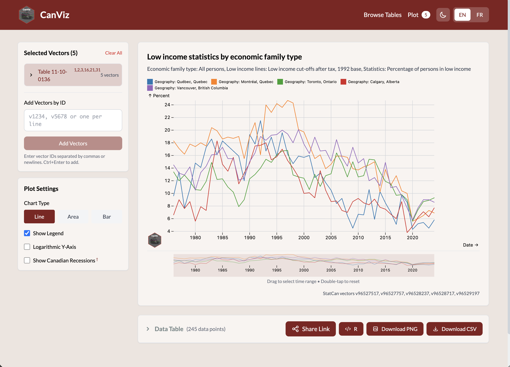

## CensusMapper

Canada-wide interactive mapping platform for Census data

## CanViz

Find and graph StatCan time series data

## Open Analysis

::::: columns
::: {.column width="50%"}
For students looking for more advanced analysis I have a collection of R packages to facilitate working with Canadian data. These are designed to be:

- Beginner friendly
- Can copy-paste code to import data from CensusMapper and CanViz
- Enable transparent, reproducible and adaptable analysis
- [Book project](https://mountainmath.github.io/canadian_data/) taking a problem-based approach to teaching how to use Canadian data for analysis.
:::

::: {.column width="50%"}

:::
:::::

## Thank you!

The slides are online at [mountainmath.ca/DevelopingMinds2026/](https://mountainmath.ca/DevelopingMinds2026/).

### References and further reading

::: {#refs}
:::

::: {style="padding-top:100px;"}
:::

### Contact information

- Jens via [Bluesky (\@jensvb)](https://bsky.app/profile/jensvb.bsky.social), [Linkedin (\@vb-jens)](https://www.linkedin.com/in/vb-jens/), or [email (jens\@mountainmath.ca)](mailto::jens@mountainmath.ca)
