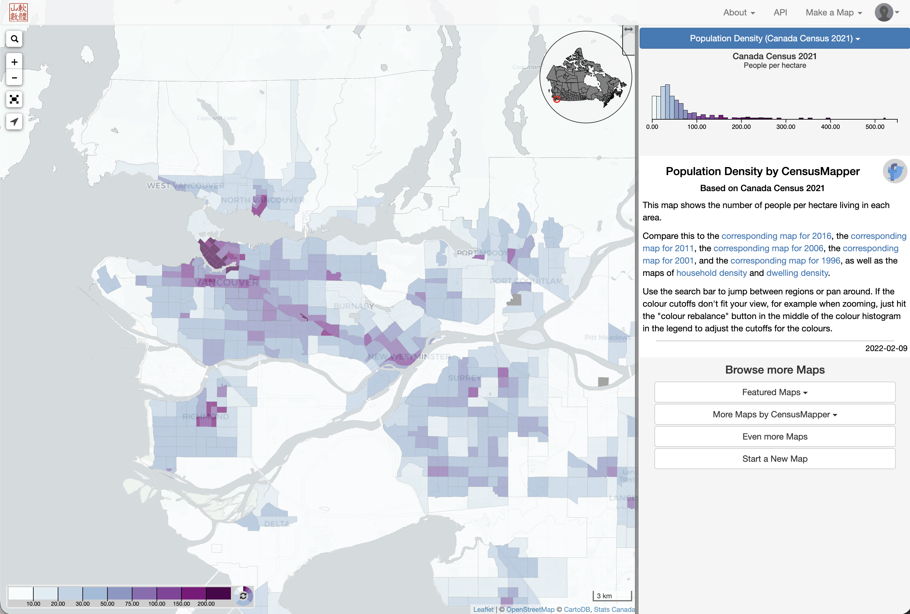
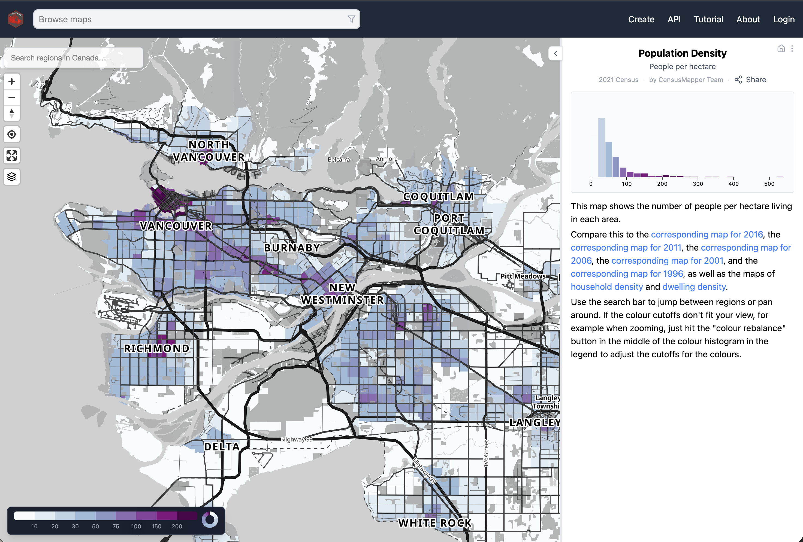

## CensusMapper 1.0

CensusMapper 1.0 went live in 2015. [@census-mapper.2015]

## CensusMapper 2.0

Started thinking about CensusMapper 2021, did not start working on it until 2025. [@censusmapper-p-review.2021]

## Thank you!

### References and further reading

::: {#refs}
:::

::: {style="padding-top:100px;"}
:::

### Contact information

* Jens via [Bluesky (\@jensvb)](https://bsky.app/profile/jensvb.bsky.social), [Linkedin (\@vb-jens)](https://www.linkedin.com/in/vb-jens/), or [email (jens\@mountainmath.ca)](mailto::jens@mountainmath.ca)
* Leia at [Linked \@leiahjchen](https://www.linkedin.com/in/leiahjchen/).

