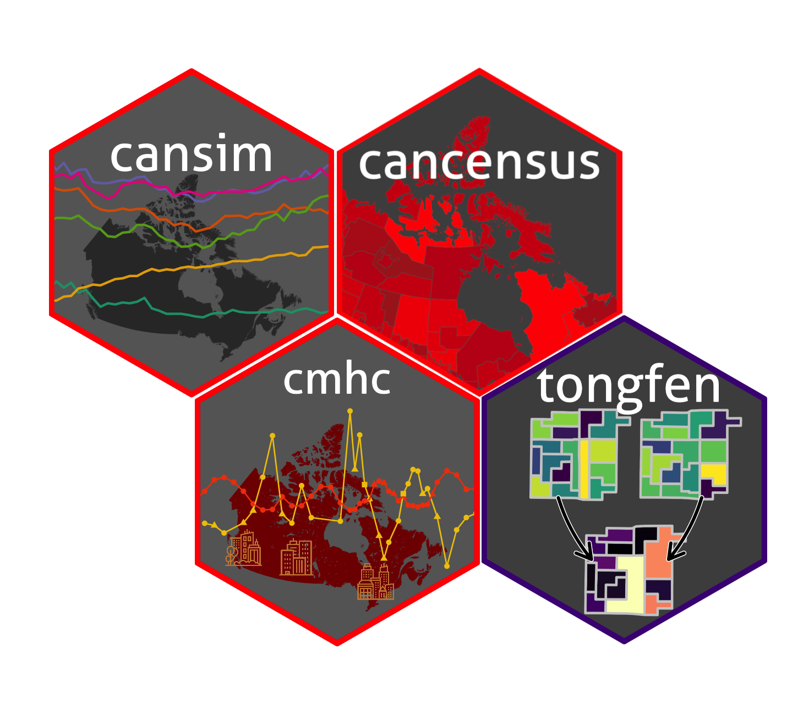

```{r setup, include=FALSE}
knitr::opts_chunk$set(
	echo = FALSE,
	fig.retina = 2,
	message = FALSE,
	warning = FALSE,
	cache = TRUE,
	dpi = 300,
	fig.height=3, 
	fig.width=6
)
library(tidyverse)
library(cansim)
library(cancensus)
library(cmhc)
library(tongfen)
library(mountainmathHelpers)
library(gganimate)
```
 
```{r metathis, include=FALSE}
library(metathis)
meta() %>%
  meta_name("github-repo" = "mountainmath") %>%
  meta_social(
    title = "Aging and access to Health Care in Canada",
    description = paste(
      "A data perspective"
    ),
    url = "https://mountainmath.ca/aging_in_canada/",
    image = "https://mountainmath.ca/aging_in_canada/images/aging_in_canada-social-card.png",
    image_alt = paste(
      "Title slide of Aging and access to Helath Care in Canada",
      "presented by Jens von Bergmann"
    ),
    og_type = "website",
    og_author = "Jens von Bergmann",
    twitter_card_type = "summary_large_image",
    twitter_creator = "@vb_jens",
    twitter_site = "@vb_jens"
  )
```

```{r xaringanExtra, echo=FALSE}
xaringanExtra::use_xaringan_extra(c("broadcast"))
```
```{r broadcast, echo=FALSE}
xaringanExtra::use_broadcast()
```

# Overview


The population is aging in many parts of the world. This creates new challenges for society and for our health care system.

At the same time, our expectations of health care access is increasing.

Data science can help inform how to address these challenges and aid decision making.

---
# Age structure

```{r}
pop_age_data <-get_cansim_sqlite("17-10-0005") |>
  filter(GEO=="Canada",Sex!="Both sexes") |>
  collect_and_normalize(disconnect = TRUE) |>
  select(REF_DATE,Date,Sex,Age=`Age group`,Count=val_norm) |>
  filter(!grepl(" to |Median age|Average age|18 years and over|65 years and over",Age)) |>
  filter(!(Age=="90 years and over" & REF_DATE>="2001")) |>
  mutate(Age=fct_recode(Age,"90 years"="90 years and over",
                        "100 years"="100 years and over")) |>
  mutate(Age=droplevels(Age)) #|>
  #filter(!is.na(Count)) 

plot_data <- pop_age_data %>%
  left_join(filter(.,Age=="All ages") |> 
              group_by(REF_DATE) |>
              summarize(Total=sum(Count),.groups="drop"),
            by=c("REF_DATE")) |>
  filter(Age!="All ages") |>
  mutate(Age=droplevels(Age)) |>
  mutate(Value=ifelse(Sex=="Males",-Count,Count))

```

.row.split-three[
.column.center[
```{r canada_age_start, fig.height=5, fig.width=4}
year <- min(plot_data$REF_DATE)
plot_data |> 
  filter(REF_DATE==year) |>
  mutate(Count=coalesce(Count,0)) |>
  ggplot(aes(x=Value,y=(Age),fill=Sex)) +
  geom_bar(stat="identity") +
  scale_y_discrete(breaks=levels(pop_age_data$Age)[seq(2,102,5)]) +
  scale_x_continuous(labels=\(x)scales::comma(abs(x),scale=10^-3,suffix="k")) +
  scale_fill_manual(values=c("Females"="red","Males"="steelblue")) +
  theme(legend.position = "bottom") +
  labs(title=paste0("Canada poplation in ",year),
       y=NULL,x=NULL,fill=NULL,
       caption="MountainMath, Data: StatCan Table 17-10-0005") 
```
]
.column.center[
```{r canada_age_animated, fig.height=2, fig.width=2}
g<-plot_data |>
  ggplot(aes(x=Value,y=(Age),fill=Sex)) +
  geom_bar(stat="identity") +
  scale_y_discrete(breaks=levels(pop_age_data$Age)[seq(2,102,5)]) +
  scale_x_continuous(labels=\(x)scales::comma(abs(x),scale=10^-3,suffix="k")) +
  scale_fill_manual(values=c("Females"="red","Males"="steelblue")) +
  theme(legend.position = "bottom") +
  transition_states(REF_DATE) +
  labs(title="Canada poplation in {closest_state}",
       y=NULL,x=NULL,fill=NULL,
       caption="MountainMath, Data: StatCan Table 17-10-0005") 
animate(g, 
        width=4,height=5,units = "in",
        res=300,
        end_pause = 5,
        duration = 10, 
        fps  =  20)
```
]

.column.center[
```{r canada_age_end, fig.height=5, fig.width=4}
year <- max(plot_data$REF_DATE)
plot_data |>
  filter(REF_DATE==year) |>
  ggplot(aes(x=Value,y=(Age),fill=Sex)) +
  geom_bar(stat="identity") +
  scale_y_discrete(breaks=levels(pop_age_data$Age)[seq(2,102,5)]) +
  scale_x_continuous(labels=\(x)scales::comma(abs(x),scale=10^-3,suffix="k")) +
  scale_fill_manual(values=c("Females"="red","Males"="steelblue")) +
  theme(legend.position = "bottom") +
  labs(title=paste0("Canada poplation in ",year),
       y=NULL,x=NULL,fill=NULL,
       caption="MountainMath, Data: StatCan Table 17-10-0005") 
```
]
]

---
# Data generation process
What causes the shape of the age structure?

* **Aging**: Very predictable process (whether we like it or not).
* **Births and deaths**: A function of age-specific fertility and mortality rates and the number people in each age group. 
* **Migration**: At the country level, this looks at immigration, emigration, and temporary external migration. At lower level geography we also need to consider local migration.

The latter two processes depend on time, space, and socio-economic factors. These are complex processes and we will need to make simplifications when modelling these.
---
# Births
```{r canada_fertility, fig.height=3, fig.width=6}
fertility_data<-get_cansim("13-10-0418",default_month="01")  %>% 
  filter(Characteristics=="Total fertility rate per female") %>%
  mutate(Name=gsub(", place of residence of mother","",GEO)) %>%
  filter(!grepl("Territo|Nuna|Yukon|Northw",Name))

fertility_geo_colours <- setNames(c(RColorBrewer::brewer.pal(length(unique(fertility_data$Name))-1,"Set3"),"black"),
                              c(setdiff(unique(fertility_data$Name),"Canada"),"Canada"))

used_fertility_geo_colours<-fertility_geo_colours[fertility_data %>% filter(Date==max(Date)) %>% arrange(-val_norm) %>% pull(Name)]

ggplot(fertility_data,aes(x=Date,y=val_norm,colour=Name)) +
  geom_line() +
  geom_point(shape=21) +
  theme_dark() +
  scale_x_date(breaks=as.Date(paste0(seq(1990,2020,5),"-01-01")),date_labels = "%Y") +
  scale_colour_manual(values=used_fertility_geo_colours) +
  labs(title="Fertility rates in Canada",
       colour="Province",
       x=NULL,y="Total fertility rate per female",
       caption="StatCan Table 13-10-0418") 
```

---
# Deaths
```{r fig.height=3.5}
mortality_data <- get_cansim_sqlite("13-10-0710") |>
  filter(!(`Age at time of death` %in% c("Age at time of death, all ages",
                                         "Age at time of death, not stated")),
         Characteristics == "Mortality rate per 1,000 population") |>
  collect_and_normalize(disconnect = TRUE)

age_map <- setNames(levels(mortality_data$`Age at time of death`),
                    levels(mortality_data$`Age at time of death`) |> 
                      gsub("Age at time of death, | year[s]?","",x=_) |>
                      gsub("^u","U",x=_))

mortality_data |>
  filter(GEO=="Canada, place of residence") |>
  filter(Sex=="Both sexes") |>
  filter((as.integer(REF_DATE)) %% 5==0) |>
  mutate(Age=fct_recode(`Age at time of death`,!!!age_map)) |>
ggplot(aes(x=Age,y=val_norm,colour=REF_DATE,group=REF_DATE)) +
  geom_line() +
  theme(axis.text.x = element_text(angle=45,hjust=1)) +
  scale_y_continuous(trans="log",breaks=c(0.1,1,10,100,1000)) +
  scale_color_brewer(palette = "Dark2") +
  labs(title="Age specific mortality rates in Canada",
       colour="Year",
       x="Age at time of death",
       y="Rate per 1,000 population (log scale)",
       caption="StatCan Table 13-10-0710")
```

---
# Migration

```{r}
migration_data <- get_cansim_sqlite("17-10-0008") |>
  filter(GEO=="Canada") |>
  collect_and_normalize(disconnect = TRUE) |>
  mutate(Value=ifelse(`Components of population growth` %in% c("Emigrants","Deaths"),
                      -val_norm,val_norm)) |>
  filter(`Components of population growth`!="Net interprovincial migration")

migration_data |>
  mutate(Date=as.Date(paste0(substr(REF_DATE,1,4),"-07-01"))) |>
ggplot(aes(x=Date,y=Value,fill=`Components of population growth`)) +
  geom_bar(stat='identity') +
  scale_y_continuous(labels=scales::comma) +
  scale_fill_brewer(palette="Dark2") +
  labs(title="Components of population growth",
       fill=NULL,y="Number of people",x=NULL,
       caption="StatCan Tanble 17-10-0008")
```

---
## Geography matters
Healthcare services are provided on a local scale. We need to understand how these processes play out locally, and how they relate to health care locations.

```{r fig.width=8,fig.height=4.3}
get_ODHF_data <- function(){
    tmp<- tempfile() 
    download.file("https://www150.statcan.gc.ca/n1/fr/pub/13-26-0001/2020001/ODHF_v1.1.zip?st=OXjX6M0b",tmp)
    files <- unzip(tmp,exdir = tempdir())
    
    data <- read_csv(files[grepl("csv$",files)]) |>
      sf::st_as_sf(coords=c("longitude","latitude"),crs=4326, na.fail = FALSE) |>
      mutate(odhf_facility_type=recode(odhf_facility_type,
                                       "nursing and residential care facilities"="Nursing and residential care facilities"))
}

odhf_data <- simpleCache(get_ODHF_data(),"canada_odhf_data.Rds",refresh = TRUE)
cities <- list_census_regions("2016") |>
  filter(CMA_UID=="59933") |>
  pull(region)

odhf_facility_types <- odhf_data$odhf_facility_type |> unique()
odhf_facility_colours <- setNames(MetBrewer::met.brewer("Egypt",3),odhf_facility_types)

odhf_data |> 
  filter(CSDuid %in% cities) |>
  ggplot() +
  geom_sf(aes(colour=odhf_facility_type),shape=21) +
  geom_water() +
  geom_roads() +
  coord_sf(datum=NA) +
  scale_colour_manual(values=odhf_facility_colours) +
  theme(legend.position = "bottom") +
  labs(title="Health care facilities in Metro Vancouver",
       colour=NULL,
       caption="StatCan ODHF v1.1")
```


---
background-image: url("https://doodles.mountainmath.ca/images/net_van.png")
background-position: 50% 50%
background-size: 100%
class: center, bottom, inverse

# <a href="https://censusmapper.ca/maps/731" target="_blank">CensusMapper Demo</a>

---
# Impact of migraion on age distribution

```{r}
age_pyramid_styling <- list(
  scale_x_discrete(breaks=c(seq(0, 100, 5),"100+")),
  scale_y_continuous(labels = scales::comma),
  coord_flip(),
  scale_fill_brewer(palette = "Set1"),
  theme_bw(),
  labs(caption="cancensus, StatCan 2021 census"))
```

```{r van_cities_age, fig.height=3.5, fig.width=9, message=FALSE, warning=FALSE, dev='svg'}
plot_data <- cancensusHelpers::get_age_data('2021',list(CSD=c("5915022","5915004","5915055"))) %>% 
  rename(City=`Region Name`)
ggplot(plot_data, aes(x = Age, y = Population, fill = Gender)) + geom_bar(stat="identity") +
  facet_wrap("City",nrow=1, scales="free_x") + age_pyramid_styling
```

At the municipal and sub-municipal geography migration effects dominate the shape of the age distribution.

---
# Measuring access to healthcare and spatial mismatch
```{r}
bc_seniors <- get_census("2021",regions=list(PR="59"),vectors = c(seniors="v_CA21_251"),
                         geo_format = 'sf',level="DA")


access_data <- odhf_facility_types |>
  map_df(\(ft) bc_seniors |>
           select(GeoUID) |>
           sf::st_point_on_surface() %>%
           mutate(dist=sf::st_distance(.,odhf_data |> 
                                         filter(odhf_facility_type==ft) |>
                                         sf::st_union()) |> 
                    as.numeric()) |>
           sf::st_drop_geometry() |>
           mutate(odhf_facility_type=ft))

bc_seniors |>
  sf::st_drop_geometry() |>
  left_join(access_data,by="GeoUID") |>
  mutate(dist_d = pretty_cut(dist,c(-Inf,500,1000,2000,4000,8000,16000,32000,Inf),
                             format=scales::label_number_si(unit="m"))) |>
  group_by(dist_d,odhf_facility_type) |>
  summarise(seniors=sum(seniors,na.rm=TRUE)) |>
  ggplot(aes(x=dist_d,y=seniors,fill=odhf_facility_type)) +
  geom_bar(stat="identity",position = "dodge") +
  theme(legend.position="bottom",
        axis.text.x = element_text(angle=45,hjust=1)) +
  scale_y_continuous(labels=scales::comma) +
  scale_fill_manual(values=odhf_facility_colours) +
  labs(title="Proximity of seniors in British Columbia to Health Care Facilities",
       fill=NULL,
       y="Number of seniors",
       x="Distance to nearest health care facility",
       caption="StatCan 2021 Census, StatCan ODHF")
```

---
# British Columbia
```{r}
bc_seniors |>
  left_join(access_data |> 
              filter(odhf_facility_type %in% c("Ambulatory health care services", "Hospitals")) |>
              group_by(GeoUID) |> 
              summarize(dist=min(dist),.groups="drop"),by="GeoUID") |>
  mutate(dist_d = pretty_cut(dist,c(-Inf,500,1000,2000,4000,8000,16000,32000,Inf),
                             format=scales::label_number_si(unit="m"))) %>%
  sf::st_transform(lambert_conformal_conic_at(.)) |>
  ggplot(aes(fill=dist_d)) +
  geom_sf(linewidth=0.1) +
  scale_fill_viridis_d(option="turbo") +
  labs(title="Proximity of seniors in BC to Health Care Services",
       fill="Distance to\nclosest facility",
       caption="StatCan 2021 Census, StatCan ODHF") +
  coord_sf(datum=NA)
```


---
# Metro Vancouver
```{r}
metro_data <- bc_seniors |>
  filter(CMA_UID=="59933") |>
  left_join(access_data |> 
              filter(odhf_facility_type %in% c("Ambulatory health care services", "Hospitals")) |>
              group_by(GeoUID) |> 
              summarize(dist=min(dist),.groups="drop"),by="GeoUID") |>
  mutate(dist_d = pretty_cut(dist,c(-Inf,500,1000,2000,4000,8000,16000,32000,Inf),
                             format=scales::label_number_si(unit="m"))) %>%
  sf::st_transform(lambert_conformal_conic_at(.)) 

metro_bbox <- metro_van_bbox('tight') |> 
  sf::st_as_sfc() |> 
  sf::st_transform(sf::st_crs(metro_data)) |>
  sf::st_bbox()

ggplot(metro_data,aes(fill=dist_d)) +
  geom_sf(linewidth=0.1) +
  scale_fill_viridis_d(option="turbo") +
  labs(title="Proximity of seniors in Metro Vancouver to Health Care Services",
       fill="Distance to\nclosest facility",
       caption="StatCan 2021 Census, StatCan ODHF") +
  geom_water(fill="#DDF8FF") +
  coord_bbox(metro_bbox)
```

---
# Location of seniors
```{r}
bc_seniors |>
  filter(CMA_UID=="59933") |>
  mutate(seniors=coalesce(seniors,0)) |>
  mutate(sd=pretty_cut(seniors/`Shape Area`/100,c(-Inf,1,5,10,20,40,80,Inf))) %>%
  sf::st_transform(lambert_conformal_conic_at(.)) |>
  ggplot(aes(fill=sd)) +
  geom_sf(linewidth=0.1) +
  scale_fill_viridis_d(option="turbo") +
  geom_water(fill="#DDF8FF") +
  labs(title="Population density of seniors in Metro Vancouver",
       fill="Seniors\nper hectare",
       caption="StatCan 2021 Census") +
  coord_bbox(metro_bbox)
```

---
# How to deal with mismatch?
.pull-left[
```{r fig.height=4, fig.width=5}
plot_text <-tibble(label=c("Spatial mismatch\nof Health Care Services\nand seniors",
                     "Change processes\ndetermining where\nseniors live",
                     "Change location\nof Health Care Services"),
                   x=c(1,0,2),
                   y=c(3,1,1))

ggplot(plot_text,aes(x=x,y=y)) +
  geom_label(align="centre",size=4,aes(label=label)) +
  expand_limits(x=c(-0.5,2.5),y=c(0.5,3.5)) +
  geom_curve(data=tibble(x=c(0.9,1.1),y=2.6,xend=c(0.2,1.8),yend=1.4),
             curvature = 0,arrow = arrow(),
             aes(xend=xend,yend=yend)) +
  theme(panel.grid = element_blank(),
        panel.grid.major = element_blank(),
        axis.line = element_blank(),
        axis.text = element_blank()) +
  labs(title="How to deal with spatial misallocation?",
        x=NULL,y=NULL)
```
]
.pull-right[
### Change processes:
* Births: Takes too long ❌
* Deaths: Undesirable ❌
* Migration: Migration incentives need to be carefully evaluated, can be paternalistic

### Change location:
* Expensive
]

**How to do this is a political question, data and data analysis can inform the political discussion.**


---
# The role of data science
Data science can serve as a basis for a political discussion. To do this effectively, the data analysis needs to be

* **Transparent and reproducible**: Code and data used for the analysis needs to be publicly available.
* **Adaptable**: During the political process questions might change. The analysis needs to be able to quickly adapt to emerging questions and perspectives.
* **Open to new perspectives**: Data and data analysis are not neutral. Open data and open analysis allows others to re-analyse data bringing in their perspective. There need to be pathways to integrate outside analysis back in.

---
class: center, middle, inverse
### Thanks for bearing with me. 

These slides are online at [https://mountainmath.ca/aging_in_canada/](https://mountainmath.ca/aging_in_canada/) and the R notebook that generated them includes the code that pulls in the data and made the graphs and [lives on GitHub](https://github.com/mountainMath/presentations/blob/master/aging_in_canada.Rmd).

<div style="height:15%;"></div>

<hr>

You can find me on Twitter at [@vb_jens](https://twitter.com/vb_jens), or (occasionally) on [Linkedin](https://www.linkedin.com/in/vb-jens/), or (possibly) on Mastodon at [@vb_jens@econtwitter.net](https://econtwitter.net/web/@vb_jens).


