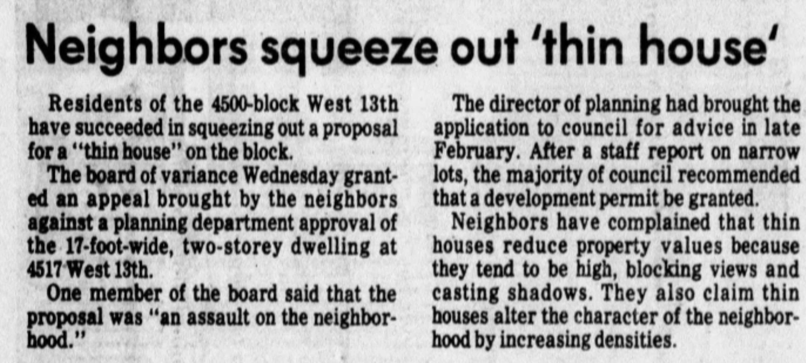

```{r setup, include=FALSE}
knitr::opts_chunk$set(
	echo = FALSE,
	message = FALSE,
	warning = FALSE,
	cache = TRUE,
	dev = "svg"
)
options(htmltools.dir.version = FALSE)
options(servr.daemon = TRUE)
library(tidyverse)
library(cancensus)
library(cansim)
library(mountainmathHelpers)
```
```{r xaringanExtra, echo=FALSE}
xaringanExtra::use_xaringan_extra(c("broadcast"))
```
```{r broadcast, echo=FALSE}
xaringanExtra::use_broadcast() 
```


```{r}
metrics <- c("Population","Dwellings","Employment")

get_2011_base_projections <- function(){
  projections_data<-tabulizer::extract_tables("http://www.metrovancouver.org/services/regional-planning/PlanningPublications/TableA1-PopDwelUnitEmpProjforMVSubregMuni.pdf",method="lattice")[[1]] %>%
    as_tibble() %>%
    slice(2:n())
  
  metrics %>%
    lapply(function(m){
      i=match(m,metrics)
      indices=c(1,seq(4*i-2,4*i+1))
      projections_data %>%
        select(indices) %>%
        set_names((.)[1,]) %>%
        slice(2:n()) %>%
        gather(key="Year",value="Value",-1) %>%
        mutate(Metric=m)
    }) %>%
    bind_rows %>%
    mutate(Value=as.integer(gsub(",","",Value)),
           Year=as.integer(Year))
}

metro_van_region_projections <- simpleCache(get_2011_base_projections(),
                                            "metro_van_pop_dw_projections_2011.Rda") %>%
  rename(Name=MUNICIPALITY) %>%
  mutate(Name=case_when(Name=="Langley Township" ~ "Langley Disrtict",
                        TRUE ~ Name)) %>%
  group_by(Name,Metric) %>%
  mutate(rate=(lead(Value, order_by = Year)/Value)^(1/10)) %>%
  ungroup()

metro_van_data <- bind_rows(metro_van_region_projections %>% filter(Year==2011),
                            metro_van_region_projections %>% filter(Year==2011) %>%
                              mutate(Value=Value*rate^5,Year=2016))

```


```{r}
metro_pop_dw_2016 <- get_census("CA16",regions=list(CMA="59933"),level="CSD",vectors=c(pop_priv="v_CA16_424"))
metro_pop_dw_2011 <- get_census("CA11",regions=list(CMA="59933"),level="CSD",vectors=c(pop_priv="v_CA11F_216"))
metro_pop_dw_2006 <- get_census("CA06",regions=list(CMA="59933"),level="CSD",vectors=c(pop_priv="v_CA06_134"))
metro_pop_dw_2001 <- get_census("CA01",regions=list(CMA="59933"),level="CSD",vectors=c(pop_priv="v_CA01_127"))
metro_pop_dw_1996 <- get_census("CA1996",regions=list(CMA="59933"),level="CSD",vectors=c(pop_priv="v_CA1996_1698"))

metro2_pop_dw_2016 <- get_census("CA16",regions=list(CMA="59933"),level="CMA",vectors=c(pop_priv="v_CA16_424"))
metro2_pop_dw_2011 <- get_census("CA11",regions=list(CMA="59933"),level="CMA",vectors=c(pop_priv="v_CA11F_216"))
metro2_pop_dw_2006 <- get_census("CA06",regions=list(CMA="59933"),level="CMA",vectors=c(pop_priv="v_CA06_134"))
metro2_pop_dw_2001 <- get_census("CA01",regions=list(CMA="59933"),level="CMA",vectors=c(pop_priv="v_CA01_127"))
metro2_pop_dw_1996 <- get_census("CA1996",regions=list(CMA="59933"),level="CMA",vectors=c(pop_priv="v_CA1996_1698"))

census_data <- bind_rows(metro_pop_dw_2016 %>% 
                         select(GeoUID,Population,Dwellings,pop_priv) %>% mutate(Year=2016),
                       metro_pop_dw_2011 %>% 
                         select(GeoUID,Population,Dwellings,pop_priv) %>% mutate(Year=2011),
                       metro_pop_dw_2006 %>% 
                         select(GeoUID,Population,Dwellings,pop_priv) %>% mutate(Year=2006),
                       metro_pop_dw_2001 %>% 
                         select(GeoUID,Population,Dwellings,pop_priv) %>% mutate(Year=2001),
                       metro_pop_dw_1996 %>% 
                         select(GeoUID,Population,Dwellings,pop_priv) %>% mutate(Year=1996),
                       metro2_pop_dw_2016 %>% 
                         select(GeoUID,Population,Dwellings,pop_priv) %>% mutate(Year=2016),
                       metro2_pop_dw_2011 %>% 
                         select(GeoUID,Population,Dwellings,pop_priv) %>% mutate(Year=2011),
                       metro2_pop_dw_2006 %>% 
                         select(GeoUID,Population,Dwellings,pop_priv) %>% mutate(Year=2006),
                       metro2_pop_dw_2001 %>% 
                         select(GeoUID,Population,Dwellings,pop_priv) %>% mutate(Year=2001),
                       metro2_pop_dw_1996 %>% 
                         select(GeoUID,Population,Dwellings,pop_priv) %>% mutate(Year=1996)) %>%
  left_join(bind_rows(metro_pop_dw_2016,metro2_pop_dw_2016) %>% select(GeoUID,Name=`Region Name`,p0=Population), by="GeoUID") %>%
  mutate(Name=as.character(Name)) %>%
  mutate(Name=case_when(GeoUID=="59933" ~ "Metro Vancouver Total",
                        GeoUID=="5915020" ~ "Electoral Area A",
                        TRUE ~ Name)) %>%
  mutate(n=gsub(" \\(.+\\)$","",Name)) %>%
  mutate(Name=case_when(n %in% (filter(.,Year==2016) %>% filter(duplicated(n)) %>% pull(n)) ~ Name,
                        TRUE ~ n)) %>%
  mutate(Name=Name %>% 
           gsub(" \\(CY\\)$"," City",.) %>%
           gsub(" \\(DM\\)$"," District",.)) %>%
  #filter(p0>=5000) %>%
  mutate(Year=as.integer(Year)) %>%
  select(GeoUID,Name,Year,p0,Dwellings,Population,pop_priv) %>%
  pivot_longer(c("Dwellings","Population","pop_priv"),names_to = "Metric",values_to = "Value")
```

class: short-title
## Population, growth, and distribution
<iframe src="https://doodles.mountainmath.ca/html/yvr_pop_timeline" width="100%" height="550px">


---
## How did we grow?
.pull-left[
```{r fig.height=5, fig.width=4.5}
census_data %>%
  group_by(GeoUID,Metric) %>%
  mutate(Change=Value/lag(Value, order_by = Year)-1,
         Period=paste0(lag(Year,order_by = Year)," - ",Year)) %>%
  filter(p0>=20000) %>%
  filter(Year>1996) %>%
  mutate(Type=ifelse(GeoUID=="59933","Metro Vancouver",
                     "Individual muncipalities\n(above 20k population)")) %>%
  select(Name,Type,Period,Metric,Change) %>%
  pivot_wider(names_from=Metric,values_from = Change) %>%
  ggplot(aes(x=Dwellings,y=pop_priv,color=Type)) +
  #geom_smooth(method="lm",color="black",se=FALSE) +
  geom_smooth(method="lm",se=FALSE,size=0.5,alpha=0.5) +
  geom_vline(data=~filter(.,GeoUID=="59933"),aes(xintercept=Dwellings),
             colour="brown",linetype="dashed") +
  geom_point(shape=21,size=2) +
  scale_colour_manual(values=c("steelblue","brown")) +
  scale_x_continuous(labels=scales::percent) +
  scale_y_continuous(labels=scales::percent) +
  theme_bw() +
  theme(legend.position = "bottom") +
  facet_wrap("Period") +
  labs(title="Population vs dwelling growth",
       subtitle="Metro Vancouver municipalities",
       x="Change in dwellings during inter-census period",
       y="Change in population during inter-census period",
       shape=NULL,
       color=NULL,
       caption="MountainMath, Data: StatCan Census 1996-2016")
```
]
.pull-right[
Over the past 4 census periods overall Metro Vancouver dwelling growth continuously slowed. Population growth slowed at similar rates.

Each individual municipality's population grew in line with it's respective dwelling growth.
]

---
class: short-title
## What caused this growth pattern?
<iframe src="https://mountainmath.ca/zoning_map" width="100%" height="550px">

---
## How do we enforce low density?


.pull-left[
Zoning bylaws prevent the sharing of land in a variety of ways.

* Limiting the number of dwelling units per lot
* Limiting ability to share a dwelling unit by defining "family" and restricting kitchens
* Limiting ability to subdivide by minimum lot size/frontage requirements

Today I want to focus on the last one, minimum frontage and lot size requirements.
]

--
.pull-right[
#### There is no method to these requirements, other than trying to freeze things in place at the time requirements came in.

]

---
## How did we end up with these rules?


.pull-left.width60[
In the 70s and 80s housing pressure in Vancouver shifted and increasingly people eanted to subdivide existing lots. Minimum frontage/size requirements became binding across Vancouver. 



This 1980 newspaper clipping captures the dynamic of NIMBY pushback spurring the City to strengthened the requirements.
]

--

.pull-right.width40[
#### This is what people tried to prevent

]
---
## How much damage does this do?
Just in the City of Vancouver alone, halfing the minimum frontage/area requirements would unlock $43 billion of the opportunity cost that comes with preventing the sharing of land in jobs and amenity rich areas.


