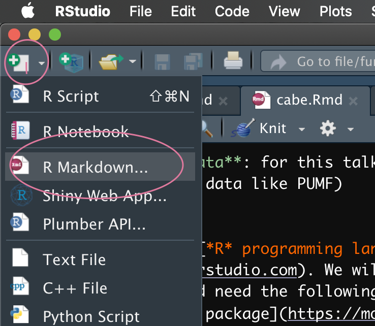
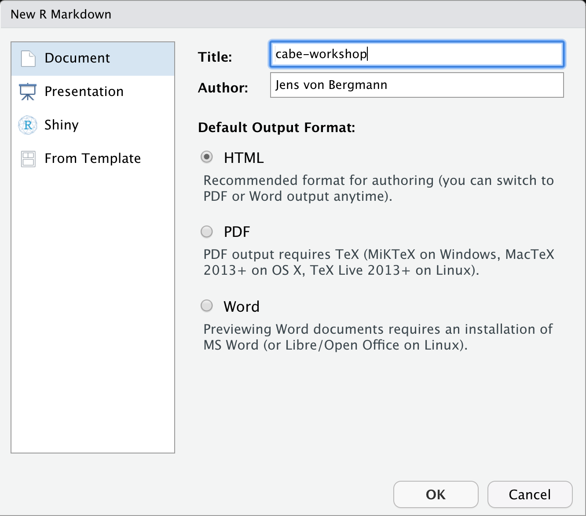
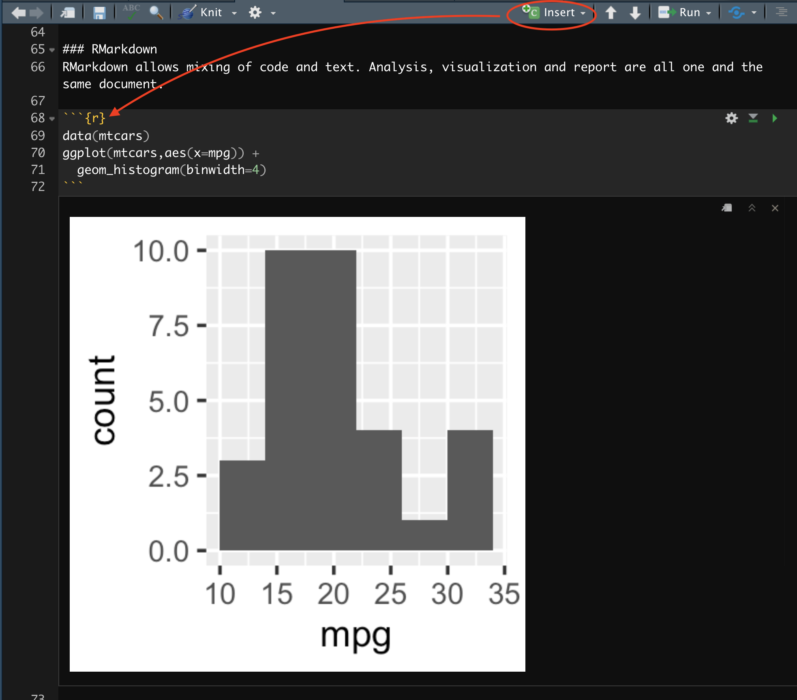
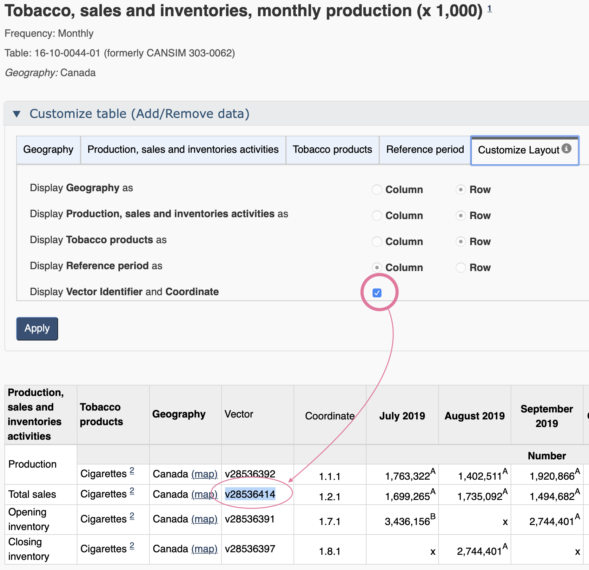

```{r setup, include=FALSE}
knitr::opts_chunk$set(
	echo = TRUE,
	message = FALSE,
	warning = FALSE,
	cache = TRUE,
	dev = "svg"
)
options(htmltools.dir.version = FALSE)
options(servr.daemon = TRUE)
library(tidyverse)
```


## Reproducible and adaptable workflows using StatCan data in R
Slides are at https://mountainmath.ca/cabe for those wanting to follow along and copy-paste code on their own machine.

--
* **Reproducible**: can be repeated by others with minimal work, (also auditable)

--
* **Adaptable**: can be easily tweaked to accomplish related tasks

--
* **StatCan data**: for this talk this means regular StatCan tables (former CANSIM) and census data (we won't look at other StatCan data like PUMF)

--
* **R**: The [*R* programming language](https://www.r-project.org). Ideally using the [RStudio IDE](https://rstudio.com). We will be working with [RMarkdown](https://bookdown.org/yihui/rmarkdown/notebook.html) documents, and need the following packages:
  - [`cansim` package](https://mountainmath.github.io/cansim/) to access census data via the [StatCan NDM API](https://www.statcan.gc.ca/eng/developers/wds)
  - [`cancensus` package](https://mountainmath.github.io/cancensus/) to access census data via the [CensusMapper API](https://censusmapper.ca/api)
  - additionally, we will be working in the [tidyverse](https://www.tidyverse.org), an *opinionated collection of R packages* for intuitive general-purpose data manipulations and visualization capabilities.

---
## Agenda

We will explore how to
* access StatCan census and regular tables data
* explore the datasets and perform basic data manipulations
* do basic descriptive analysis and visualization

We **won't** discuss how to
* do deeper data analysis
* work with census data across several census years
* do fancy visualization or interactive live widgets

---
## Getting set up
For those wishing to follow along live-coding, open a new RMarkdown document.

.pull-left[

]
.pull-right[

]

---
.pull-left[


### RMarkdown
RMarkdown allows mixing of code and text. Analysis, visualization and report are all one and the same document. 

```{r fig.height=3, fig.width=3}
library(tidyverse)
data(mtcars)
ggplot(mtcars,aes(x=mpg)) + 
  geom_histogram(binwidth=4)
```

]
.pull-right[


RMarkdown documents can be compiled to **HTML**, **PDF** or **Word**.

The output of code blocks gets inserted into the document. We can show or hide the actual code.

]
---
## Required packages (and API key)

Time to get started in earnest.

```{r}
#install.packages("tidyverse")
library(tidyverse)
#install.packages(c("cansim","cancensus"))
library(cansim)
library(cancensus)
```

A slight complication, the `cancensus` package needs an API key. You can sign up for one on [CensusMapper](https://censusmapper.ca/users/sign_up), but for today everyone who does not have one already is welcome to use a temporary API key:

```{r}
options(cancensus.api_key='CensusMapper_a82c59c0bf38e8779320cac642297b2b')
```

This API key will expire later today, for future use replace it with your own and put this line into your `.Rprofile` file, that way it's available in every R session and you won't expose your API key when sharing code.

---
## First example: Motor vehicle sales
To start off we grab data on motor vehicle sales from table 20-10-0001 and inspect the available variables.

```{r}
mv_sales <- get_cansim("20-10-0001") %>%
  normalize_cansim_values(factors=TRUE)

mv_sales %>% select_if(is.factor) %>% sapply(levels)
```

---
## Motor vehicle sales (Notes)
It's always good to check the notes so there are no unexpected hiccups.
```{r}
mv_notes <- get_cansim_table_notes("20-10-0001")
knitr::kable(mv_notes)
```


--

We take note of the definition for **Trucks** and that **seasonally adjusted** data has been discontinued.

---
## Motor vehicle sales
```{r fig.height=3, fig.width=6}
plot_data <- mv_sales %>% 
  filter(GEO=="Canada",
         `Vehicle type`!="Total, new motor vehicles",
         `Origin of manufacture`=="Total, country of manufacture",
         Sales=="Units",
         `Seasonal adjustment`=="Unadjusted")

ggplot(plot_data,aes(x=Date,y=VALUE,color=`Vehicle type`)) +
  geom_line() 
```

---
## Motor vehicle sales (nicer graph)
```{r fig.height=3, fig.width=6}
g<- plot_data %>% filter(Date>=as.Date("1990-01-01")) %>% 
  ggplot(aes(x=Date,y=VALUE,color=`Vehicle type`)) +
  theme_light() +
  geom_line(alpha=0.2) + 
  geom_smooth(span=0.1) + 
  scale_y_continuous(labels=function(d)scales::comma(d,scale=1/1000,suffix="k")) +
  labs(title="Canadian new motor vehicle sales",x=NULL,y="Sales per month",
       caption="StatCan Table 20-10-0001")
g
```


---
class: medium-code
## Motor vehicle sales (annotated graph, final version)
```{r fig.height=4, fig.width=6}
library(ggrepel)   # (for nicer labels)
g + geom_text_repel(data=~filter(.,Date==as.Date("1990-08-01"),`Vehicle type`=="Passenger cars"),
                   label="Passenger cars",show.legend = FALSE,hjust=0,nudge_y = 30000) +
  geom_text_repel(data=~filter(.,Date==as.Date("2018-10-01"),`Vehicle type`=="Trucks"),
                   label="Trucks, SUVs, Vans, Buses",show.legend = FALSE,
                  hjust=1,nudge_x = -2000,nudge_y=10000) +
  scale_color_manual(values=c("Passenger cars"="steelblue","Trucks"="brown"),guide=FALSE)
```

---

## Cigarette sales
.pull-left[
Sometimes we are just interested in one specific variable. It can be easier to pull in the StatCan vector.

Vector discovery can be cumbersome, downloaded table data has it. The web view has it too.

We can go to the web view of table right from the R console using the following command.

```{r eval=FALSE}
view_cansim_webpage("16-10-0044")
```

Selecting the **Add/Remove data** option allows us to filter the data down to what we want and enable the display of StatCan vectors.
]


.pull-right[

]
---
class: medium-code
## Cigarette sales
```{r fig.height=4, fig.width=6}
get_cansim_vector("v28536414","1800-01-01") %>% 
  normalize_cansim_values() %>%
  ggplot(aes(x=Date,y=VALUE)) +
  geom_line() + 
  geom_smooth(span=0.25,se=FALSE) +
  labs(title="Canadian cigarette sales",x=NULL,y="Monthly sales",caption="StatCan vector v28536414")
```

---
class: medium-code
## Housing consumption share of GDP
Sometimes we need more data processing to get to quantities we are interested in. One frequent pattern is that we want to look at percent shares of a total.

```{r}
gdp_data <- get_cansim("36-10-0402") %>% 
  normalize_cansim_values() %>%
  filter(Value=="Chained (2012) dollars") %>%
  select(Date,GEO,naics=`North American Industry Classification System (NAICS)`,VALUE) %>%
  left_join(filter(.,grepl("T001",naics)) %>% select(Date,GEO,Total=VALUE)) 

gdp_data %>% filter(grepl("5311",naics)) %>% pull(naics) %>% unique
```

Here we cut down to Chained (2012) dollars and joined the **Total** GDP as another column, and we check that NAICS sub-codes starting with **5311** correspond to housing consumption.

--

```{r}
housing_consumption <- gdp_data %>% 
  filter(grepl("5311",naics)) %>%
  group_by(Date,GEO) %>%
  summarize(Share=sum(VALUE)/first(Total)) %>%
  mutate(highlight=GEO %in% c("British Columbia","Alberta","Ontario","Quebec"))
```

We compute the combined share of those two categories for each Date and Geography.

---
class: medium-code
## Housing consumption share of GDP
```{r fig.height=4, fig.width=8}
ggplot(housing_consumption,aes(x=Date,y=Share,group=GEO)) +
  geom_line(data=~filter(.,!highlight),color="grey") + 
  geom_line(data=~filter(.,highlight),aes(color=GEO)) +
  theme_light() + scale_y_continuous(labels=scales::percent) +
  labs(title="Housing consumption as share of GDP",caption="StatCan Table 36-10-0402",fill=NULL,x=NULL)
```


---
class: medium-code
## Data discovery
Data discovery is still a major issue. Right now we have two ways

* Google
* cumbersome overview table from Open Data Canada

```{r}
search_cansim_tables("job vacancy") %>% select(cansim_table_number,title) %>% knitr::kable()
```


--

StatCan is working on better data discovery, hopefully things will get easier in the future.


---
class: medium-code
## Combining StatCan tables
To understand growth of jobs we combined LFS employment data with JVWS data on job vacancies.
```{r}
library(lubridate)
lfs_data <- get_cansim("14-10-0293") %>% normalize_cansim_values() %>%
  filter(`Labour force characteristics`=="Employment", Statistics=="Estimate")
jv_data <- get_cansim("14-10-0325") %>% normalize_cansim_values() %>%
  filter(Statistics=="Job vacancies") %>% mutate(Date=Date %m+% months(1))
```

Job vacancies are only available quarterly, so we combine 3 months moving average LFS data with job vacancy data time-shifted to the middle of the quarter.

--
```{r}
jobs_data <- inner_join(lfs_data %>% select(Date,GeoUID,GEO,Employment=VALUE),
                        jv_data %>% select(Date,GeoUID,`Job vacancies`=VALUE),
                        by=c("Date","GeoUID")) %>%
  filter(!is.na(`Job vacancies`)) %>%
  pivot_longer(c("Job vacancies","Employment")) %>%
  mutate(name=factor(name,levels=c("Job vacancies","Employment"))) %>%
  filter(grepl("Canada|Lower Mainland|Toronto|Calgary",GEO))
```

Start dates for job vacancy data varies by geography, so it's safer to join and pivot the data than to just bind the rows.

---
class: medium-code
## Combining StatCan tables
```{r fig.height=4, fig.width=8}
ggplot(jobs_data,aes(x=Date,y=value,fill=name)) +
  geom_bar(stat="identity") +
  facet_wrap("GEO",scales="free_y") +
  scale_y_continuous(labels=scales::comma) +
  labs(title="Jobs by economic region",fill=NULL,x=NULL,y=NULL,
       caption="StatCan Tables 14-10-0293,14-10-0325")
```

---
class: medium-code
## Income by age groups
```{r}
income_age_groups <- c("16 to 24 years", "25 to 34 years" , "35 to 44 years" , 
                       "45 to 54 years" , "55 to 64 years", "65 years and over")
income_data <- get_cansim("11-10-0239") %>%
  normalize_cansim_values(factors = TRUE) %>%
  filter(GEO=="Canada",
         Sex=="Both sexes",
         Statistics=="Median income (excluding zeros)",
         `Income source`=="Total income",
         `Age group` %in% income_age_groups) 
```
Sometimes we want to do several similar plots, it can be useful to define a custom theme.
```{r}
line_theme <- list(
  geom_line(),
  geom_point(data=~filter(.,Date==max(Date))),
  scale_color_brewer(palette="Dark2",guide=FALSE),
  theme_light(),
  expand_limits(x=as.Date("2025-01-01")),
  ggrepel::geom_text_repel(data=~filter(.,Date==max(Date)),aes(label=`Age group`),hjust=-0.1,
                           color='black',direction="y",size=4),
  scale_y_continuous(labels=scales::dollar)
)
```

---
class: medium-code
## Income by age groups
```{r fig.height=4.5, fig.width=7}
ggplot(income_data,aes(x=Date,y=VALUE,color=`Age group`)) +
  line_theme +
  labs(title="Median income by age group in Canada", x=NULL, y="2017 constant dollars",
       caption="StatCan Table 11-10-0239")
```

---
class: medium-code
## Wealth

```{r}
cpi <- get_cansim_vector("v41693271","1990-01-01") %>% normalize_cansim_values() %>%
  filter(Date<="2016-12-31") %>% mutate(CPI=VALUE/last(VALUE,order_by=Date))
wealth_age_groups <- c("Under 35 years","35 to 44 years" , "45 to 54 years",   "55 to 64 years" , "65 years and older")
wealth_data <- get_cansim("11-10-0016") %>%
  normalize_cansim_values(factors=TRUE) %>%
  filter(GEO=="Canada",
         `Assets and debts`=="Net Worth (assets less debts)",
         Statistics=="Median value for those holding asset or debt",
         `Economic family type`!="Economic families and persons not in an economic family",
         `Age group` %in% wealth_age_groups) %>%
  left_join(cpi %>% select(Date,CPI),by="Date") %>%
  mutate(Value=VALUE/CPI) %>%
  select(GEO,Date,`Age group`,`Confidence intervals`,`Economic family type`,Value) %>%
  pivot_wider(names_from="Confidence intervals",values_from="Value")
```

Wealth data needs a bit more processing. 
* We need to manually adjust the wealth data for inflation. 
* We want to also pay attention to the confidence intervals.

---
class: medium-code
## Wealth
```{r fig.height=4, fig.width=9}
ggplot(wealth_data,aes(x=Date,y=Estimate,color=`Age group`)) +
  line_theme +
  geom_ribbon(aes(ymin=`Lower bound of a 95% confidence interval`,
                  ymax=`Upper bound of a 95% confidence interval`),fill="grey",alpha=0.3,size=0) +
  facet_wrap("`Economic family type`") +
  labs(title="Median net worth by age group in Canada",x=NULL,y="Constant 2016 dollars",
       caption="StatCan Table 11-10-0239")
```

---
## Census data
Census data offers much richer variables and spatial resolution, but at coarse time intervals.

Richer data comes at a price: Data discovery and acquisition is more complex. Enter [CensusMapper](https://censusmapper.ca).

CensusMapper is a flexible census data mapping platform. Anyone can explore and map census data.

CensusMapper is also an API server to facilitate data acquisition for analysis, as a [GUI data selection tool](https://censusmapper.ca/api).

--

We will take a quick tour of CensusMapper...

---
class: medium-code
## Census data
```{r fig.height=4, fig.width=8, message=FALSE, warning=FALSE}
poverty_data <- get_census("CA16",regions=list(CSD="3520005"),vectors=c(lico_at="v_CA16_2573"),
                           geo_format="sf",level="CT") 

ggplot(poverty_data,aes(fill=lico_at/100)) +
  geom_sf(size=NA) + coord_sf(datum = NA) + 
  scale_fill_viridis_c(option = "inferno",labels=scales::percent) +
  labs(title="Toronto share of children in poverty",fill=NULL,caption="StatCan Census 2016")
```

---
class: medium-code
## Mixing census data with StatCan Tables
```{r fig.height=3.2, fig.width=7}
geo_data <- get_census("CA16",regions=list(CMA="59933"),geo_format = 'sf',level="CSD")
chsp_data <- get_cansim("46-10-0049") %>% normalize_cansim_values(factors = TRUE) %>%
  filter(GeoUID %in% geo_data$GeoUID) %>%
  filter(`Owner-occupied property type` == "Condominium apartment",
         `Owner characteristics at the property level`=="None of the owners receive pension income",
         Estimates=="Median ratio of assessment value to total income") 

ggplot(left_join(geo_data,chsp_data),aes(fill=VALUE)) +
  geom_sf() + scale_fill_viridis_c(option = "magma",trans="log") + coord_sf(datum=NA) +
  labs(title="Median ratio of assessment value to total income\nfor non-pensioner condo owners",
       caption="StatCan table 46-10-0049",fill=NULL)
```


---
## Recap

* APIs make it easy to pull in data as needed. 
* scripting data processing in R (or python) make analysis transparent, autitable and adaptable.
* simply re-run the scripts when new data becomes available.
* to collaborate just share the code, don't need to worry about sharing data and keeping data up-to-date.
* iterative process: can easily add data analysis and visualization.
* packages like **cansim** provides stability against API changes, they abstract the changes under the hood and deliver (more) stable results.


---
class: inverse center
## Thanks for listening
The RMarkdown for this presentation can be [found on GitHub](https://github.com/mountainMath/presentations/blob/master/cabe.Rmd) if anyone wants to download the code and adapt it for their own purposes. 

### Please post your questions in the chat.
### .....<span class="blinking-cursor">|</span>

<div style="height:30%;"></div>

<hr>

You can find me on Twitter at [@vb_jens](https://twitter.com/vb_jens).

My blog has lots of examples with code. [doodles.mountainmath.ca](https://doodles.mountainmath.ca)
In particular 

[examples using the {cansim} package](https://doodles.mountainmath.ca/categories/cansim/) and 

[examples using the {cancensus} package](https://doodles.mountainmath.ca/categories/cancensus/).


