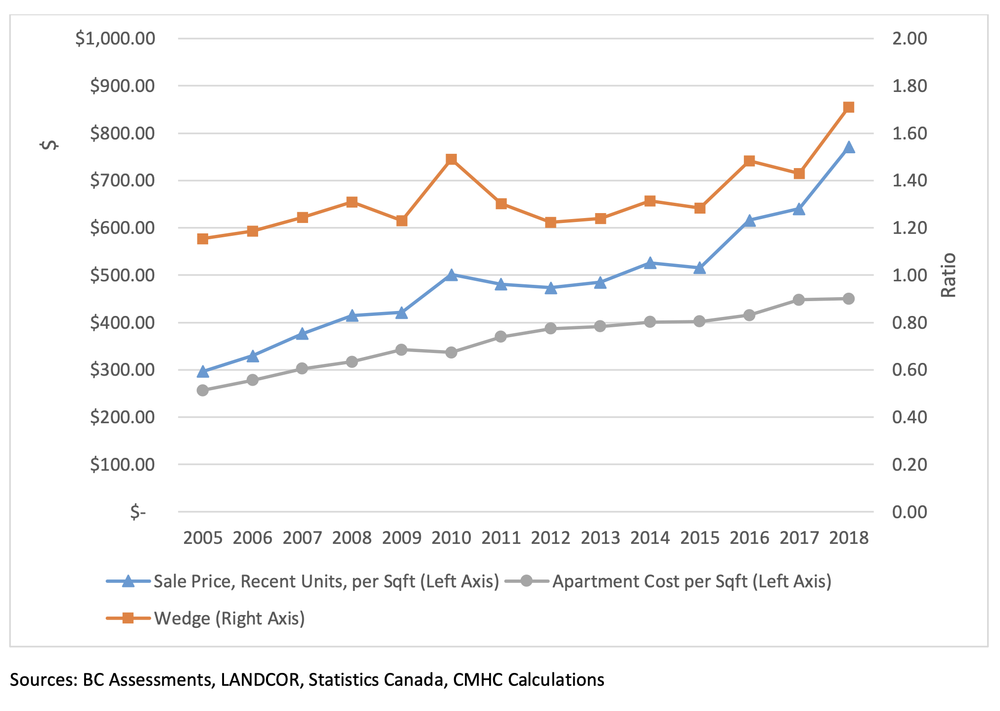

```{r setup, include=FALSE}
library(tidyverse)
library(canpumf)
library(cansim)
library(mountainmathHelpers)
```


# What is a shortage?

In economics, a shortage is a situation where the demand for a good exceeds the supply of that good at prevailing prices. Shortages generally self-correct through price adjustments. (And that's exactly what is happening in housing, **the market through which housing is allocated** operates fairly freely.)

When we talk about housing shortages in Canada we think of **the market of housing production**. 


# Do we have a housing shortage?

Some circumstantial evidence:

The market for housing production is heavily regulated:

* binding zoning
* lengthy and risky regulatory approval processes
* high development fees

Especially so in Vancouver and Toronto where prices and rents are high.

# Some more concrete evidence

Ratio of market prices of new housing to Minimal Profitable Construction Costs is informative on binding supply restrictions [Glaeser & Gyourko](https://www.newyorkfed.org/medialibrary/media/research/epr/03v09n2/0306glae.pdf)




Marginal construction costs have increased, prices have increased faster.


<!--
# Demand for housing

The two main ingredients of housing demand are:

-   demographic pressure
-   income

Incomes generally change slowly.

To estimate how changes in demographics (and changes in housing supply) will affect housing costs we need to estimate how the demand curve depends on demographics.

This **demand elasticity** is the central ingredient to understand how rents and prices react to changes in supply and demographic pressures.
-->
## Folding in demand

::::: columns
::: {.column width="50%"}
 Suggests a 1% increase in housing stock lowers prices and rents by \~ 4%. (Literature suggest a point estimate closer to 2.5%.)

(Taken from our [modelling report for BC's SSMUH and TOA policies](https://news.gov.bc.ca/files/bc_SSMUH_TOA_scenarios_Final.pdf).)
:::

::: {.column width="50%"}
This relies on econometric time series modelling:

-   specifies a structural model
-   try to estimate elasticities based on historical changes in demographics, prices, housing stock, income, and other macroeconomic factors
-   has to overcome significant endogeneity issues
-   comes with considerable uncertainties

#### Can we understand this more directly looking via demographic modelling?
:::
:::::

## Connect the macro to micro

Marco reasoning alone makes it difficult to understand how families and individuals are impacted.

We need to understand what function housing serves, and how people meet housing.

::: {style="margin-top:60px;"}
:::

::: fragment 

### The value of housing

**People derive tremendous value from living in housing!**

:::

::: fragment

Housing provides

-   shelter
:::

::: fragment
-   location
:::

::: fragment
-   privacy
:::

## Location

BC has a housing shortage, but housing in the wrong location is not useful.

::::: columns
::: {.column width="50%"}

:::

::: {.column width="50%"}
Demand for housing varies strongly by location.

-   When housing demand falls, outlying areas are hit first and hardest.
-   When housing demand rises, prices & rents in central areas rise first.
:::
:::::

## Privacy

Housing affords various levels of privacy:

-   Bedrooms: People might share bedrooms or have separate bedrooms
-   Dwelling units: People might share a dwelling unit or live in separate dwelling units

Privacy considerations matter a lot, doubling up is the **main mechanism** how people respond to housing shortages/high rents.

Rent/sf for smaller (Studio or 1 Bedroom) vs larger (2 Bedroom or larger) units

{height="350px"}

<!--
# What's a household?


-->


# A mathematics digression

::::: columns
::: {.column width="50%"}

**The Pigeonhole principle:**

If $n$ objects are put into $m$ containers, with $n > m$, then at least one container must contain more than one object.


::: fragment

:::: {style="margin-top:100px"}
::::

**How does this apply to housing?**

What takes to place of pigeons and what takes the place of holes?

:::

:::
::: {.column width="50%"}


:::
::::


# A long view on housing in Canada

How have people distributed over housing historically?


## How does this play out in detail?


## Benchmarking shortages

::::: columns
::: {.column width="60%"}
How much housing is needed to eliminate all doubling up?

 Some doubling up may be voluntary, Quebec CMA puts a bound on that.
:::

::: {.column width="40%"}
The regions with the highest housing shortfall are also the regions with the highest rents, and this is no coincidence.
:::
:::::

## Shortages and rents

::::: columns
::: {.column width="60%"}


There is a strong relationship between housing shortages and rents.
:::

::: {.column width="40%"}
Other factors matter too, in particular:

-   incomes
-   cultural tolerance of doubling up

```{r}
slope <- 0.2330284

ratio_response <- function(housing_increase) {
  1-housing_increase/(1+housing_increase)
}

supply_response <- function(housing_increase) {
 exp(log(ratio_response(housing_increase))/slope)-1
}
```

Relationship suggests that increasing the housing stock in Vancouver by 1% reduces rents by `r scales::percent(-supply_response(0.01),accuracy=0.1)`, similar to econometric estimate.

(This does not account for migration response which reduces the effect.)
:::
:::::


# Families and individuals


# Families and individuals vs rents


# Common pitfalls (news articles)

> Historically high US homebuilding rates were in large part driven by falling household size. If you control for this factor, the current low rates of US homebuilding looks less dire.

> With Less Household Growth, Demand For New Housing Units is Projected to Decline

> If all 1,000 people live alone, then 1,000 dwellings are required. But if they all reside in households of five, then only 200 dwellings are required.
>
> Dividing those 1,000 people by the average household size of the jurisdiction where they live paints a very different picture about housing needs and can help to interpret differences in rates of housing supply between cities, provinces and countries. These differences in average household size mean those same 1,000 people require an average of 507 dwellings in Germany and 441 in Japan. In Canada, because of our larger average household size of 2.47 people, this figure is only 405.

# Common pitfalls (academic papers)

::::: columns
::: {.column width="50%"}

> Households in our model have preferences over two goods, housing stock (S) [measured in number of housing units] and a numeraire consumption good (C). 

> The intensive margin [floorspace per dwelling] reflects individual household demand for floorspace, while the extensive margin [number of dwellings] reflects in-migration of households in response to increased real incomes from reductions in dwelling prices.

:::
::: {.column width="50%"}

> It seems unlikely that these constraints on household formation are so widespread as to indicate a pervasive housing shortage. If inadequate housing supply was indeed stymieing household growth, population growth would be occurring within a constrained housing supply. Without sufficient supply, household growth rates would not exceed the rate of population growth by a significant margin. Headship rates would decrease and the incidence of overcrowded housing would probably increase. We see no evidence of this, at least at the national level.

:::
::::


## Thank you!

These slides are online at <https://mountainmath.ca/cabe_housing_shortage/>.

### References and further reading

::: {#refs}
:::

::: {style="padding-top:100px;"}
:::

You can reach me via [Bluesky (\@jensvb)](https://bsky.app/profile/jensvb.bsky.social), [Linkedin (\@vb-jens)](https://www.linkedin.com/in/vb-jens/), or [email (jens\@mountainmath.ca)](mailto::jens@mountainmath.ca).
