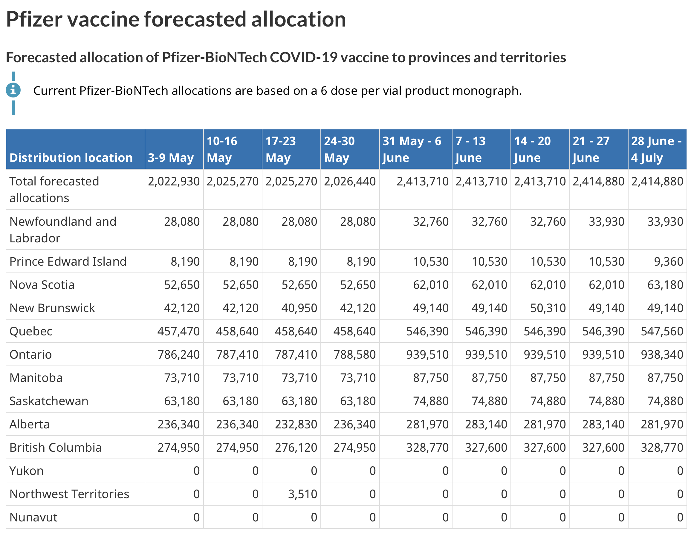
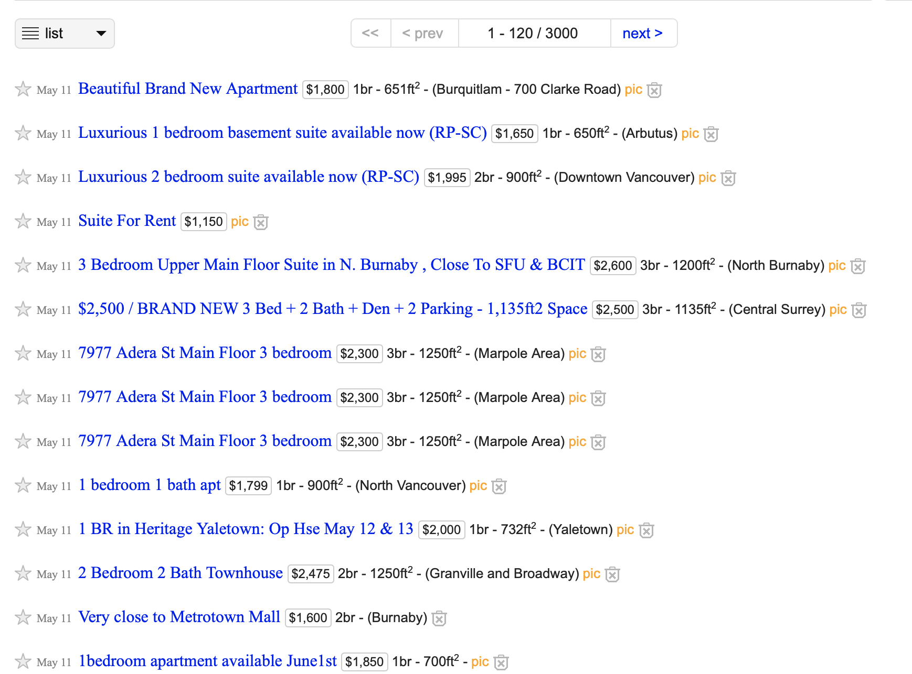
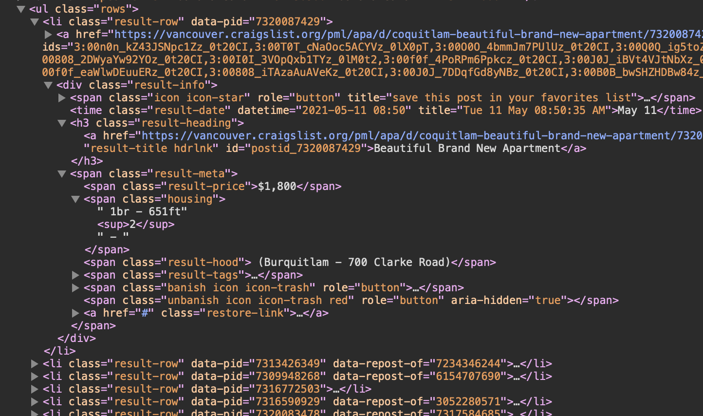
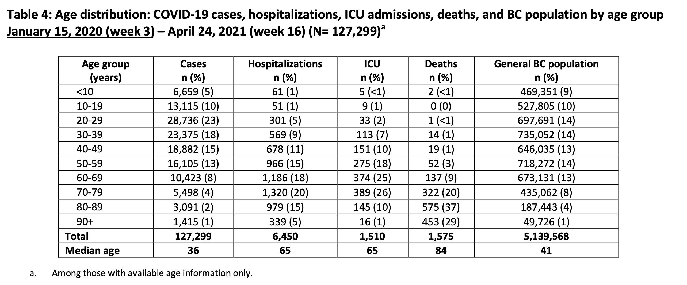

```{r setup, include=FALSE}
knitr::opts_chunk$set(
	echo = TRUE,
	message = FALSE,
	warning = FALSE,
	cache = TRUE,
	dev = "svg"
)
options(htmltools.dir.version = FALSE)
options(servr.daemon = TRUE)
library(tidyverse)
library(cancensus)
library(cansim)
```
```{r xaringanExtra, echo=FALSE}
xaringanExtra::use_xaringan_extra(c("broadcast"))
```
```{r broadcast, echo=FALSE}
xaringanExtra::use_broadcast()
```


## PUMF data, data scraping, and interfacing with Excel and other programs

Building on the previous two workshops, we will 
* give an overview over how to work with ~~panel~~ StatCan PUMF data, 
* show how to scrape tables from web pages, 
* scrape non-tabular data like rental listings from web pages,
* extract tabular data from PDFs
* interface with SPSS, Excel, and other programs


---
class: medium-code
## StatCan PUMF data
StatCan PUMF data is now freely available via EFT upon request, and some PUMF datasets can be directly downloaded without wait times or manual steps. Which is great for reproducibility. 

I have started collecting data import and data handling scripts for PUMF data in a (still fairly rough and rapidly changing) [{canpumf} package](https://mountainmath.github.io/canpumf/).

```{r}
#remotes::install_github("mountainmath/canpumf")
library(canpumf)
download_lfs_pumf("2021-04") %>% read_pumf_data()
```

---
class: medium-code
## LFS PUMF data

Time to start working! We will grab the LFS data for the first four months of this year, and apply human-readable column names and variable labels.

```{r}
lfs_2021 <- c("2021-01","2021-02","2021-03","2021-04") %>%
  lapply(download_lfs_pumf) %>%
  lapply(read_pumf_data) %>%
  lapply(label_pumf_data) %>%
  bind_rows()

lfs_2021
```

---
class: medium-code medium-font
## LFS PUMF (overview over available concepts)
```{r}
names(lfs_2021) %>% paste0(collapse = ", ") %>% str_wrap %>% cat("\n")
```

---
class: medium-code
## LFS PUMF (Unemployment status of immigrants)
```{r fig.height=3.5, fig.width=10}
lfs_2021 %>%
  group_by(`Survey month`,`Immigrant status`,`Not currently employed, worked in the past`) %>%
  summarise(value=sum(`Standard final weight`)) %>%
  ggplot(aes(x=`Survey month`,y=value,fill=`Not currently employed, worked in the past`)) +
  geom_bar(stat="identity",position = "fill") +
  facet_wrap("`Immigrant status`") +
  scale_y_continuous(labels=scales::percent) +
  labs(title="Unemployment status",caption="LFS PUMF",y=NULL,fill="Worked in past")
```

---
class: medium-code
## LFS PUMF (digging deeper)
```{r fig.height=3.5, fig.width=10}
lfs_2021 %>%
  filter(`Five-year age group of respondent` %in% c("25 to 29 years", "30 to 34 years", "35 to 39 years", "40 to 44 years","45 to 49 years", "50 to 54 years", "55 to 59 years")) %>%
  group_by(`Survey month`,`Immigrant status`,`Not currently employed, worked in the past`) %>%
  summarise(value=sum(`Standard final weight`)) %>%
  ggplot(aes(x=`Survey month`,y=value,fill=`Not currently employed, worked in the past`)) +
  geom_bar(stat="identity",position = "fill") +
  facet_wrap("`Immigrant status`") +
  scale_y_continuous(labels=scales::percent) +
  labs(title="Unemployment status of 25-59 year olds",caption="LFS PUMF",y=NULL,fill="Worked in past")
```

---
class: medium-code
## LFS PUMF (bootstrap weights)
PUMF data has a lot of uncertainty built in. A simple way to assess the robustness of estimates is bootstrap weights. Important products like the census PUMF come with ready-made bootstrap weights, but many other PUMF datasets to not.

In absence of official bootstrap weights we can make our own, the `add_bootstrap_weights` function facilitates this.


```{r}
lfs_2021_bootstrap <- lfs_2021 %>% 
  add_bootstrap_weights(.,"Standard final weight") %>%
  filter(`Nine largest CMAs`=="Vancouver") %>%
  filter(`Five-year age group of respondent` %in% 
           c("25 to 29 years", "30 to 34 years", "35 to 39 years", "40 to 44 years",
             "45 to 49 years", "50 to 54 years", "55 to 59 years")) %>%
  group_by(`Survey month`,`Immigrant status`,`Not currently employed, worked in the past`) %>%
  summarise_at(vars(matches("Standard final weight|WT\\d+")),sum) %>%
  pivot_longer(matches("Standard final weight|WT\\d+")) %>%
  group_by(`Survey month`,`Immigrant status`,name) %>%
  mutate(share=value/sum(value)) %>%
  filter(`Not currently employed, worked in the past`!="Not applicable")
```

---
class: medium-code
## LFS PUMF (bootstrap weights)
```{r fig.height=4, fig.width=10}
ggplot(lfs_2021_bootstrap,aes(x=`Not currently employed, worked in the past`,y=share,fill=`Survey month`)) +
  geom_boxplot(position="dodge") +
  facet_wrap("`Immigrant status`") +
  scale_y_continuous(labels=scales::percent) +
  coord_flip() +
  theme(legend.position = "bottom") +
  labs(y="Share",title="Unemployment status of 25-59 year olds in Vancouver",caption="LFS PUMF 2021")
```

---
## Web scraping


Sometimes data is not easily available for download, but we can scrape it from the web. This is fairly straight-forward if the data is in an html table.

As an example, let's look at the [Canadian COVID-19 vaccine delivery scheduel by PHAC](https://www.canada.ca/en/public-health/services/diseases/2019-novel-coronavirus-infection/prevention-risks/covid-19-vaccine-treatment/vaccine-rollout.html). It contains three tables, one for past distributions and one each for future Moderna and BioNTech/Pfizer distributions.


The current version of the {rvest} package makes this easy.

```{r}
library(rvest)
url <- "https://www.canada.ca/en/public-health/services/diseases/2019-novel-coronavirus-infection/prevention-risks/covid-19-vaccine-treatment/vaccine-rollout.html"
tables <- read_html(url) %>% html_table()

length(tables)
```

---
class: medium-code
# Web scraping (Vaccine delivery schedule)
Let's combine the last two tables and look at the expected vaccine rollout of the combined shipments.

```{r}
delivery_data <- bind_rows(tables[[2]] %>% 
                             pivot_longer(-`Distribution location`) %>%
                             mutate(type="Pfizer/BioNTech") ,
                           tables[[3]] %>% 
                             pivot_longer(-`Distribution location`) %>%
                             mutate(type="Moderna")) %>%
  mutate(Date=as.Date(paste0(gsub("^.+- *","",name)," 2021"),format="%d %b %Y"),
         value=gsub(",","",value) %>% as.integer(),
         `Distribution location`=gsub(" +"," ",`Distribution location`))

head(delivery_data)
```

---
class: medium-code
# Web scraping (Vaccine delivery schedule)


```{r fig.height=3.5}
delivery_data %>%
  filter(`Distribution location`=="Total forecasted allocations") %>%
  ggplot(aes(x=Date,y=value,fill=type)) +
  geom_bar(stat="identity") +
  scale_y_continuous(labels=scales::comma) +
  labs(title="Canadian COVID-19 vaccine delivery schedule",
       x=NULL,y="Number of doses",fill=NULL,caption="Data: PHAC")
```

---
# Web scraping (Craigslist)
Some data takes a bit more work to scrape, for example [rental listings from Craigslist](https://vancouver.craigslist.org/d/apartments-housing-for-rent/search/apa). Data does not come in table form, this will require a little more work to import the data.



---
# Web scraping (Craigslist)
Web browsers allow to "inspect" html elements. This reveals the structure of the data, will will utilize this to locate the pieces that we want to scrape.



--

Notice the hierarchical structure, the types of elements like `li` for list item, as well as the "attributes" like `class`. We will use these to pinpoint the information we want.

---
class: medium-code
# Web scraping (Craigslist)
We access elements using [xpath](https://devhints.io/xpath) expressions. And iterate through several pages of listings.

```{r}
get_data_for_page <- function(page){
  base_url <- paste0("https://vancouver.craigslist.org/d/apartments-housing-for-rent/search/apa?s=",page*120)
  rows <- read_html(base_url) %>%
      html_nodes(xpath='//ul[@class="rows"]//li//div[@class="result-info"]') 
  result <- rows %>%
    lapply(function(r){
      tibble(Date=r %>% html_node("time") %>% html_text(),
             Price=r %>% html_node(xpath='.//span[@class="result-price"]') %>% html_text(),
             Housing=r %>% html_node(xpath='.//span[@class="housing"]') %>% html_text(),
             Title=r %>% html_node("h3 a") %>% html_text(),
             Hood=r %>% html_node(xpath='.//span[@class="result-hood"]') %>% html_text())
    }) %>%  bind_rows()
}

cl_data <-  lapply(seq(0,5),get_data_for_page) %>% bind_rows() %>%
  mutate_all(function(d)gsub("( |\\n)+"," ",d) %>% gsub("^ | $| - $","",.))
```

---
class: medium-font
# Web scraping (Craigslist)

```{r}
head(cl_data) %>% knitr::kable()
```

--
```{r}
cleaned_cl_data <- cl_data %>%
  mutate(Date=as.Date(paste0(Date," 2021"),format="%b %d %Y"),
         Bedrooms = str_extract(Housing,"\\d+br"),
         Size = str_extract(Housing,"\\d+ft2") %>% gsub("ft2","",.) %>% as.numeric,
         Ask=gsub("\\$|,","",Price) %>% as.numeric) 
head(cleaned_cl_data) %>% knitr::kable()
```

---
class: medium-code
# Web scraping (Craigslist)

```{r fig.height=3.5, fig.width=8}
cleaned_cl_data  %>%
  mutate(`Asking price per square foot` = Ask/Size) %>%
  filter(Bedrooms %in% c("1br","2br","3br")) %>%
  ggplot(aes(x=Bedrooms,y=`Asking price per square foot`)) +
  geom_violin() +
  ggbeeswarm::geom_beeswarm() +
  scale_y_continuous(labels=function(d)paste0("$",d,"/sf")) +
  labs(title="Vancouver asking rents", caption="Data: Craigslist") 
```

---
class: medium-code
# PDF scraping
As an example, we look at BC age-based hospitalization and ICU admissions from the [Situation reports](http://www.bccdc.ca/Health-Info-Site/Documents/COVID_sitrep/Week_16_2021_BC_COVID-19_Situation_Report_Final.pdf). The {tabulizer} package helps extract tabular data from PDFs.

```{r}
library(tabulizer)
```



---
class: medium-code
# PDF scraping
```{r warning=FALSE}
get_hospitalization_age <- function(week){
  base <- "http://www.bccdc.ca/Health-Info-Site/Documents/COVID_sitrep/"
  sit_rep <- "BC_COVID-19_Situation_Report"
  url <- case_when(week==1~ paste0(base,sit_rep,"_Jan_15_2021.pdf"),
                   week %in% c(11,16)~ paste0(base,"Week_",week,"_2021_",sit_rep,"_Final.pdf"),
                   TRUE ~ paste0(base,"Week_",week,"_2021_",sit_rep,".pdf"))
  d<-tabulizer::extract_tables(url)
  
  index <- which(lapply(d,function(e)e[1,1]) %>% unlist=="Age group")
  d[[index]] %>% 
    as_tibble() %>%
    setNames(slice(.,1)) %>%
    slice(-c(1,2)) %>%
    mutate(Week=week)
}

data <- seq(1,16) %>% lapply(get_hospitalization_age) %>%
  bind_rows() %>%
  mutate_at(vars(-one_of("Age group")),
            function(d)gsub(" \\(.+\\)$|,","",d) %>% as.integer())
```

---
class: medium-code
# PDF scraping (BC COVID hospitalizations by age)

```{r fig.height=3.2, fig.width=9}
data %>% filter(!is.na(Cases),!(`Age group` %in% c("Total","Median age"))) %>%
  pivot_longer(c("Hospitalizations","ICU")) %>%
  group_by(`Age group`,name) %>%
  mutate(value=value-lag(value,order_by = Week)) %>%
  ggplot(aes(x=Week,y=value,fill=`Age group`)) +
  geom_bar(stat="identity",position="stack") +
  facet_wrap("name",scales="free_y") +
  scale_x_continuous(breaks=data$Week %>% unique) +
  scale_fill_viridis_d() +
  labs(title="COVID-19 hospital and ICU admissions in BC",
       y="Weekly admissions", caption="Data: BCCDC Situation Reports")
```

---
class: medium-code medium-font
## Data import (Excel)
<style>
td{font-size:10px;}
</style>

Excel data is out there, whether we like it or not. Main problem: Not tidy.
```{r}
excel_tmp <- tempfile(fileext = ".xls")
download.file("https://mountainmath.ca/data/2013_FAM_e.xls",excel_tmp)

readxl::excel_sheets(excel_tmp)
```

```{r}
excel_data <- readxl::read_excel(excel_tmp,sheet="1")
excel_data %>% head() %>% knitr::kable()
```


--
<div style="position:fixed;width:550px;height:550px;top:10px;right:10px;">
<blockquote class="twitter-tweet"><p lang="en" dir="ltr">Live look at me opening a &quot;dataset&quot; <a href="https://t.co/eaBEguiA11">pic.twitter.com/eaBEguiA11</a></p>&mdash; Darren Dahly (@statsepi) <a href="https://twitter.com/statsepi/status/1323619993263755264?ref_src=twsrc%5Etfw">November 3, 2020</a></blockquote> <script async src="https://platform.twitter.com/widgets.js" charset="utf-8"></script>
</div>


---
class: medium-code medium-font
## Excel data import (cleaning multi-line headers)
Multi-line headers are evil. But nothing a couple of lines of code can't solve.

.pull-left[
```{r}
header <- readxl::read_excel(excel_tmp,col_names = FALSE,
                             n_max = 3,skip=1) %>%
  t() %>% as.data.frame() %>% as_tibble()
header %>% head(18)
```
]
.pull-right[
```{r}
header <- header %>% fill(everything(),.direction="down")
header %>% head(20)
```
]

---
class: medium-code medium-font
## Excel data import (cleaning multi-line headers)
Generally it's easiest to operate on columns, transposing exchanges rows and columns.

```{r}
header <- readxl::read_excel(excel_tmp,col_names = FALSE,n_max = 3,skip=1) %>%
  t() %>% as.data.frame() %>%
  fill(matches("V"),.direction="down") %>%
  t() %>% as.data.frame() %>%
  summarise_all(function(d) d %>% na.omit() %>% paste0(collapse = " - ")) %>%
  unlist(use.names=FALSE)
excel_data <- readxl::read_excel(excel_tmp,sheet="1", skip=4,col_names = header)
excel_data %>% knitr::kable()
```

---
class: medium-code medium-font
## Excel data (footers)
Multi-line headers aren't the only annoying regular Excel "feature", footer rows are common too. (Put this kind of information into a cover sheet!)

```{r}
excel_data %>% tail(5) %>% select(1:6) %>% knitr::kable()
```

--

In this case the footer is separated by a row of `NA` fields, we can search for it to know where to cut.
```{r}
na_rows <- which(excel_data %>% is.na() %>% rowSums() == ncol(excel_data))
na_rows
```

```{r}
excel_data <- excel_data %>%  slice(seq(1,na_rows[1]-1))
```

---
class: medium-code medium-font
## Excel data (working with cleaned data)

```{r fig.height=4, fig.width=10}
excel_data %>% 
  pivot_longer(matches("^Couple Families .* Median employment income$")) %>%
  mutate(name=gsub("Couple Families - | - Median employment income","",name)) %>%
  ggplot(aes(x=`Place name`,y=value,fill=name)) +
  geom_bar(stat="identity",position="dodge") +
  coord_flip() +
  scale_y_continuous(labels=scales::dollar) +
  labs(title="Coupld families single and dual earners", fill=NULL,
       y="Employment income",x=NULL,caption="T1FF Taxfilers")
```

---
## Interfacing with other data
Data comes in lots of forms, and sometimes needs to be exported for other platforms to ingest.

Keep data simple, clean and human readable.

Lots of tools for data import and export is available. [{googlesheets4} for google sheets](https://googlesheets4.tidyverse.org). [{haven} for SAS, SPSS and Stata](https://haven.tidyverse.org).

---
class: inverse center
## Thanks for listening and coding along
The RMarkdown for this presentation can be [found on GitHub](https://github.com/mountainMath/presentations/blob/master/cabe_workshop3.Rmd) if anyone wants to download the code and adapt it for their own purposes. 

### Please post your questions in the chat.
### .....<span class="blinking-cursor">|</span>

<div style="height:20%;"></div>

<hr>

You can find me on Twitter at [@vb_jens](https://twitter.com/vb_jens) or (less regularly) on [LinkedIn](https://www.linkedin.com/in/jens-von-bergmann-282431aa/).


My blog has lots of examples with code. [doodles.mountainmath.ca](https://doodles.mountainmath.ca)

