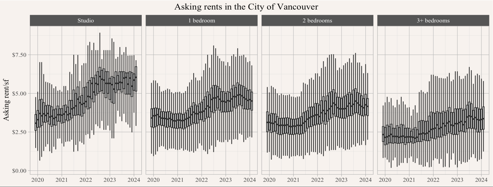
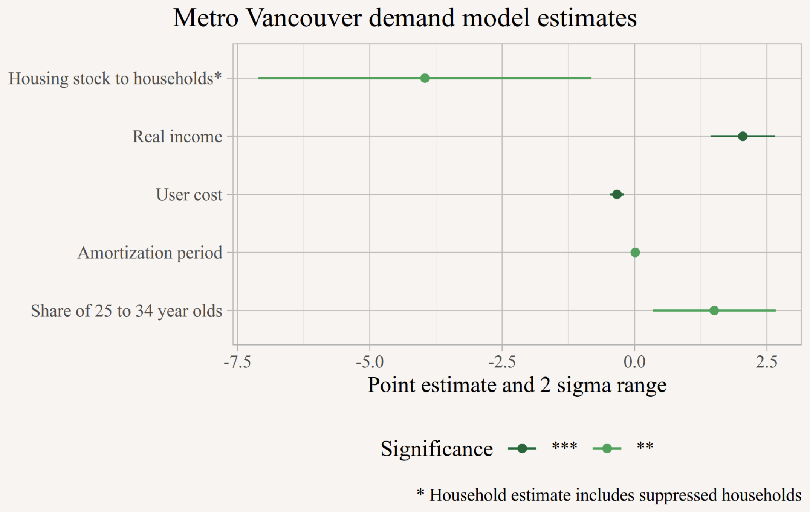
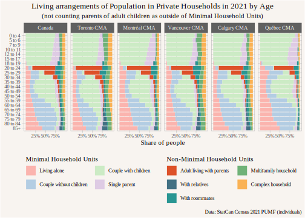
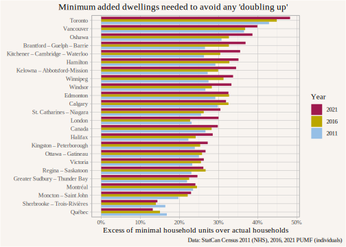
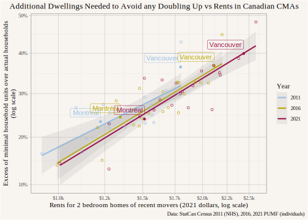

```{r setup, include=FALSE}
library(tidyverse)
library(canpumf)
library(cansim)
library(mountainmathHelpers)
```

# The value of housing

**People derive tremendous value from living in housing!**

Housing provides

::: fragment
-   shelter
:::

::: fragment
-   location
:::

::: fragment
-   privacy
:::

## Location

BC has a housing shortage, but housing in the wrong location is not useful.

::::: columns
::: {.column width="50%"}

:::

::: {.column width="50%"}
Demand for housing varies strongly by location.

-   When housing demand falls, outlying areas are hit first and hardest.
-   When housing demand rises, prices & rents in central areas rise first.
:::
:::::

## Privacy

Housing affords various levels of privacy:

-   Bedrooms: People might share bedrooms or have separate bedrooms
-   Dwelling units: People might share a dwelling unit or live in separate dwelling units

Privacy considerations matter a lot, doubling up is the **main mechanism** how people respond to housing shortages/high rents.

Rent/sf for smaller (Studio or 1 Bedroom) vs larger (2 Bedroom or larger) units

{height="350px"}

# Demand for housing

The two main ingredients of housing demand are:

-   demographic pressure
-   income

Incomes generally change slowly.

To estimate how changes in demographics (and changes in housing supply) will affect housing costs we need to estimate how the demand curve depends on demographics.

This **demand elasticity** is the central ingredient to understand how rents and prices react to changes in supply and demographic pressures.

## Econometric modelling

::::: columns
::: {.column width="50%"}
 Suggests a 1% increase in housing stock lowers prices and rents by \~ 4%. (Literature suggest a point estimate closer to 2.5%.)

(Taken from our [modelling report for BC's SSMUH and TOA policies](https://news.gov.bc.ca/files/bc_SSMUH_TOA_scenarios_Final.pdf).)
:::

::: {.column width="50%"}
This relies on econometric time series modelling:

-   specifies a structural model
-   try to estimate elasticities based on historical changes in demographics, prices, housing stock, income, and other macroeconomic factors
-   has to overcome significant endogeneity issues
-   comes with considerable uncertainties

#### Can we understand this more directly looking via demographic modelling?
:::
:::::

# Demographic estimates of shortages

How have people distributed over housing historically?


## How does this play out in detail?



## Benchmarking shortages

::::: columns
::: {.column width="60%"}
How much housing is needed to eliminate all doubling up?

 Some doubling up may be voluntary, Quebec CMA puts a bound on that.
:::

::: {.column width="40%"}
The regions with the highest housing shortfall are also the regions with the highest rents, and this is no coincidence.
:::
:::::

## Shortages and rents

::::: columns
::: {.column width="60%"}


There is a strong relationship between housing shortages and rents.
:::

::: {.column width="40%"}
Other factors matter too, in particular:

-   incomes
-   cultural tolerance of doubling up

```{r}
slope <- 0.2330284

ratio_response <- function(housing_increase) {
  1-housing_increase/(1+housing_increase)
}

supply_response <- function(housing_increase) {
 exp(log(ratio_response(housing_increase))/slope)-1
}
```

Relationship suggests that increasing the housing stock in Vancouver by 1% reduces rents by `r scales::percent(-supply_response(0.01),accuracy=0.1)`, similar to econometric estimate.

(This does not account for migration response which reduces the effect.)
:::
:::::

# Lesson for architects

-   Shortages and high rates of doubling up shifts demand to smaller units.
-   Housing stays around for a long time, if we reduce shortages demand shifts to larger units.
-   Think about **resilience**, how to design housing today to adapt to tomorrows needs? Is it easy to combine units? What other ways are there to ensure resiliency to changing demand patterns?

## Thank you!

These slides are online at <https://mountainmath.ca/pw_seminar/>.

### References and further reading

::: {#refs}
:::

::: {style="padding-top:100px;"}
:::

You can reach me via [Bluesky (\@jensvb)](https://bsky.app/profile/jensvb.bsky.social), [Linkedin (\@vb-jens)](https://www.linkedin.com/in/vb-jens/), or [email (jens\@mountainmath.ca)](mailto::jens@mountainmath.ca).
