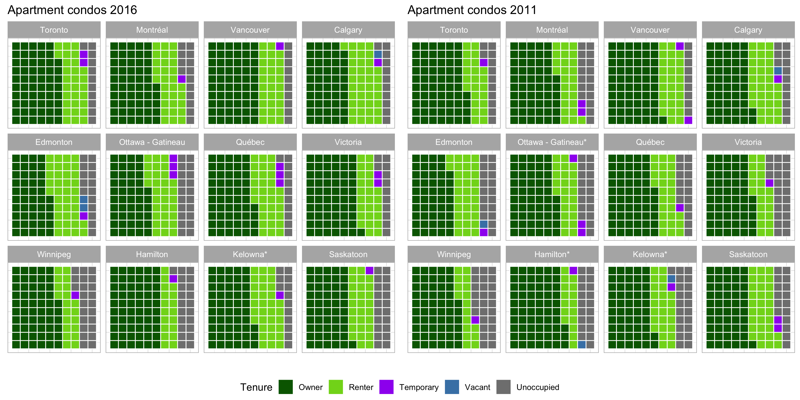

```{r setup, include=FALSE}
knitr::opts_chunk$set(
	echo = FALSE,
	message = FALSE,
	warning = FALSE,
	dev="svg"
)
options(htmltools.dir.version = FALSE)
library("knitr")
library("utils")
library(tidyverse)
library(cancensus)
library(cancensusHelpers)
library(cansim)
library(cmhc)
library(rental)
library(sf)
options(servr.daemon = TRUE)

bg_color="#c0c0c0"
theme_opts<-list(theme(panel.grid.minor = element_blank(),
                       #panel.grid.major = element_blank(), #bug, not working
                       panel.grid.major = element_line(colour = bg_color),
                       panel.background = element_rect(fill = bg_color, colour = NA),
                       plot.background = element_rect(fill=bg_color, size=1,linetype="solid"),
                       axis.line = element_blank(),
                       axis.text.x = element_blank(),
                       axis.text.y = element_blank(),
                       axis.ticks = element_blank(),
                       axis.title.x = element_blank(),
                       axis.title.y = element_blank()))

```


# Goals for this talk: 

1) What does reproducibility mean today?

2) Showcase some tools to work with [census](https://mountainmath.github.io/cancensus/index.html), [CMHC](https://github.com/mountainMath/cmhc), [cansim](https://mountainmath.github.io/cansim/index.html) and other public data

3) Highlight some obstacles and data gaps

4) Advocate for a culture of collaborative data analysis


---

# So much data, so little time

Data analysis and communication of results take a lot of time. So I favour workflows that facilitate and greatly speed this up while increasing *transparency*, *predictability* and *adaptability*. 

I want to showcase some of these tools dealing with


* Property Level Data
* Census Data
* CMHC Data
* CANSIM Data
* ...

---
# Property Level Data

Property level data lets us explore civic questions at the individual property level. Great detail, but missing demographic variables. Also, sketchy coverage, lots of important variables aren't publicly accessible. Comprehensive data is available to researchers and deep-pocket private interests, but NDAs create barriers.

Because of barriers to access we are mostly stuck at doing simple descriptive analysis visualizations.

Examples:

* [Assessment (and related) Data](https://mountainmath.ca/map/assessment)
* [Teardown Index data story](https://mountainmath.ca/teardowns)
* [Tax Density](https://mountainmath.ca/assessment_gl/map)
* [Houses and Dirt Explorer](https://mountainmath.ca/assessment/split_map)
* Listings data

???
Sadly, most useful data is not publicly available. Can be accessed for research through cumbersome process and results can't be shared unless dropping detail and aggregated to high level.
---
# Data infrastructure 
Just as important as access to data is data infrastructure. Good API access to data is critical to efficiently working with data, and it provides a great starting point of collaborative analysis.

APIs come at different levels of usefulness:

--

1) Standardized, versioned and authoritative APIs
- Ideally APIs have clear data protocols that clients can rely on. They are versioned so that changes to API don't break infrastructure that builds on older versions. And they are implemented by the entity generating the data, providing an authoritative source.
- The new StatCan NDM is standardized and authoritative, but not fully versioned. 

--

2) Third party APIs,
- When APIs are not available, a third part may mirror the data and implement an API. CensusMapper is one example.

--

3) Pseudo-APIs. Data available, but it requires clicking through a website, accumulating cookies and submitting web forms to download data.
- One can implement a pseudo-API that wraps this process and provides a clean interface to access data.
- CMHC is an example, and my *cmhc* R package wraps this.
---
# Examples of data infrastructure

CensusMapper is my answer to the inaccessibility of census data by non-experts. 

It allows instant and flexible mapping of census data. Canada wide. Maps can be narrated, saved and shared. By anyone.

---
background-image: url("https://doodles.mountainmath.ca/images/net_van.png")
background-position: 50% 50%
background-size: 100%
class: center, bottom, inverse

# <a href="https://censusmapper.ca/maps/731" target="_blank">CensusMapper Demo</a>

???
Lots of hidden features too that aren't accessible to general public. Don't have the resources to make them more user-friendly and release to public free to use.
---

# Maps aren't analysis

CensusMapper has APIs to facilitate deeper analysis. Open for all to use. 

[`cancensus`](https://github.com/mountainMath/cancensus) is an R package that seamlessly integrates census data into data analysis in R.

Let's try and understand the effects of the net migration patterns by age on the age distribution.

???
While we do need better data, we don't make good use of the data we already have. What's needed most is analysis.
---

# Age pyramids
How does the net migration effect the age distribution in each municipality?

```{r, message=FALSE, warning=FALSE, include=FALSE}
age_pyramid_styling <- list(
  scale_x_discrete(breaks=c(seq(0, 100, 5),"100+")),
  scale_y_continuous(labels = scales::comma),
  coord_flip(),
  scale_fill_brewer(palette = "Set1"),
  theme_bw(),
  labs(caption="cancensus, StatCan 2016 census"))
```

```{r canada_age, echo=TRUE, fig.height=3.5, fig.width=9, message=FALSE, warning=FALSE, dev='svg'}
plot_data <- get_age_data('CA16',list(CSD=c("5915022","5915004","5915055"))) %>% 
  rename(City=`Region Name`)
ggplot(plot_data, aes(x = Age, y = Population, fill = Gender)) + geom_bar(stat="identity") +
  facet_wrap("City",nrow=1, scales="free_x") + age_pyramid_styling
```

???
Explain how net migration patterns lead to different age distributions.
---
background-image: url("/images/api_tool.png")
background-position: 50% 50%
background-size: 100%
class: center, bottom, inverse

# <a href="https://censusmapper.ca/api" target="_blank">CensusMapper API Demo</a>

---

# Value of API access

* Census data is already openly available, but API access makes it easy to work with.

* Bulk census data is unwildly, hard to share and often gets manually pre-processed which breaks reproducibility.

* [`cancensus`](https://github.com/mountainMath/cancensus) is an R wrapper for these APIs that makes analysis reproducible, transparent and adaptable and accessible to everyone.

--

.center[**Well, maybe not everyone. But everyone here.**]

---

# Non-census data
CMHC provides great housing-related data. It's a pain to download, so I built an [pseudo-API in R](https://github.com/mountainMath/cmhc).

```{r, message=FALSE, warning=FALSE, include=FALSE}

# A function to read and tidy CMHC data
vacancy_rent_table_for <- function(geography,geography_type="CMA"){
  region_params=cmhc_region_params(geography = geography,type=geography_type)
  params=cmhc_timeseries_params(table_id = cmhc_table_list["Rms Vacancy Rate Time Series"],region=region_params)
  dat_vacancy=get_cmhc(params)
  title_x=attr(dat_vacancy,"title")
  dat_vacancy <- dat_vacancy %>% 
    select("X1","Total") %>%
    #mutate(Total=as.numeric(as.character(Total))/100) %>%
    rename(vacancy_rate=Total, X=X1)
  params=cmhc_timeseries_params(table_id = cmhc_table_list["Rms Rent Change Time Series"],region=region_params)
  dat_rent_change=get_cmhc(params)
  title_y=attr(dat_rent_change,"title")
  dat_rent_change <- dat_rent_change %>%
    select("X1","Total") %>%
    #mutate(Total=as.numeric(as.character(Total))/100) %>%
    rename(rent_change=Total, X=X1)
  dat=inner_join(dat_vacancy,dat_rent_change,by="X") %>% rename(Year=X)
  attr(dat,"region")=paste0(geography," ",geography_type)
  attr(dat,"labels")=c(title_x,title_y)
  return(dat)
}

get_vacancy_rent_data <- function(names,level){
  cmhc=bind_rows(lapply(names,function(x){return(vacancy_rent_table_for(x,"CMA")) %>% mutate(city=x)})) %>% 
    gather(key = "Series", value = "Rate",vacancy_rate:rent_change) %>%
    mutate(
      Series = case_when(
      .$Series == "vacancy_rate" ~ "Vacancy Rate",
      .$Series == "rent_change" ~ "Rent Change"),
      Year = as.Date(paste0(Year," 01"),format="%Y %B %d"),
      Rate=Rate/100)
  return(cmhc)  
}

vanancy_plot_options=list(
    # labs(#title="Vacancy Rate vs Change in Rent", 
    #    #subtitle ="Select Cities",
    #    caption="Source: CMHC Rms, code: https://github.com/mountainMath/cmhc"),
  scale_y_continuous(labels = scales::percent),
  xlab("") ,
  scale_x_date(breaks = seq(as.Date("1990-10-01"), as.Date("2016-10-01"), by="2 years"), 
    date_labels=format("%b %Y")),
  scale_color_manual(labels = c("% Rent Change\n(fixed sample)","Vacancy Rate"), values = c("darkgreen", "steelblue"), name = ""),
  theme_minimal(),
  theme(axis.text.x = element_text(angle = 45, hjust = 1))
)

```


```{r, echo=TRUE, fig.height=4, fig.width=10, message=FALSE, warning=FALSE, dev="svg"}
cmhc <- get_vacancy_rent_data(c("Vancouver","Toronto","Calgary","Winnipeg"),"CMA")
ggplot(cmhc, aes(x = Year, y = Rate, color = Series)) + vanancy_plot_options +
  geom_line() + geom_point() + facet_wrap("city", ncol=2) 
```

???
CMHC has recently made finer data available. Sadly no APIs, but we can hack their data portal to speed up analysis. So we built a pseudo-API to consume it.

This graph shows the primary market vacancy rate and the fixed-sample rent change on the same axis. We note the clear inverse relationship between the two, with sometimes strong responses in non rent-controlled Calgary. And yes, rents do drop when the vacancy rate is high.
---
#  CANSIM
How to add more context to this? What macro-economic factors drive rent and rental vacancy rates? StatCan provides data we can fold in for deeper insights.

```{r}
pre_process <- function(data) {
  data %>% 
    filter(grepl("Mainland|Toronto|Calgary|Montr|Ottawa|Edmonton|Canada|Vancouver",GEO)) %>%
    mutate(GEO=sub(",.+$","",GEO),
           Date=as.Date(paste0(REF_DATE,"-01")))%>% 
    normalize_cansim_values %>% 
    filter(Statistics=="Job vacancy rate") %>%
    group_by(GEO)
}
job_vacancy_theme <- list(
  theme_bw(),
  scale_color_brewer(palette = "Dark2"),
  scale_y_continuous(labels=scales::percent),
  labs(title="Job Vacancy Rate",y="",x="",fill="", 
       color="Economic Region","StatCan 14-10-0325")
)
```


```{r echo=TRUE, fig.height=3, fig.width=7}
data <- get_cansim("14-10-0325") %>% pre_process

ggplot(data,aes(x=Date,y=VALUE,color=GEO)) +
  geom_line(alpha=0.3) + geom_smooth(se=FALSE) +
  job_vacancy_theme 
```

---
# Rents and income in Vancouver
```{r}

max_increases <- read_csv("data/max_rent_increase.csv") %>%
  mutate(`Max Allowable`=as.numeric(gsub("%","",rate))/100) %>%
  mutate(Date=as.Date(paste0(Year,"-10-01"))) %>%
  select(Date,`Max Allowable`) 

categories=c("Bachelor","1 Bedroom","2 Bedroom","3 Bedroom +","Total")
region_params=cmhc_region_params(geography = "Vancouver",type="CMA")
params=cmhc_timeseries_params(table_id = cmhc_table_list["Rms Vacancy Rate Time Series"],region=region_params)
dat_vacancy=get_cmhc(params) %>%
  mutate(Date=as.Date(paste0(X1," 01"),format="%Y %B %d")) %>%
  select("Date",categories) %>%
  gather(key="Type",value="Value",categories) %>%
  mutate(Value=Value/100)

inflation <- get_cansim("18-10-0256") %>% 
  normalize_cansim_values() %>%
  filter(`Alternative measures`=="Measure of core inflation based on a factor model, CPI-common (year-over-year percent change)") %>%
  select(Date,VALUE)

inflation_van <- get_cansim("18-10-0004") %>%
  normalize_cansim_values() %>% 
  filter(grepl("Vancouver",GEO),
         `Products and product groups`=="All-items") %>%
  select(Date,VALUE) %>%
  rename(CPI=VALUE)

inflation_van_rent <- get_cansim("18-10-0004") %>%
  normalize_cansim_values() %>% 
  filter(grepl("Vancouver",GEO),
         `Products and product groups`=="Rented accommodation") %>%
  select(Date,VALUE) %>%
  rename(CPI_rent=VALUE)

income_van <- get_cansim("11-10-0012") %>%
  normalize_cansim_values() %>% 
  filter(grepl("Vancouver",GEO)) %>%
  mutate(Date=as.Date(paste0(REF_DATE,"-10-01"))) %>%
  filter(`Family income`=="Median total income",
         `Age of older adult`== "Total all ages")%>% # "25 to 34 years") %>%
  select(Date,`Family type`,VALUE) %>%
  spread(key="Family type",value="VALUE")

params=cmhc_timeseries_params(table_id = cmhc_table_list["Rms Rent Change Time Series"],region=region_params)
rent_change_data <- get_cmhc(params)

index_data_since <- function(data,year){
  dat_rent_change=data %>%
    mutate(Date=as.Date(paste0(X1," 01"),format="%Y %B %d")) %>%
    select("Date",categories) %>%
    mutate(Bachelor=coalesce(Bachelor,Total),
           `1 Bedroom`=coalesce(`1 Bedroom`,Total),
           `2 Bedroom`=coalesce(`2 Bedroom`,Total),
           `3 Bedroom +`=coalesce(`3 Bedroom +`,Total)) %>%
    gather(key="Type",value="Value",categories) %>%
    left_join(inflation) %>%
    left_join(inflation_van) %>%
    left_join(inflation_van_rent) %>%
    left_join(income_van) %>%
    left_join(max_increases) %>%
    mutate(`Max Allowable`=coalesce(`Max Allowable`,0)) %>%
    mutate(Value=Value/100+1,
           VALUE=VALUE+1,
           `Max Allowable`=`Max Allowable`+1) %>%
    mutate(Value=coalesce(Value,1)) %>%
    group_by(Date) %>%
    spread(key="Type",value="Value") %>%
    mutate(Series="Change") %>%
    ungroup
   
    
  dates <- dat_rent_change %>% 
    filter(Date>=as.Date(paste0(year,"-01-01"))) %>% 
    pull(Date) %>%
    unique %>% 
    sort
  last_date=dates[1]
  ld=dat_rent_change %>% filter(Date==last_date)
  dat_rent_change <- dat_rent_change %>% 
    filter(Date %in% dates) %>%
    mutate(CPI=CPI/ld$CPI,
           CPI_rent=CPI_rent/ld$CPI_rent,
           `Couple families`=`Couple families`/ld$`Couple families`,
           `Lone-parent families`=`Lone-parent families`/ld$`Lone-parent families`,
           `Persons not in census families`=`Persons not in census families`/ld$`Persons not in census families`)
  #dat_rent_change$Series[dat_rent_change$Date==last_date]="Index"
  dat_rent_change[dat_rent_change$Date==last_date,]=dat_rent_change[dat_rent_change$Date==last_date,] %>% mutate(
    Series="Index",VALUE=1,`Bachelor`=1,`1 Bedroom`=1,`2 Bedroom`=1,`3 Bedroom +`=1,Total=1,`Max Allowable`=1
  )
  for (i in seq(2,length(dates))) {
    date=dates[i]
    changes <- dat_rent_change %>% 
      filter(Date==date,Series %in% c("Change")) 
    new_rows <- dat_rent_change %>% 
      filter(Date==last_date,Series=="Index") %>%
      mutate(Date=date,Series="Index",CPI=changes$CPI,CPI_rent=changes$CPI_rent,
             `Couple families`=changes$`Couple families`,
             `Lone-parent families`=changes$`Lone-parent families`,
             `Persons not in census families`=changes$`Persons not in census families`)
    for (c in c("VALUE",c(categories,"Max Allowable"))) {
      new_rows[[c]]=new_rows[[c]]*changes[[c]]
    }
    dat_rent_change <- bind_rows(dat_rent_change,new_rows)
    last_date=date
  }
  dat_rent_change
}
```

```{r fig.height=4, fig.width=7}
all_cats=c(categories,"Max Allowable","CPI Vancouver","Couple families","Lone-parent families","Persons not in census families")
colors <- set_names(c(RColorBrewer::brewer.pal(length(categories)+1,"Reds")[2:(length(categories)+1)],
                      "purple",
                      "black",
                      rev(RColorBrewer::brewer.pal(4,"Blues")[2:4])),all_cats)

year=2003
dat_rent_change <- index_data_since(rent_change_data,year) 


plot_data <- dat_rent_change %>% 
  filter(Series=="Index") %>% 
  mutate(`CPI Vancouver`=CPI,
         `Inflation Canada`=VALUE) %>%
  gather(key="Type",value="Value",all_cats,factor_key=TRUE) %>%
  mutate(Value=Value*100,
         VALUE=VALUE*100,
         CPI=CPI*100,
         CPI_rent=CPI_rent*100) 
ggplot(plot_data ,aes(x=Date,y=Value,color=Type,group=Type)) +
  geom_line() +
  #geom_line(aes(y=CPI),color="black") +
  #geom_line(aes(y=CPI_rent),color="grey") +
  theme_bw() +
  scale_color_manual(values=colors)+
  labs(title="Indexed Fixed sample rent, CPI & Family Income, Vancouver CMA",x="Year",y=paste0("Index (Oct ",year," = 100)"),
       caption="CMHC RMS, CANSIM 18-10-0004, 11-10-0012, BC Housing & Tenancy")

```

---
# Next steps in data infrastructure

As our depth of data processing and analysis increases, we start to need a shared infrastructure for derived data.

--

* Build an infrastructure for sharing custom data extracts, even when they are not fully standardized. For example custom census tabulations.

* For complex models where training is computationally intensive or some of the training data is sensitive we can share the model kernel or other model output.

* Build out statistical tools to deal with common data issues. Examples are [tongfen](https://github.com/mountainMath/tongfen) to make census geographies and data comparable across census years, or more robust ecological inference models for estimating individual level correlations from aggregate data.

---
# Some concrete ideas for needed data infrastructure

- Mixing in real estate listings data

- Keeping the census fresh

- Build out [tongfen](https://github.com/mountainMath/tongfen) to all census geographies and expand API coverage for census years.

- Advanced ecological inference models

---

# Rental Listings Data
Rental listings data is another data source that can augment survey and census data.

```{r echo=FALSE, message=FALSE, warning=FALSE}
library(rental)

s_time="2018-08-01"
e_time="2018-11-30"
min_listings=10
  
median_rent <- function(v){
  ifelse(length(v)>=min_listings, median(v),NA)
} 
yvr_cts=get_census(dataset = 'CA16',regions=list(CMA="59933"),geo_format='sf',level="CT")
listings_data <- get_listings(s_time,e_time,st_union(yvr_cts$geometry),beds=1,filter = 'unfurnished')
aggregate_listings <- aggregate(listings_data %>% select("price"),yvr_cts,median_rent)

rental_map_theme <- list(
  scale_fill_gradient2(low="darkgreen",high="darkred",mid="yellow",midpoint=median(aggregate_listings$price,na.rm=TRUE),
                       labels=scales::dollar),
  labs(title="1 Bedroom Unfurnished Median Ask",caption=paste0(s_time," to ",e_time),
       fill="Asking price"),
  theme_opts
)
```

```{r price_map, echo=TRUE, fig.height=3.25, fig.width=7, dev='svg'}
yvr_cts=get_census(dataset = 'CA16',regions=list(CMA="59933"),geo_format='sf',level="CT")
listings_data <- get_listings(s_time,e_time,st_union(yvr_cts$geometry),beds=1,filter = 'unfurnished')
aggregate_listings <- aggregate(listings_data %>% select("price"),yvr_cts,median_rent)
ggplot(aggregate_listings,aes(fill = price)) +
  geom_sf(size=0.1) + rental_map_theme
```

Rental listings data is messy, but provides fine-grained and real-time information. Can augment CMHC survey and census data to provide more timely insights into rental market.

???
Only showing data for areas with at least 10 listings.

---
# For sale listings data
Listings data is great to complement public data, but vague legal framework prevents easy sharing of data, analysis and results.


We are still working off of 20th century models and concepts. HPI is a good all-purpose tool, but too coarse to be used in most analysis.

???
Non-open nature of this data limits how this data can be used and makes collaborative approaches very hard.

---
# Keeping the Census fresh
The 2016 census data is still quite up to date. But the clock is ticking, how can we keep it fresh? 

```{r, echo=FALSE, message=FALSE, warning=FALSE, dev="svg", fig.height=3.5, fig.width=7}
cma_uid="59933"
cansim_data <- get_cansim("17-10-0078") %>% 
  normalize_cansim_values() %>%
  filter(GeoUID==substr(cma_uid,3,5),`Age group`=="All ages",Sex=="Both sexes") %>% 
  mutate(type="CANSIM") %>%
  rename(Value=VALUE,
         Ref_Date=REF_DATE)

census_data <- do.call(rbind,lapply(c(2006,2011,2016),function(year){ 
  dataset=paste0("CA",substr(as.character(year),3,4))
  get_census(dataset=dataset,regions=list(CMA=cma_uid),vectors=c("v_CA16_1"),level="Regions") %>%
    mutate(GEO=`Region Name`,Value=Population,Ref_Date=year) %>%
    select(GEO,Value,Ref_Date,Population,Dwellings,Households) %>%
    mutate(type="Census")
  }
))

data <- rbind(cansim_data %>% select(Ref_Date,GEO,Value,type) %>% filter(Ref_Date >=2006),
              census_data %>% select(Ref_Date,GEO,Value,type))

ggplot(data,aes(x=Ref_Date,y=Value, color=type,group=type)) +
  geom_line() +
  geom_point() +
  theme_bw()+
  #expand_limits(y = 0) +
  scale_y_continuous(labels=scales::comma) +
  scale_color_manual(name="Source", values=c(CANSIM="red",Census="blue")) +
  labs(title="Vancouver CMA Population Estimates",x="Year",y="Population",caption="CANSIM 051-0056, via CANSIM2R, Census via cancensus")
```

CANSIM data includes census undercounts. We can use relative changes in CANSIM data to estimate changes in Census data.

???
A retroactive look.
---
# Where in Vancouver did people move to?

CMHC building data can tell us where people go, we can use past censuses migration data to model demolition rates and the demographics of the new units.

```{r, echo=FALSE, fig.height=4, fig.width=7, message=FALSE, warning=FALSE, dev='svg'}

cma="Vancouver"

census_cma=census_geography_list[[cma]]
cma_header=substr(census_cma, nchar(census_cma)-2,nchar(census_cma))


census_cma=census_geography_list[[cma]]
cma_header=substr(census_cma, nchar(census_cma)-2,nchar(census_cma))

#get all under construction data for Vancouver and pad CT GeoUIDs.

dates <- seq(from=as.Date('2011-05-01'), to=as.Date("2016-04-01"),by='months' )

# CMHC server is excrutiatingly slow, so good idea to cache data
get_completions <- function(dates) {
  do.call(rbind,lapply(dates,function(date){
    month=strftime(date,format="%m")
    year=strftime(date,format="%Y")
    c<-get_cmhc(cmhc_snapshot_params(
    table_id=cmhc_table_list["Scss Completions CT"],
    geography_id = cmhc_geography_list[[cma]],
    year = year,
    month = month)) %>% 
    mutate(GeoUID = paste0(cma_header,X1),
           date=date) %>% 
      select(-X1,-X2)
    return(c)
    })) 
}

completions <- simpleCache(get_completions(dates),"van_completions") %>% 
  mutate(year=as.integer(substr(date,1,4)))

geos11 <- get_census(dataset = 'CA11', regions=list(CMA=census_cma),level='CT',geo_format='sf') %>% 
  select(-`NHS Non-Return Rate`) %>%
  inner_join(
  completions %>% 
    filter(year>=2012) %>% 
        select(-date,-year) %>% 
    group_by(GeoUID) %>% 
    summarise_all(sum), by="GeoUID"
) 

geos06 <- get_census(dataset = 'CA06', regions=list(CMA=census_cma),level='CT',geo_format='sf') %>%
  inner_join(
      completions %>% 
      filter(year<2012) %>% 
        select(-date,-year) %>% 
      group_by(GeoUID) %>%
    summarise_all(sum), by="GeoUID"
  )

baseVars=c("Population","Dwellings","Households")
cmhcVars=c("Single","Semi-Detached","Row", "Apartment","All")
vars=c(baseVars,cmhcVars)
geos11 <- common_cts(geos06,geos11,vars) 

geos_data=rbind(geos06 %>% as.data.frame %>% select("GeoUID",cmhcVars),
                geos11 %>% as.data.frame %>% select("GeoUID",cmhcVars)) %>% 
  group_by(GeoUID) %>% summarize_all(sum,na.rm=TRUE)

geos=geos11 %>% select(GeoUID,baseVars) %>% inner_join(geos_data,by="GeoUID") %>%
  mutate(units=All) %>% #-Single/2) %>% #`Semi-Detached` + Row + Apartment) %>%
  mutate(`Estimated Dwellings`=Dwellings + units) 

breaks=c(-Inf,1,10,20,50,100,150,200,400,1000,Inf)
labels <- c(paste0("0 - ",breaks[2]))
for(i in 2:(length(breaks)-2)){
  labels[i] = paste(breaks[i],breaks[i+1], sep=" - ")
}
labels[length(breaks)-1]=paste0("Over ",breaks[length(breaks)-1])
#colors=c("darkred",(RColorBrewer::brewer.pal(length(labels)-1,"YlGnBu")))
labels=factor(labels, levels=labels)
colors=setNames(c("#808080",RColorBrewer::brewer.pal(length(labels)-1,"Greens")),labels)
#colors=factor(as.character(colors),levels=as.character(colors))

# categorize the numbers under contruction
geos$categories <- geos$units %>% cut(breaks=breaks, labels=labels)
total=sum(geos$units)

ggplot(geos) +
  geom_sf(aes(fill = categories), size = 0.05) +
  scale_fill_manual(labels=labels, values=colors, name = "Number of Units\nMay 2011 - May 2016") +
  ggtitle(paste0(cma, " CMA Completions May 2011 - April 2016 (",prettyNum(total,big.mark = ",")," total)")) +
  theme_opts
```

???
Mixing in concurrent data sources like CMHC and CANSIM can extend the useful life of census data. Data APIs designed to be easily integrated facilitate this. And APIs make it simple to update analysis when new data becomes available.
---
# Reality Check
Census and CMHC timelines of completions don't always line up. Demolitions explain part of that, as do slow move-ins in recent completions, and as issues in Census and CMHC data.

```{r, echo=FALSE, fig.height=4.5, fig.width=7, message=FALSE, warning=FALSE}
geos16 <- get_census(dataset = 'CA16', regions=list(CMA=census_cma),level='CT',geo_format='sf')
geos16 <- common_cts(geos,geos16,baseVars)
geos_total <- inner_join(geos %>% 
                           mutate(Dwellings2011=Dwellings) %>%
                           select("GeoUID","Dwellings2011","units","Estimated Dwellings"), 
                         geos16 %>% as.data.frame %>% select(GeoUID,Dwellings),by="GeoUID") %>%
  mutate(difference=`Estimated Dwellings`-Dwellings)

diff_breaks=c(-Inf,-400,-200,-100,-50,50,100,200,400,Inf)
diff_labels <- c(paste0("Under ",diff_breaks[2]))
for(i in 2:(length(diff_breaks)-2)){
  diff_labels[i] = paste(diff_breaks[i],diff_breaks[i+1], sep=" - ")
}
diff_labels[length(diff_breaks)-1]=paste0("Over ",diff_breaks[length(diff_breaks)-1])
#colors=c("darkred",(RColorBrewer::brewer.pal(length(labels)-1,"YlGnBu")))
diff_labels=factor(diff_labels, levels=diff_labels)
diff_colors=setNames(RColorBrewer::brewer.pal(length(diff_labels),"PiYG"),diff_labels)
geos_total$diff_categories <- geos_total$difference %>% cut(breaks=diff_breaks, labels=diff_labels)

diff_total <- sum(geos_total$difference)

ggplot(geos_total) +
  geom_sf(aes(fill = diff_categories), size = 0.05) +
  scale_fill_manual(labels=diff_labels, values=diff_colors,name = "Estimate - Actual") +
  ggtitle(paste0(cma, " CMA Estimate - Actual (",prettyNum(diff_total,big.mark = ",")," difference)")) +
  theme_opts
```

???
Estimate is reasonably good. There are some timing issues with completions close to the census. Single family areas see relatively many demolitions for each new built, should not be hard for a model to learn to estimate.

---
# Mixing data sources
Mixing data from different sources is tricky. Sometimes we want to make individual-level inferences from aggregate data.

Classical example is inferring minority voting and turnout from aggregate eligible voter and voting results data.

In the context of housing data it could be inferring data on property usage by mixing Airbnb scrapes, census data, electricity usage data and other administrative sources. These datasets can't be mixed at the individual property level.

---
# A Toy Example
Consider an example where we know the answer. Take the number of households spending more than 30% of income on shelter in each census tract in Metro Vancouver, as well as the share of Owner and Tenant households. We want to know what share of Owner and Renter households each spend more than 30% of income on shelter.

```{r, fig.height=3, fig.width=6, message=FALSE, warning=FALSE, include=FALSE}
vectors=c("v_CA16_4886", # total shelter-to-income
          "v_CA16_4888", # total spending >30% income on shelter
          "v_CA16_4890", # total owner
          "v_CA16_4892", # pct_100 owners spending >30% income on shelter 
          "v_CA16_4897", # total renter
          "v_CA16_4899", # pct_100 renters spending >30% income on shelter
          "v_CA16_4891", # pct_100 owner households with mortgage
          "v_CA16_4898", # pct_100 renter households in subsidized housing
          "v_CA16_2540"  # pct_100 limat 
        ) 
ei_data <- get_census(dataset='CA16', 
                           regions=list(CMA="59933"), 
                           vectors=vectors, 
                           level='CT',
                           geo_format="sf", 
                           labels='short') 

ei_data <- ei_data %>%
  mutate(shelter_poor=v_CA16_4888/v_CA16_4886,
         shelter_ok = 1 - shelter_poor,
         sum = v_CA16_4890 + v_CA16_4897,
         owner_pct = v_CA16_4890/sum,
         renter_pct = v_CA16_4897/sum,
         total = as.integer(v_CA16_4886),
         rent_poor = v_CA16_4899/100.0,
         house_poor = v_CA16_4892/100.0,
         mortgage = v_CA16_4891/100,
         subsidized = v_CA16_4898/100,
         limat = v_CA16_2540/100)
```

```{r, echo=FALSE, fig.height=4, fig.width=6, message=FALSE, warning=FALSE}
ei_data_fit <- glm(shelter_poor ~ renter_pct, data=ei_data)
predicted_ei <- data.frame(shelter_poor = predict(ei_data_fit, ei_data), renter_pct=ei_data$renter_pct)
ggplot(ei_data,aes(x=shelter_poor,y=renter_pct,color=limat)) + 
  geom_point()+#aes(size=total)) +
  scale_color_viridis_c(option="magma", labels=scales::percent) +
  geom_line(color='red',data = predicted_ei) +
  scale_x_continuous(labels=scales::percent) +
  scale_y_continuous(labels=scales::percent) +
  labs(title="CTs in Vancouver CMA",x="Share Spending >30% of Income on Shelter Cost", 
       y="Share of Tenant Households", color="LIMAT", size="Households")
```

---
# Ecological Inference
Ecological inference builds a distribution over the space of our quantities of interest, the share of owners $\beta^w$ and the share of renters $\beta^b$ spending more than 30% of income on shelter.

```{r, message=FALSE, warning=FALSE, include=FALSE}
library(ei)
filtered_ei_data <- ei_data %>% na.omit
data <-  filtered_ei_data %>% dplyr::select(shelter_poor, renter_pct, total, GeoUID, mortgage,subsidized,limat)
truth <- filtered_ei_data %>% dplyr::select(rent_poor, house_poor)
cache_file=paste0(getOption("cache_path"),"ei_data.Rda")
if (file.exists(cache_file)) { # speed things up
  load(cache_file)
} else {
result <- ei(formula = shelter_poor ~ renter_pct, 
             data=data,
             id="GeoUID",
             truth=truth,
             total="total",
             Zw="limat",Zb="limat")
  save(result,file=cache_file)
}
estimate <- eiread(result,"maggs")
goodman <- eiread(result,"goodman")

```


```{r, echo=FALSE, fig.height=4.5, fig.width=5}
plot(result, "tomog")
```

---

```{r, echo=FALSE, fig.height=5, fig.width=6}
plot(result, "tomogE")
```

```{r, include=FALSE}
ei_table <- tibble(Type=c("Owner Households","Tenant Households"),`Goodman Regression`=c(goodman["BetaW","Estimate"],goodman["BetaB","Estimate"]),`Ecological Inference`=c(format_percent(estimate[2]),format_percent(estimate[1])),Actual=c("25.4%","43.5%"))

ei_table %>% knitr::kable()
```
Tenants spending > 30% of income on shelter: `r format_percent(estimate[1])`, Goodman Reg: `r format_percent(goodman["BetaB","Estimate"])`, Actual: 43.5%

Owners spending > 30% of income on shelter: `r format_percent(estimate[2])`, Goodman Reg: `r format_percent(goodman["BetaW","Estimate"])`, Actual: 25.4%


```{r, eval=FALSE, include=FALSE}
plot_data=cbind(filtered_ei_data,betaw=result$betaw)
ggplot(plot_data,aes(x=betaw,y=house_poor,size=total, color=limat)) + geom_point()
```

---
# Mapping the Residuals
A geographic check of the residuals reveals where we went wrong. In regular examples we don't have this information and have to rely on other tests to understand the presence of biases in our model and refine it.

```{r, echo=FALSE, fig.height=4.5, fig.width=6, message=FALSE, warning=FALSE}
ei_data2 <- left_join(ei_data,tibble(GeoUID=result$id,betaw=result$betaw),by="GeoUID") %>% 
  mutate(Estimate=betaw, `House Poor`=house_poor,Difference=betaw-house_poor) 
# ggplot(ei_data2 %>% gather(key="type",value="Share",c("Estimate","House Poor")), aes(fill=Share)) +
#   geom_sf(size=0.1) +
#   facet_wrap("type",nrow=1) + theme_opts
ggplot(ei_data2, aes(fill=Difference)) +
  scale_fill_viridis_c() +
  geom_sf(size=0.1) + 
  theme_opts +
  labs(title="Estimate - Actual")
```
```{r, include=FALSE}
detach(package:ei)
detach(package:eiPack)
detach(package:MASS)
```

---

# Reproducibility, Transparency, Adaptability
We need to adopt a more collaborative approach to understanding civic issues.

.pull-left[
### Notebooks
A data Notebook is a document that integrates explanatory text and data analysis. In its crudest form this could be an Excel spreadsheet with embedded comments. At the other end of the spectrum are R or Python Notebooks. In fact, this presentation is an R notebook and [lives on GitHub](https://github.com/mountainMath/presentations/blob/master/reproducible_housing_analysis.Rmd). It contains
all the code to reproduce the graphs in the presentation.
]
.pull-right[
### APIs
In order to be reproducible, any analysis should ship with code and the data. But that's not very adaptable. To be adaptable, the data should come through APIs. That way one can easily make changes that requires slightly different data, e.g. use related census variables, other time frames or geographic regions.

Analysis can automatically update as new data becomes available.
]
--

.center[**Should become standard as base for public policy.**]

--

I will leave you with some quiz questions.

???
This is key to building an ecosystem of people and groups that collaborate to advance understanding of civic issues. Opening up your analysis for everyone to see and pluck apart might be uncomfortable at first, but it's essential to take the discussion to the next level. It increases transparency and trust, and allows others to build on your work.
---
# Question 1

Has affordability in the City of Vancouver gotten better or worse?

--

```{r, message=FALSE, warning=FALSE, include=FALSE}
caption="StatCan census 2006, 2011 NHS, 2016 via cancensus & CensusMapper"
format_percent <- function(x){return(paste0(round(x*100,1),"%"))}
format_number <- function(x){return(format(x,big.mark = ","))}

affordability_graph_for <- function(regions, text_size=4) {
vectors_2016=c("v_CA16_4892","v_CA16_4899")
vectors_2011=c("v_CA11N_2283","v_CA11N_2290")
vectors_2006=c("v_CA06_2049","v_CA06_2051","v_CA06_2053","v_CA06_2056")
data_2016=get_census("CA16",level="Regions",regions=regions,vectors=vectors_2016,labels="short") %>%
  mutate(Owner=v_CA16_4892/100, Tenant=v_CA16_4899/100, Year=2016) 
data_2011=get_census("CA11",level="Regions",regions=regions,vectors=vectors_2011,labels="short") %>%
  mutate(Owner=v_CA11N_2283/100, Tenant=v_CA11N_2290/100, Year=2011) 
data_2006=get_census("CA06",level="Regions",regions=regions,vectors=vectors_2006,labels="short") %>%
  mutate(Owner=v_CA06_2056/v_CA06_2053, Tenant=v_CA06_2051/v_CA06_2049, Year=2006)

data <- do.call(rbind,list(
  data_2016 %>% select("Region Name", "Owner", "Tenant", "Year"),
  data_2011 %>% select("Region Name", "Owner", "Tenant", "Year"),
  data_2006 %>% select("Region Name", "Owner", "Tenant", "Year")
                      )) %>% mutate(Region=`Region Name`) %>% 
         gather(key="Tenure", value="Count",c("Owner","Tenant")) %>%
         mutate(Year=factor(Year,levels=c(2006,2011,2016),ordered=TRUE))

g1 <- ggplot(data, 
       aes(x=factor(Year), y=Count, fill=Tenure)) +
  geom_bar(stat="identity",position="dodge") +
  scale_y_continuous(labels = scales::percent) +
  labs(x="Year", y="Share", title="Households spending 30% or more on shelter") +
  geom_text(aes(label=format_percent(Count)),vjust=-0.5, position = position_dodge(width = 1), size=text_size) +
  expand_limits(y=max(data$Count)*1.15) +
  facet_wrap("Region",ncol=2) +
  theme_bw()
return(g1)
}        

multiple_graph_for <- function(regions, text_size=4) {
vectors_2016=c("v_CA16_4985","v_CA16_4890","v_CA16_4894","v_CA16_4897","v_CA16_4901")
vectors_2011=c("v_CA11N_2563","v_CA11N_2281","v_CA11N_2285","v_CA11N_2288","v_CA11N_2292")
vectors_2006=c("v_CA06_2001","v_CA06_2049","v_CA06_2050","v_CA06_2053","v_CA06_2055")
data_2016=get_census("CA16",level="Regions",regions=regions,vectors=vectors_2016,labels="short") %>%
  mutate(Ratio=(v_CA16_4890*v_CA16_4894+v_CA16_4897*v_CA16_4901)/(v_CA16_4890+v_CA16_4897)*12/v_CA16_4985, Year=2016) 
data_2011=get_census("CA11",level="Regions",regions=regions,vectors=vectors_2011,labels="short") %>%
  mutate(Ratio=(v_CA11N_2281*v_CA11N_2285+v_CA11N_2288*v_CA11N_2292)/(v_CA11N_2281+v_CA11N_2288)*12/v_CA11N_2563, Year=2011) 
data_2006=get_census("CA06",level="Regions",regions=regions,vectors=vectors_2006,labels="short") %>%
  mutate(Ratio=(v_CA06_2049*v_CA06_2050+v_CA06_2053*v_CA06_2055)/(v_CA06_2049+v_CA06_2053)*12/v_CA06_2001, Year=2006) 
# vectors_2016=c("v_CA16_2397","v_CA16_4890","v_CA16_4894","v_CA16_4897","v_CA16_4901")
# vectors_2011=c("v_CA11N_2562","v_CA11N_2281","v_CA11N_2285","v_CA11N_2288","v_CA11N_2292")
# vectors_2006=c("v_CA06_2000","v_CA06_2049","v_CA06_2050","v_CA06_2053","v_CA06_2055")
# data_2016=get_census("CA16",level="Regions",regions=regions,vectors=vectors_2016,labels="short") %>%
#   mutate(Ratio=(v_CA16_4890*v_CA16_4894+v_CA16_4897*v_CA16_4901)/(v_CA16_4890+v_CA16_4897)*12/v_CA16_2397, Year=2016) 
# data_2011=get_census("CA11",level="Regions",regions=regions,vectors=vectors_2011,labels="short") %>%
#   mutate(Ratio=(v_CA11N_2281*v_CA11N_2285+v_CA11N_2288*v_CA11N_2292)/(v_CA11N_2281+v_CA11N_2288)*12/v_CA11N_2562, Year=2011) 
# data_2006=get_census("CA06",level="Regions",regions=regions,vectors=vectors_2006,labels="short") %>%
#   mutate(Ratio=(v_CA06_2049*v_CA06_2050+v_CA06_2053*v_CA06_2055)/(v_CA06_2049+v_CA06_2053)*12/v_CA06_2000, Year=2006) 

data <- do.call(rbind,list(
  data_2016 %>% select("Region Name", "Ratio", "Year"),
  data_2011 %>% select("Region Name", "Ratio", "Year"),
  data_2006 %>% select("Region Name", "Ratio", "Year")
                      )) %>% mutate(Region=`Region Name`) %>% 
         mutate(Year=factor(Year,levels=c(2006,2011,2016),ordered=TRUE))

g1 <- ggplot(data, 
       aes(x=factor(Year), y=Ratio)) +
  geom_bar(stat="identity",position="dodge", fill="steelblue") +
  scale_y_continuous(labels = scales::percent) +
  labs(x="Year", title="Average Shelter cost to Average Income") +
  geom_text(aes(label=format_percent(Ratio)),vjust=-0.5, position = position_dodge(width = 1), size=text_size) +
  expand_limits(y=max(data$Ratio)*1.15) +
  facet_wrap("Region",ncol=2) +
  theme_bw()
return(g1)
} 

library(grid)
library(gridExtra)

```


```{r, echo=FALSE, message=FALSE, warning=FALSE, fig.height=4, fig.width=10, dev='svg'}
region=list_census_regions('CA16', quiet=TRUE, use_cache = TRUE) %>%
  filter(level=='CSD',name=='Vancouver') %>% as_census_region_list

grid.arrange(
  grobs=list(affordability_graph_for(region),multiple_graph_for(region)),
  ncol = 2
  #top = 'Comparing Affordability Measures',
  #bottom=""
  )


```

Diverging narratives that need to be reconciled: At ecological level, it looks like things got worse. At individual levels, it looks like like they got better.

---
# Question 2
Which city has higher incomes, Toronto or Vancouver?

--

```{r, include=FALSE}
caption="StatCan census via cansim and CensusMapper"
format_currency <- function(x){return(paste0("$",format(x,big.mark = ",")))}
regions=list(CSD=c("5915022","3520005"))
```
```{r, message=FALSE, warning=FALSE, include=FALSE}
data_2016 <- get_census(dataset='CA16', regions=regions,
                        vectors=c("v_CA16_2397","v_CA16_2400","v_CA16_2403","v_CA16_2447","v_CA16_2451","v_CA16_2455"),
                        labels="short", geo_format=NA, level='Regions') %>% 
  mutate(Year="2015/2016") %>% 
  rename(`Median Household Income`=v_CA16_2397,
         `Median 1 Person Household Income`=v_CA16_2400,
         `Median 2+ Person Household Income`=v_CA16_2403,
         `Median Family Income`=v_CA16_2447,
         `Median Couple Family`=v_CA16_2451,
         `Median Couple Family with Children`=v_CA16_2455
         )
data_2011 <- get_census(dataset='CA11', regions=regions,
                        vectors=c("v_CA11N_2562","v_CA11N_2567","v_CA11N_2572","v_CA11N_2456","v_CA11N_2462","v_CA11N_2468"), 
                        labels="short", geo_format=NA, level='Regions') %>% 
  mutate(Year="2010/2011") %>% 
  rename(`Median Household Income`=v_CA11N_2562,
         `Median 1 Person Household Income`=v_CA11N_2567,
         `Median 2+ Person Household Income`=v_CA11N_2572,
         `Median Family Income`=v_CA11N_2456,
         `Median Couple Family`=v_CA11N_2462,
         `Median Couple Family with Children`=v_CA11N_2468
         )
data_2006 <- get_census(dataset='CA06', regions=regions,
                        vectors=c("v_CA06_2000","v_CA06_2015","v_CA06_1802","v_CA06_1809"), 
                        labels="short", geo_format=NA, level='Regions') %>% 
  mutate(Year="2005/2006") %>% 
  rename(`Median Household Income`=v_CA06_2000,
         `Median 1 Person Household Income`=v_CA06_2015,
         `Median Family Income`=v_CA06_1802,
         `Median Couple Family`=v_CA06_1809
         ) %>% 
  mutate(
         `Median 2+ Person Household Income`=NA,
         `Median Couple Family with Children`=NA
         )

categories=c("Median Household Income","Median 1 Person Household Income","Median 2+ Person Household Income","Median Family Income","Median Couple Family","Median Couple Family with Children")

data <- do.call(rbind,list(
  data_2016 %>% select("Year", "Region Name",categories),
  data_2011 %>% select("Year","Region Name",categories),
  data_2006 %>% select("Year","Region Name",categories)
  ))
```

```{r income, echo=FALSE, fig.height=4, fig.width=9, message=FALSE, warning=FALSE}
plot_data <- data %>% 
  gather(key="Type", value="Median Income", categories) %>%
  rename(City=`Region Name`) %>%
  mutate(`Household Type` = paste0(Type," ",City)) %>%
  mutate(Year=factor(Year,levels=c("2005/2006","2010/2011","2015/2016"), ordered=TRUE))
ggplot(plot_data, aes(x=Year, y=`Median Income`, group=`Household Type`, color=Type, shape=City, linetype=City, linewidth=2)) +
  scale_color_brewer(palette = "Set2") +
  scale_y_continuous(labels=format_currency) +
  geom_line() + geom_point() +
  labs(title="Median Income Measures", caption=caption) +
      theme_bw()
```

---
# Question 3
What share of Toronto and Vancouver residential properties are owned by owner-occupiers, investors living in Canada and investors living abroad?

--

```{r, message=FALSE, warning=FALSE, include=FALSE}
chsp_data_1 <- get_cansim("0350001") %>% 
  normalize_cansim_values() %>%
  rename(Value=VALUE)
sfs_data <- get_cansim("2050002") %>% 
  normalize_cansim_values() %>%
  rename(Value=VALUE)
```

```{r, echo=FALSE, message=FALSE, warning=FALSE}


sfs_primary_counts <- sfs_data %>% filter(grepl("Vancouver|Toronto",GEO),
                                 `Age group`=="All ages",
                                 `Economic family type`=="Economic families and persons not in an economic family",
                                 Statistics=="Number holding asset or debt",
                                 REF_DATE=="2016",
                                 `Assets and debts`=="Principal residence") %>%
  select(GEO,`Confidence intervals`,Value) %>%
  mutate(GEO=sub(",.+$","",GEO),
         `Confidence intervals`=recode(`Confidence intervals`,`Lower bound of a 95% confidence interval`="lower",
                          `Upper bound of a 95% confidence interval`="upper"),
         type="SFS") 

census_counts <- get_census(dataset='CA16', regions=list(CMA=c("59933","35535")), vectors=c("v_CA16_4890","v_CA16_4896"), labels="short", geo_format=NA, level='Regions') %>% 
  mutate(Value=v_CA16_4890, 
         GEO=gsub(" \\(.+\\)$","",`Region Name`),
         `Confidence intervals`="Estimate",
         type="Census")  %>% 
  select(GEO,`Confidence intervals`,Value,type)

plot_data <- rbind(sfs_primary_counts,census_counts) %>%
  group_by(GEO) %>% spread(key="Confidence intervals", value="Value")

# ggplot(plot_data,aes(x=GEO,y=Estimate, fill=type)) +
#   geom_bar(stat="identity", position="dodge") +
#   scale_y_continuous(labels=scales::comma) +
#   geom_errorbar(aes(ymin=lower, ymax=upper),
#                   size=.3,    # Thinner lines
#                   width=.2, position=position_dodge(.9)) +
#   labs(title="Residential Properties",
#        x="CMA",
#        y="Number of Properties",
#       fill="Data Source")
```


```{r, echo=FALSE, message=FALSE, warning=FALSE}
chsp_counts <- chsp_data_1 %>% filter(grepl("metropolitan",GEO)) %>%
  filter(`Number of owners`=="Total, all owner categories", 
         Estimates=="Number",
         `Residency status` != "Total, all residency status categories", 
         `Property type`=="Total, all property types") %>%
  mutate(GEO=sub(",.+$","",GEO),
         type="CHSP") %>%
  rename(`Confidence intervals`=Estimates) %>%
  select(GEO,type,`Residency status`,`Confidence intervals`,Value)
plot_data <- do.call(rbind,list(sfs_primary_counts %>% mutate(`Residency status`="Resident"),
                                             census_counts %>% mutate(`Residency status`="Resident"),
                                             chsp_counts)) %>%
  group_by(GEO) %>% spread(key="Confidence intervals", value="Value")


```


```{r investors, echo=FALSE, fig.height=4.5, fig.width=7, message=FALSE, warning=FALSE}
sfs_estimates <- sfs_primary_counts %>% filter(`Confidence intervals`=="Estimate")
chsp_res1_counts <- chsp_counts %>% filter(`Residency status`=="Resident") %>% mutate(
  Value=ifelse(GEO=="Vancouver",
                     (census_counts$Value[census_counts$GEO=="Vancouver"]+sfs_estimates$Value[sfs_estimates$GEO=="Vancouver"])/2,
                     (census_counts$Value[census_counts$GEO=="Toronto"]+sfs_estimates$Value[sfs_estimates$GEO=="Toronto"])/2),
  `Residency status`="Resident owner-occupier")
chsp_res2_counts <- chsp_counts %>% filter(`Residency status`=="Resident") %>% mutate(
  Value=ifelse(GEO=="Vancouver",
                     Value-chsp_res1_counts$Value[chsp_res1_counts$GEO=="Vancouver"],
                     Value-chsp_res1_counts$Value[chsp_res1_counts$GEO=="Toronto"]),
  `Residency status`="Local investor")


plot_data <- do.call(rbind,list(chsp_counts %>% filter(`Residency status`=="Non-resident") %>% mutate(`Residency status`="Overseas investor"),
                                chsp_res1_counts,
                                chsp_res2_counts)) %>%
  mutate(`Residency status`=factor(`Residency status`,levels=rev(c("Resident owner-occupier","Local investor","Overseas investor")),ordered=TRUE))


ggplot(plot_data,aes(x=GEO,y=Value, fill=`Residency status`)) +
  geom_bar(stat="identity", position="fill") +
  scale_y_continuous(labels=scales::percent) +
  scale_fill_brewer(palette = "Set2") + 
  labs(title="Residential Properties",
       x="CMA",
       y="Share of Properties",
       fill="Owner")

```

---
# Question 4
Which Canadian CMA has the highest share of renter-occupied apartment condos? Which has the highest share of empty condos?

--




---
class: center, middle

Thanks for bearing with me. These slides are online at https://mountainmath.ca/reproducible_housing_analysis/reproducible_housing_analysis.html and the R notebook that generated them includes the code that pulls in the data and made the graphs and [lives on GitHub](https://github.com/mountainMath/presentations/blob/master/reproducible_housing_analysis.Rmd).

???
Our discussion rarely move beyond presenting a simple quotient. We need to move beyond viewing the world through single census variables or simple percentages and dig deeper into the very complex issues we are facing.
