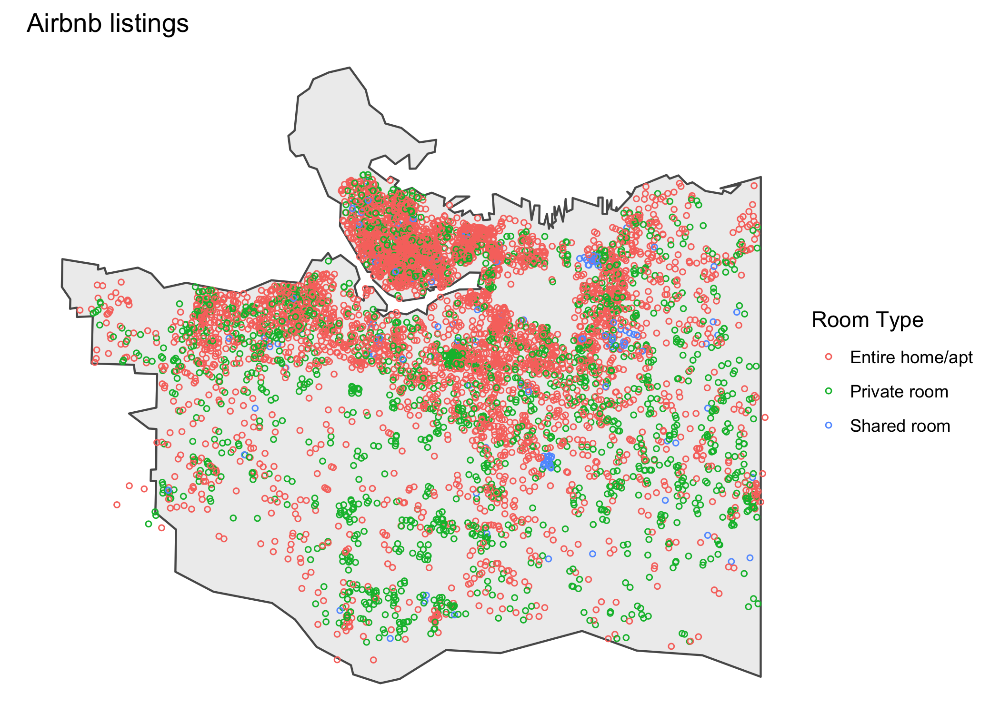

```{r setup, include=FALSE}
knitr::opts_chunk$set(
	echo = FALSE,
	message = FALSE,
	warning = FALSE,
	dev="svg"
)
options(htmltools.dir.version = FALSE)
library(tidyverse)
library(cancensus)
library(cancensusHelpers)
library(cansim)
library(cmhc)
library(sf)
options(servr.daemon = TRUE)
```


class: center, middle

StatCan data is "open" since 2011. But it's still trying to be become accessible.

How to access and work with Census, CMHC and related data?


---

Some tools to make StatCan data more accessible.

#### CensusMapper
A tool for quick and easy visualization of census data. Also functions
as an API server for pinpointed data access.
#### cancensus
An R wrapper around the CensusMapper API for reproducible workflows with census data.
#### cansim
An R wrapper around the CANSIM NDM API for reproducible workflows with CANSIM data.
#### cmhc
An R pseudo-API (deep beta) that extracts CMHC data for reproducible workflows with CMCH data.

---
background-image: url("https://doodles.mountainmath.ca/images/net_van.png")
background-position: 50% 50%
background-size: 100%
class: center, bottom, inverse

# CensusMapper

# <a href="https://censusmapper.ca/maps/731" target="_blank">CensusMapper Demo</a>


---
class: inverse, middle, center

# CensusMapper API

* StatCan is great for bulk census data download

* For more pinpointed data we need an API. CensusMapper offers APIs for 2006, 2011, and 2016 census data, for DB, DA, CT, CSD, CMA, CD, PR, C geographies.

* Map-based interface to select geographic regions, searchable hierarchical list for selecting census variables

---

# cancensus

Cancensus is an R wrapper for the CensusMapper API. Built together with [Dmitry Shkolnik](https://twitter.com/dshkol) and [Aaron Jacobs](https://github.com/atheriel).

Lives on CRAN and comes [with documentation](https://mountainmath.github.io/cancensus/index.html).

Allows pinpointed access to census data, CensusMapper works as GUI to facilitate data and region selection.

Motivated by [Kyle Walker's tidycensus package](https://walkerke.github.io/tidycensus/). StatCan does not have API's, so `cancensus` ties into CensusMapper APIs.

---
background-image: url("images/api_tool.png")
background-position: 50% 50%
background-size: 100%
class: center, bottom, inverse

# <a href="https://censusmapper.ca/api" target="_blank">CensusMapper API Demo</a>
---
# Example
How does the net migration effect the age distribution in each municipality?

```{r message=FALSE, warning=FALSE, include=FALSE}
age_pyramid_styling <- list(
  scale_x_discrete(breaks=c(seq(0, 100, 5),"100+")),
  scale_y_continuous(labels = scales::comma),
  coord_flip(),
  scale_fill_brewer(palette = "Set1"),
  theme_bw(),
  labs(caption="cancensus, StatCan 2016 census"))
```

```{r canada_age, echo=TRUE, fig.height=3.5, fig.width=9, message=FALSE, warning=FALSE, dev='svg'}
plot_data <- get_age_data('CA16',list(CSD=c("5915022","5915004","5915055"))) %>% 
  rename(City=`Region Name`)
ggplot(plot_data, aes(x = Age, y = Population, fill = Gender)) + geom_bar(stat="identity") +
  facet_wrap("City",nrow=1, scales="free_x") + age_pyramid_styling
```

???
Explain how net migration patterns lead to different age distributions.
---
class: inverse, middle, center

# CANSIM

* StatCan just switched over to the New Dissemination Model

* Has `r scales::comma(list_cansim_tables() %>% mutate(t=substr(table,1,10)) %>% filter(!duplicated(t)) %>% nrow)`
different dataseries, `r scales::comma(list_cansim_tables() %>% mutate(t=substr(table,1,10)) %>% filter(!duplicated(t)) %>% filter(!grepl("Archived",title)) %>% nrow())` of them ongoing and getting updated regularly.

* NDM makes it easier to explore and process data programmatically. `cansim` R package makes it easy. (Again, built with together with [Dmitry Shkolnik](https://twitter.com/dshkol))

* Available on [GitHub](https://github.com/mountainMath/cancensusHelpers), planning to release on CRAN in coming months.

---
# cansim example
List all tables that changed today:

```{r echo=TRUE}
tables <- get_cansim_changed_tables("2018-06-25") %>% head 
tables$productId
```
```{r echo=TRUE}
get_cansim_cube_metadata(tables$productId)$cubeTitleEn
```

---
# Look at Non-resident owners

```{r echo=TRUE, message=TRUE}
get_cansim_table_overview("39-10-0049")
```

---
```{r}
graph_style1 <- list(
  coord_flip() ,
  scale_y_continuous(labels = scales::percent) ,
  labs(title="Non-resident owners",x="Region (top 10 by share)",y="Share of non-resident owners",caption="MountainMath, CANSIM 39-10-0049")
)
```

```{r echo=TRUE, fig.height=4}
data_csd <- get_cansim("39-10-0049") %>% normalize_cansim_values() 
plot_data <- data_csd %>% 
  filter(Estimates=="Percentage",
         `Residency status`=="Non-resident")
ggplot(plot_data %>% top_n(10,VALUE),
       aes(x=reorder(GEO,VALUE),y=VALUE)) +
  geom_bar(stat="identity",fill="brown") +
  graph_style1
```
---

```{r}
graph_style2 <- list(
coord_flip(),
  scale_y_continuous(labels = scales::percent),
  labs(title="Non-resident owners",x="Region (top 10 by dwelling count)",y="Share of non-resident owners",caption="CANSIM 39-10-0049")
)
```

```{r echo=TRUE, fig.height=4}
top_pop_munis <- data_csd %>% filter(Estimates=="Number",
         `Residency status`=="Total, all residency status categories") %>% 
  top_n(10,VALUE) %>% pull(GEO) %>% unique

ggplot(plot_data %>% filter(GEO %in% top_pop_munis),
       aes(x=reorder(GEO,VALUE),y=VALUE)) +
  geom_bar(stat="identity",fill="brown") +
  graph_style2
```
---
# Can combine with census data
```{r echo=TRUE}
csds <- get_census("CA16",regions=list(PR="59"),geo_format="sf",level="CSD") %>%
  st_transform(26910) %>% st_intersection(
    get_ecumene_2016() %>% filter(ECUMENE=="1") %>% st_transform(26910))
```  
```{r}
library(rmapzen)
get_vector_tiles <- function(bbox){
  mz_set_tile_host_nextzen(getOption("nextzen_API_key"))
  mx_box=mz_rect(bbox$xmin,bbox$ymin,bbox$xmax,bbox$ymax)
  mz_vector_tiles(mx_box)
}

bbox <- csds %>% st_bbox
bbox2 <- bbox %>% st_as_sfc %>% st_transform(4326) %>% st_bbox
vector_tiles <- simpleCache(get_vector_tiles(bbox2),"bc_ecumene_vector_tiles")
boundaries <- as_sf(vector_tiles$boundaries)  %>% st_transform(st_crs(csds))
water <- as_sf(vector_tiles$water)  %>% st_transform(st_crs(csds))

map_theme <- list(
    theme_void(),
  scale_fill_viridis_c(trans="log",labels=scales::percent,option = "inferno"),
  coord_sf(datum=NA,xlim = c(bbox$xmin,bbox$xmax), ylim=c(bbox$ymin,bbox$ymax)),
  labs(title="Share of non-resident owners",fill="Share")
)
```

```{r echo=TRUE, fig.height=2.5}
ggplot(csds %>% left_join(plot_data,by="GeoUID")) + 
  geom_sf(data = water, fill = "lightblue", colour = NA) +
  geom_sf(data=boundaries,color="black",size=0.1) +
  geom_sf(aes(fill=VALUE),color=NA) + map_theme
```

---

# Non-census data
CMHC provides great housing-related data. It's a pain to download, so I built an [pseudo-API in R](https://github.com/mountainMath/cmhc).

```{r, message=FALSE, warning=FALSE, include=FALSE}

# A function to read and tidy CMHC data
vacancy_rent_table_for <- function(geography,geography_type="CMA"){
  region_params=cmhc_region_params(geography = geography,type=geography_type)
  params=cmhc_timeseries_params(table_id = cmhc_table_list["Rms Vacancy Rate Time Series"],region=region_params)
  dat_vacancy=get_cmhc(params)
  title_x=attr(dat_vacancy,"title")
  dat_vacancy <- dat_vacancy %>% 
    select("X1","Total") %>%
    #mutate(Total=as.numeric(as.character(Total))/100) %>%
    rename(vacancy_rate=Total, X=X1)
  params=cmhc_timeseries_params(table_id = cmhc_table_list["Rms Rent Change Time Series"],region=region_params)
  dat_rent_change=get_cmhc(params)
  title_y=attr(dat_rent_change,"title")
  dat_rent_change <- dat_rent_change %>%
    select("X1","Total") %>%
    #mutate(Total=as.numeric(as.character(Total))/100) %>%
    rename(rent_change=Total, X=X1)
  dat=inner_join(dat_vacancy,dat_rent_change,by="X") %>% rename(Year=X)
  attr(dat,"region")=paste0(geography," ",geography_type)
  attr(dat,"labels")=c(title_x,title_y)
  return(dat)
}

get_vacancy_rent_data <- function(names,level){
  cmhc=bind_rows(lapply(names,function(x){return(vacancy_rent_table_for(x,"CMA")) %>% mutate(city=x)})) %>% 
    gather(key = "Series", value = "Rate",vacancy_rate:rent_change) %>%
    mutate(
      Series = case_when(
      .$Series == "vacancy_rate" ~ "Vacancy Rate",
      .$Series == "rent_change" ~ "Rent Change"),
      Year = as.Date(paste0(Year," 01"),format="%Y %B %d"),
      Rate=Rate/100)
  return(cmhc)  
}

vanancy_plot_options=list(
    # labs(#title="Vacancy Rate vs Change in Rent", 
    #    #subtitle ="Select Cities",
    #    caption="Source: CMHC Rms, code: https://github.com/mountainMath/cmhc"),
  scale_y_continuous(labels = scales::percent),
  xlab("") ,
  scale_x_date(breaks = seq(as.Date("1990-10-01"), as.Date("2016-10-01"), by="2 years"), 
    date_labels=format("%b %Y")),
  scale_color_manual(labels = c("% Rent Change\n(fixed sample)","Vacancy Rate"), values = c("darkgreen", "steelblue"), name = ""),
  theme_minimal(),
  theme(axis.text.x = element_text(angle = 45, hjust = 1))
)

```


```{r, echo=TRUE, fig.height=4, fig.width=10, message=FALSE, warning=FALSE, dev="svg"}
cmhc <- get_vacancy_rent_data(c("Vancouver","Toronto","Calgary","Winnipeg"),"CMA")
ggplot(cmhc, aes(x = Year, y = Rate, color = Series)) + vanancy_plot_options +
  geom_line() + geom_point() + facet_wrap("city", ncol=2) 
```

???
CMHC has recently made finer data available. Sadly no APIs, but we can hack their data portal to speed up analysis. So we built a pseudo-API to consume it.

This graph shows the primary market vacancy rate and the fixed-sample rent change on the same axis. We note the clear inverse relationship between the two, with sometimes strong responses in non rent-controlled Calgary. And yes, rents do drop when the vacancy rate is high.

---

# Processing census (and related) data
Some related packages that play well with cancensus:

* [cancensusHelpers](https://github.com/mountainMath/cancensusHelpers) -- My package that encapsulates helper functions I frequently use. In a public package so others can reproduce my workflows.
* [dotdensity](https://github.com/mountainMath/dotdensity) -- Good for dot-density maps, but also for re-aggregating data
* [tongfen](https://github.com/mountainMath/tongfen) -- Good for comparing census data across censuses. Census geographies change over time, making comparisons hard.
---

# Bring your own
There is lots of other data out there. Airbnb data is [available via insideairbnb](http://insideairbnb.com). Some people have rental listings data. 


---

# Make your own
If data isn't available, consider building your own database.

---

# Working with (open) data
Basic rules of thumb:

* Script the data download (and cache the data) for reproducibility.

--

* If you use a workflow twice, refactor it into a function.

--

* If you use a workflow in more than one project, refactor it into a package.

--

* If you use a workflow in more than two projects, clean up your package and put it on GitHub.

--

* If others, including people you never met, are using your package package submitting issues or pull requests, put your package on CRAN.

--

* Use R (or jupyter) notebooks whenever possible, integrates data import, cleaning, analysis, visualization and
interpretation into one document. Can be compiled to html or pdf.

---
# Projects
Code for the slides is [available on GitHub](https://github.com/mountainMath/presentations), some other presentations with more code too. More worked examples can be found [on my blog](https://doodles.mountainmath.ca), with links back to the R notebooks with the code.

Project ideas:

* CANSIM 35-10-0007 on youth admissions to correctional services by aboriginal status was [in the news yesterday](http://www.cbc.ca/news/canada/manitoba/youth-incarcerated-indigenous-half-1.4720019), could use some more analysis by province and normalized by aboriginal youth population.

* Census data has a wealth of variables, can look at individual or combination of variables, and/or at change through time. Browse variables on CensusMapper and see what piques your curiosity.

* Browse cansim variables using `list_cansim_tables()`, there is a lot of interesting data.
