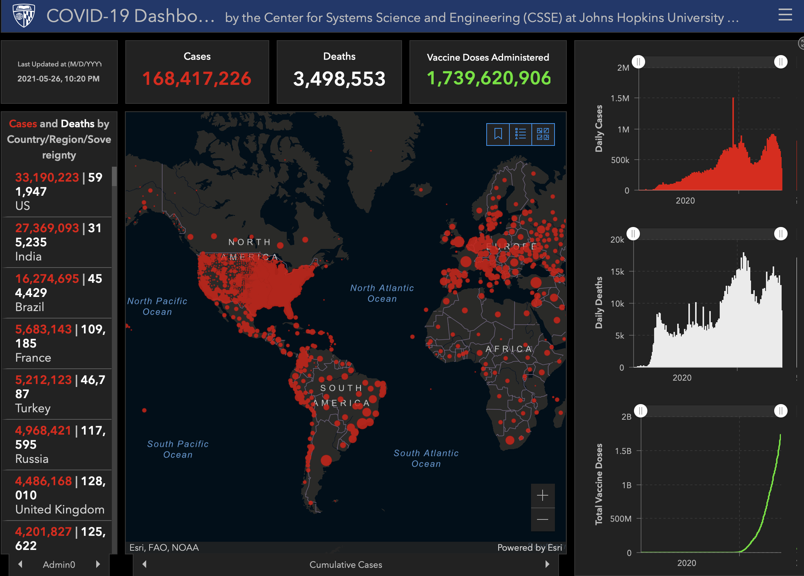

```{r setup, include=FALSE}
knitr::opts_chunk$set(
	message = TRUE,
	warning = TRUE,
	cache = TRUE,
	dev = "svg",
	include = FALSE
)
options(htmltools.dir.version = FALSE)
options(servr.daemon = TRUE)
library(tidyverse)
library(CanCovidData)
```
```{r xaringanExtra, echo=FALSE}
xaringanExtra::use_xaringan_extra(c("broadcast"))
```
```{r broadcast, echo=FALSE}
xaringanExtra::use_broadcast()
```


# COVID-19 Data and Modelling
COVID has dominated our lives for over a year now. We all followed the newest numbers, looked at charts and modelling. And maybe done our own charts and our own modelling.

In this talk I want to show my personal **data analyst journey through COVID-19** and how I tried to make sense of things.

My background is mathematics (and physics), not epidemiology. And nowadays I deal a lot with data, data analysis, and visualization/communication. This colours my approach and thinking on this.

I was also fortunate in that I connected with excellent people in the [BC COVID Modelling Group](https://bccovid-19group.ca) who do have background in epidemiology and related fields, so I could fill gaps in my knowledge and tap into other people's expertise to better understand the data and the underlying processes.

---
## COVID-19 Data
.pull-left[
Covid data has been messy from the very beginning. Public health data systems could not handle the data demands of a fast-growing global pandemic.

The first global data sources weren't the WHO, it was newspapers, universities, and loosely assembled groups of volunteers that collected, cleaned, and standardized the data, and made it generally available. And with it came (generally clunky) [visualization tools](https://coronavirus.jhu.edu/map.html).

Since then, things have gotten better. But not by much.
]
.pull-right[

]

---
## Canadian Data
In Canada the first national data source was the [COVID-19 Canada Open Data Working Group](https://opencovid.ca), which is still collecting and organizing provincial data. Nowadays some data is available directly from PHAC, but many data feeds, for example hospitalizations, are still only available via volunteer data aggregation efforts.

I have a (quite rough, not on CRAN) R package that assembles various data sources with minimal cleaning to facilitate ingestion of COVID-19 data called [CanCovidData](https://mountainmath.github.io/CanCovidData/) with focus on Canadian data sources.
```{r eval=FALSE, echo=TRUE}
remotes::install_github("mountainmath/CanCovidData")
```


---
## Contextualizing COVID data
.pull-left[
One of the first ways people tried to make sense of COVID data was the (semi-)log plot first popularized by [John Burn-Murdoch](https://twitter.com/jburnmurdoch) at the Financial Times.

Why are log plots a useful thing to do? It respects the data generation process, viral growth. 

Lots of dashboards were using this approach in the early days, but this approach needed refinement after the first wave subsided.
]
.pull-right[
<blockquote class="twitter-tweet" data-conversation="none"><p lang="en" dir="ltr">Shift the starting cutoff up to anchor further down the trajectories for less noisy comparisons. Click on legend items to compare trajectories one by one. <a href="https://t.co/Kv1jqIffqr">pic.twitter.com/Kv1jqIffqr</a></p>&mdash; Jens von Bergmann (@vb_jens) <a href="https://twitter.com/vb_jens/status/1242894344845062146?ref_src=twsrc%5Etfw">March 25, 2020</a></blockquote> <script async src="https://platform.twitter.com/widgets.js" charset="utf-8"></script>
]


---
## Introductions and risk from travel

In early March Nathan Lauster and I looked at [risk of importantions](https://doodles.mountainmath.ca/blog/2020/03/03/overnight-visitors-and-crude-travel-vectors/) by combining travel data with COVID case data, constructing a simple risk metric. These kind of estimates are hard, and testing was still getting ramped up and data quality was poor.

Nonetheless, this helps understanding importation risk in broad strokes.


---
## Did people change behaviour after public health measures?
Surrey makes quarter hour traffic loop induction counts available. This is yet another metric to help us understand how people change behaviour in response to public health measures. Here is how [driving volume changed in early March 2020 around the initial lockdown](https://doodles.mountainmath.ca/blog/2020/03/22/behaviour-change-in-response-to-covid-19/).


---
## Understanding the data
Whenever dealing with data we need to pay close attention to definitions, as well as all aspects of the data generation process. For example, for COVID data we need to understand viral growth, as well as our ability to detect/confirm infections through tests, and how that data is reported. Here is [one such example walking through data issues](https://doodles.mountainmath.ca/blog/2020/04/10/covid-19-data-in-canada/) with a focus on Dates, and what they refer to using Ontario data as an example.


---
## Estimating effective reproduction numbers
.pull-left[
Depending on the question we are interested in we often want to go beyond raw case data. Early in the pandemic we learned about the effective reproduction number, the average number of infections an index case causes. 

While this is an intuitive concept, it runs into lots of problems in real life. It is model dependent, different viral models will produce different estimates. Different ways data is prepared will produce different estimates.

For modelling, it's best to stay away from reproduction numbers and focus on well-defined metrics like daily growth rates instead.
]
.pull-right[

]
---
## Mixing COVID data with other data (e.g. Census)
Due to lack of individual level data on COVID cases (for example, BC does not collect data on race, income or occupation of COVID cases), we sometimes try to mix aggregate COVID data at health region or neighbourhood level to compare it to other data sources aggregated at the same level. The goal is then to use aggregate data to make inferences about how COVID affects different groups of people. This is called **ecological inference**, and [is surprisingly difficult to do well](https://doodles.mountainmath.ca/blog/2020/05/27/on-mixing-covid-19-and-census-data/).

Our first inclination might be to run a regression of neighbourhood level demographic and economic variables derived e..g from the census against covid cases. But this is well known to produce biased and often wrong results. This is known as the **ecological fallacy**.

It requires more sophisticated statistical tools to deal with, we provide an [example on our blog](https://doodles.mountainmath.ca/blog/2020/05/27/on-mixing-covid-19-and-census-data/).

Doing proper analysis on spatial data is hard. And ecological inference makes it even harder.


---
## The data generation process

.pull-left[
### SIR model
\begin{eqnarray}
\frac{\textit{d}S}{\textit{dt}} &=&-\beta \cdot \frac{S}{N} \cdot I\\
\frac{\textit{d}I}{\textit{dt}} &=&\beta \cdot \frac{S}{N} \cdot I - \gamma \cdot I\\
\frac{\textit{d}R}{\textit{dt}} &=&\gamma \cdot I
\end{eqnarray}

where $S$ is the susceptible, I is the infected, and R is the recovered population. 

We are mostly interested in the dynamics of the infected population $I(t)$ at a given time $t$. 
]
.pull-right[
Looking at the second equation, with "growth rate" 
$$r(t)=\beta(t)\frac{S(t)}{N}-\gamma(t)$$ 
we have
$$
I(t)=e^{\int_{t_0}^tr(s)\textit{d}s}
$$
If $S$ is changing slowly and the transmission rate $\beta$ is constant, this simplifies to
$$
I(t)=e^{r\cdot t}
$$
and we define $R=1+\frac{r}{\gamma}=\beta\frac{S}{N}/\gamma$ is the reproduction number in this model.
]


---
## The data generation process (part 2)
But we don't observe infections, we observe *cases*. That is infections that we detect and confirm through testing or by other means.

We can estimate this by looking at serology surveys, in BC we have not seen any of the data that goes beyond 2020 spring/early summer.

If we are interesting in modelling cases, then we don't need to worry about this too much as long as we can assume that the ascertainment rate, the fraction of infections that we identify, stays roughly constant.

---
## Descriptive analysis
Before we do modelling, we want to first do some descriptive analysis to understand past case growth. But case data tends to be noisy. 

In particular, there tends to be a strong weekly pattern due to reporting and test seeking.

```{r include=FALSE}
extract_stl_trend_m <- function(c,s.window=14,t.window=14){
  cc <- c %>%
    log() %>%
    ts(frequency = 7,start = as.numeric(format(Sys.Date(), "%j"))) %>% 
    stl(s.window=s.window,t.window=t.window) 
   
    as_tibble(cc$time.series)$trend %>% exp()
}

extract_stl_seasonal_m <- function(c,s.window=14,t.window=14){
  cc <- c %>%
    log() %>%
    ts(frequency = 7,start = as.numeric(format(Sys.Date(), "%j"))) %>% 
    stl(s.window=s.window,t.window=t.window) 
   
    as_tibble(cc$time.series)$seasonal  %>% exp()
}
d<-read_csv("https://opendata.arcgis.com/datasets/6d78eb3b86ad4466a8e264aa2e32a2e4_0.csv") %>%
  mutate(Date=as.Date(substr(Datum,1,10),format="%Y/%m/%d"))

plot_data <- d %>% 
  select(Date,matches("Anz|Kum")) %>%
  group_by(Date) %>%
  summarize_all(sum)  %>%
  ungroup() %>%
  arrange(Date) %>%
  #mutate(Cases=KumFall-lag(KumFall)) %>%
  #filter(Date>=as.Date("2020-03-15")) %>%
  mutate(Cases=AnzFallMeldung) %>%
  mutate(Trend=extract_stl_trend_m(Cases,s.window =21)) %>%
  mutate(Seasonal=extract_stl_seasonal_m(Cases,s.window =21)) %>%
  mutate(Adjusted=Cases/Seasonal)
```

.pull-left[
```{r echo=FALSE, fig.height=4}
ggplot(plot_data, aes(x=Date,y=Cases)) +
  geom_point(shape=21,size=0.25,alpha=0.5) +
  geom_line(aes(y=Cases),size=0.5) +
  theme_bw() +
  scale_y_continuous(labels=scales::comma) +
  labs(title="COVID-19 cases in Germany",
       caption="MountainMath, Data: RKI",
       x=NULL,
       y="Number of daily cases") 
```
]

.pull-right[
```{r echo=FALSE, fig.height=4}
ggplot(plot_data, aes(x=Date,y=Cases)) +
  geom_point(shape=21,size=0.25,alpha=0.5) +
  geom_line(aes(y=Adjusted),size=0.5,color="steelblue") +
  geom_line(aes(y=Trend),color="brown",size=1) +
  theme_bw() +
  scale_y_continuous(labels=scales::comma) +
  labs(title="COVID-19 cases in Germany",
       subtitle="(case counts, seasonally adjused lines and STL trend line)",
       caption="MountainMath, Data: RKI",
       x=NULL,
       y="Number of daily cases") 
```
]

We want to do "seasonal adjustment" to get rid of the weekly pattern and estimate a trend line. 

---
## Seasonal adjustment and smoothing
.pull-left[
It is worth spending a little bit of time [thinking about how to get a useful trendline of covid cases](https://doodles.mountainmath.ca/blog/2021/01/30/on-covid-trend-lines/). A simple way is to use a 7-day moving average, but there are several problems. 

We lose 3 days of data at either end, and we introduce systematic bias, moving averages disrespect the data generation process.

A better way is to first explicitly identify and remove the weekly pattern, and then fit a trend line. Both from theory, and from inspecting the data, we know that the trend line, the weekly pattern and the random noise are multiplicative, so we should choose an appropriate method.
]
.pull-right[

]

---
## Modelling
There are two basic ways we can model COVID infections. 

* Compartmental models, which will use a variation of the above SIR equation and divide the population into homogeneous groups of people, or 
* Agent-based models, which model people with individual properties with connections between them.

Agent-based models are good for understanding how e.g. specific interventions like rapid testing, or adjustments to office or school setup would likely play out. But they are generally less useful to fit to case data because they have a lot of free parameters. They also tend to be computationally expensive.

Compartmental models generally work well to capture case growth, we can add compartments as needed to capture aspects of the pandemic that we may be interested in interested in.

---
## Minimalist modelling (piecewise exponential)
```{r echo=FALSE, message=FALSE, warning=FALSE} 
major_restrictions <- c("2020-03-18"="Phase 1","2020-11-07"="No private\ngatherings","2020-11-19"="Masks in stores\nTravel discouraged","2021-03-29"="No indoor dining\nNo indoor group activity\nMasks grades 4-12")
major_restriction_labels <- c("2020-03-18"="Phase 1","2020-11-07"="No private\ngatherings","2020-11-19"="Masks in stores\nTravel discouraged","2021-02-25"="No indoor dining\nNo indoor group activity\nMasks grades 4-12")
major_restrictions_y <- c("2020-03-18"=1,"2020-11-07"=0.1,"2020-11-19"=1,"2020-03-29"=0.1)
minor_restrictions <- c("2020-03-11","2020-03-12","2020-03-16","2020-03-17",
                        "2020-03-21","2020-03-22","2020-03-26","2020-04-18",
                        "2020-06-18","2020-08-21","2020-09-08","2020-10-26","2021-04-30")
major_reopenings <- c("2020-05-19"="Phase 2","2020-06-24"="Phase 3","2021-05-25"="Step 1\nreopening")
minor_reopenings <- c("2020-05-14","2020-06-01","2020-06-08",
                      "2020-06-30","2020-07-02","2020-09-10","2020-12-15")

restriction_markers <- function(major_size=1,minor_size=0.25){
  list(
    geom_vline(xintercept = as.Date(minor_reopenings),
               linetype="dashed",color="darkgreen",size=minor_size),
    geom_vline(xintercept = as.Date(names(major_reopenings)),linetype="dashed",color="darkgreen",size=major_size),
    geom_vline(xintercept = as.Date(names(major_restrictions)),linetype="dashed",color="brown",size=major_size),
    geom_vline(xintercept = as.Date(minor_restrictions),
               linetype="dashed",color="brown",size=minor_size)
)}

full_labels <- function(label_y,
                        major_restriction_labels = c("2020-03-18"="Phase 1","2020-11-07"="No private\ngatherings"),
                        major_restrictions_y = c(1,0.15)){
  c(restriction_markers(),list(
    geom_label(data = tibble(Date=as.Date(names(major_reopenings)),
                             count=rep(label_y,length(major_reopenings)),
                             label=as.character(major_reopenings)),
               aes(label=label),size=4,alpha=0.7,color="darkgreen"),
    geom_label(data = tibble(Date=as.Date(names(major_restriction_labels)),
                             label=as.character(major_restriction_labels),
                             count=as.numeric(major_restrictions_y)),
               aes(label=label),size=4,alpha=0.7,color="brown")
  ))
}

add_stl_trend_m <- function(c){
  #print(length(c))
  cc <- c %>%
    log() %>%
    ts(frequency = 7,start = as.numeric(format(Sys.Date(), "%j"))) %>% 
    stl(s.window=14,t.window=14) 
   
    as_tibble(cc$time.series) %>%
      mutate_all(exp)
}

ha_colours <- setNames(c(sanzo::trios$c157,sanzo::trios$c149),
                       c("Fraser","Rest of BC","Vancouver Coastal" , "Vancouver Island", "Interior", "Northern"))

share_to_ratio <- function(s)1/(1/s-1)
ratio_to_share <- function(r)1/(1+1/r)
get_n501y_data <- function(){
  read_csv("http://www.bccdc.ca/Health-Info-Site/Documents/VoC/Figure1_weeklyreport_data.csv") %>%
    rename(epiweek=Epiweek,epi_cdate=`Epiweek - Start Date`,patient_ha=Region,
           prop_voc=`Proportion of VoC`)
}

bc_voc_data <- get_n501y_data() %>%
  mutate(Date=as.Date(epi_cdate)+4,
         share_voc=prop_voc/100) %>%
  #left_join(get_b.1.617(),by=c("patient_ha","epiweek")) %>%
  #mutate(share_voc=share_voc+coalesce(prop_b.1.617,0)/100) %>%
  mutate(ratio_voc=share_to_ratio(share_voc)) %>%
  mutate(Day=difftime(Date,min(Date),units = "day") %>% unclass) 

n501y <- bc_voc_data %>%
  filter(patient_ha=="British Columbia") %>%
  select(Date,Week=epiweek,share_voc,ratio_voc,Day) 

break_day <- n501y %>% filter(Date>=as.Date("2021-04-01")) %>% 
                                head(1) %>% 
                                pull(Day)

model.n501y <- lm(log(ratio_voc)~Day,data=n501y%>% filter(as.integer(Week)>=7))
model.n501y.s <- segmented::segmented(model.n501y,psi = break_day)
prediction.n501y <- tibble(Date=seq(as.Date("2021-02-01"),Sys.Date(),by="day")) %>%
  mutate(Day=difftime(Date,min(n501y$Date),units = "day") %>% unclass) %>%
  mutate(share_voc = predict(model.n501y.s,newdata = .) %>% exp %>% ratio_to_share) 

data <- get_british_columbia_case_data() %>%
  count(Date=`Reported Date`,name="Cases") %>%
  filter(Date>=as.Date("2020-03-01")) %>%
  mutate(stl=add_stl_trend_m(Cases)) %>%
  mutate(Trend=stl$trend,
         Random=stl$remainder,
         Seasonal=stl$seasonal) %>%
  select(-stl) %>%
  mutate(Cleaned=Cases/Seasonal)

all_data <- get_british_columbia_case_data() %>%
  count(Date=`Reported Date`,name="Cases") %>%
  filter(Date>=as.Date("2020-03-01")) %>%
  mutate(stl=add_stl_trend_m(Cases)) %>%
  mutate(Trend=stl$trend,
         Random=stl$remainder,
         Seasonal=stl$seasonal) %>%
  select(-stl) %>%
  mutate(Cleaned=Cases/Seasonal) %>%
  left_join(prediction.n501y, by="Date") %>%
  mutate(`Wild type`=Trend*(1-share_voc)) %>% 
  mutate(`Wild type`=coalesce(`Wild type`,Trend)) %>%
  mutate(Combined=Trend) %>%
  mutate(Trend=`Wild type`)


start_date <- as.Date("2020-04-25")
projection_days <- 14

model_data <- all_data %>% 
  filter(Date>=start_date) %>%
  mutate(day=difftime(Date,first(Date),units="day") %>% as.integer) %>%
  mutate(log_Trend=log(Trend)) 

model.lm <- lm(log_Trend ~ day,data=model_data)
  

model.s <- segmented::segmented(model.lm,npsi=6)

change_points <- model.s$psi %>% 
  as_tibble() %>% 
  mutate(Date=start_date+Est.)

if (TRUE){
  model.s <- segmented::segmented(model.lm,psi=c(change_points$Est.,14.0) %>% sort)
  
  change_points <- model.s$psi %>% 
    as_tibble() %>% 
    mutate(Date=start_date+Est.)
}
# initial_phase <- tidy(model.s) %>% 
#   slice(1,2) %>%
#   pull(estimate)


predict_data <- list(seq(as.Date("2020-03-20"),start_date,by="day"),
                     seq(max(all_data$Date),max(all_data$Date)+projection_days,by="day")) %>%
  lapply(function(dates){
    tibble(Date=dates) %>%
      mutate(day=difftime(Date,start_date,units = "day") %>% as.integer) %>%
      mutate(log_count=predict(model.s,newdata=.)) %>%
      mutate(count=exp(log_count))
  }) 

growth_rates <- broom::tidy(model.s) %>%
  filter(term!="(Intercept)",!grepl("psi",term)) %>%
  mutate(r=cumsum(estimate)) %>%
  mutate(R=exp(r*6.5))

cutoff_data <- tibble(min=c(start_date,sort(change_points$Date)) %>% as.character()) %>%
  mutate(max=lead(min) %>% coalesce(.,max(all_data$Date) %>% as.character()),
         predict_max=lead(min) %>% coalesce(.,as.character(max(all_data$Date)+projection_days))) %>%
  mutate_all(as.Date) %>%
  mutate(t=as.character(row_number() %% 2)) %>%
  mutate(mid=min+as.numeric(difftime(max,min,units="day"))/2) %>%
  bind_cols(growth_rates %>% select(r,R)) %>%
  mutate(label=paste0("Wild type\nr=",scales::percent(r,accuracy = 0.1),"\nR=",round(R,2))) %>%
  mutate(mid=case_when(mid==min(mid) ~ mid-12,TRUE ~ mid))
```

```{r echo=FALSE, fig.height=5.5, fig.width=9, message=FALSE, warning=FALSE}
label_y <- max(model_data$Cases) * 0.85

g <- all_data %>%
  left_join(model_data %>% 
              mutate(Fitted=predict(model.s,new_data=.) %>% exp()) %>%
              select(Date,Fitted),by="Date")%>%
  pivot_longer(c("Cases","Wild type","Cleaned","Combined","Fitted"),names_to="type",values_to="count") %>%
  filter(type!="Wild type" | Date>=as.Date("2021-02-01")) %>%
  mutate(type=factor(type,levels=c("Cases","Cleaned","Wild type","Fitted","Combined"))) %>%
  ggplot(aes(x = Date, y = count,color=type,size=type)) + 
  geom_rect(data=cutoff_data,
            aes(xmin=min,xmax=max,fill=t), inherit.aes = FALSE,
            ymin=0,ymax=Inf,show.legend = FALSE,alpha=0.5) +
  scale_fill_manual(values=c("#dddddd","#aaaaaa")) +
  full_labels(label_y,major_restriction_labels=major_restriction_labels,
              major_restrictions_y=major_restrictions_y*label_y) +
  geom_point(data=~filter(.,type=="Cases"),shape=21) +
  geom_line(data=~filter(.,type!="Cases")) +
  scale_size_manual(values=c("Cases"=0.5,"Cleaned"=0.25,
                              "Wild type"=1,
                              "Combined"=1,"Fitted"=0.75),
                    guide=FALSE) +
  #geom_vline(data=change_points %>% bind_rows(tibble(Date=start_date)),aes(xintercept = Date)) +
  theme_bw() +
  theme(legend.position = "bottom") +
  theme(panel.grid.major = element_blank(), 
        panel.grid.minor = element_blank()) +
  scale_x_date(breaks="month",labels=function(d)strftime(d,"%b")) +
  scale_color_manual(values=c("Cases"="grey","Cleaned"="darkgrey",
                              "Wild type"="grey40",
                              "Combined"="black","Fitted"="steelblue"),
                     labels=c("Cases"="Raw cases","Cleaned"="Cases adjusted for weekly pattern",
                              "Wild type"="Wild type",
                              "Combined"="Wild type and VOC","Fitted"="Fitted wild type")) +
  guides(color = guide_legend(override.aes = list(linetype = c("Cases"=NA, "Cleaned"=1,
                                                               "Wild type"=1,"Fitted"=1, "Combined"=1),
                                                  shape = c("Cases"=21,"Cleaned"=NA,
                                                            "Wild type"=NA,"Fitted"=NA, "Combined"=NA)) ) ) +
  geom_label(data=cutoff_data, y=max(model_data$Cases*0.98),
                            aes(label=label,x=mid),inherit.aes = FALSE,size=3,alpha=0.8) +
  labs(title=paste0("Covid-19 daily new cases in British Columbia (up to ",strftime(max(all_data$Date),"%a %b %d"),")"),
       subtitle="Timeline of <b style='color:#A52A2A;'>closure</b> and <b style='color:#006400;'>reopening</b> events",
       x=NULL,y="Number of daily cases",color=NULL,caption="MountainMath, Data: BCCDC") +
  theme(plot.subtitle = ggtext::element_markdown())
g 
```


---
## Agent based model, an example
Example of a [school class and cohort network, with several simulated test-trace-isolate interventions](https://doodles.mountainmath.ca/blog/2020/09/08/covid-school-modelling/).

.pull-left[

]
.pull-right[

]

---
## Vaccinations and VOC
.pull-left[
In some cases a simple exponential growth model does not work well for describing (and predicting) case growth.
Heterogeneity across compartments/agents does not matter much as long as nature of heterogeneity does not change over time.

In early March two factors broke our basic exponential model assumptions:

* vaccines were progressing at an accelerated pace so $S(t)$ could not be assumed to be nearly constant
* variants of concern had a significantly higher growth rate, cases could not be described by a single growth rate (the sum of two exponential function is not an exponential function)
]
.pull-right[
The solution is a [modified model that adds vaccinations and a second strain](https://doodles.mountainmath.ca/blog/2021/03/10/vaxx-vs-vocs/). There was high uncertainty because BCCDC did not release VOC data.


]


---
## Estimating the VOC growth rate advantage
.pull-left[
A key ingredient in understanding variants of concern is estimating the transmission advantage of VOC. We can think of regular wild type COVID and VOC as two independent processes.
$$
C_0(t) = C_0 e^{r_0t}, \qquad C_v(t) = C_v e^{(r_a+r_0)t},
$$
where $C_0$ and $C_v$ are the number of regular and variant COVID-19 cases at time 0, $r_0$ is the base growth rate for regular COVID-19 and $r_a$ is the growth rate advantage of the B.1.1.7 variant. Taking the ratio of variant to non-variant cases

$$
\kappa = \frac{C_v(t)}{C_0(t)} = \frac{C_v}{C_0} e^{r_at}, \qquad \log(\kappa) = \hat c + r_a\cdot t
$$

]
.pull-right[
```{r echo=FALSE, fig.height=5, fig.width=5, message=FALSE, warning=FALSE}
ratio_to_share <- function(r)1/(1+1/r)
share_to_ratio <- function(s)1/(1/s-1)
add_stl_trend_m <- function(c){
  cc <- c %>%
    log() %>%
    ts(frequency = 7,start = as.numeric(format(Sys.Date(), "%j"))) %>% 
    stl(s.window=14,t.window=14) 
   
    as_tibble(cc$time.series) %>%
      mutate_all(exp)
}


get_n501y_data <- function(){
  read_csv("http://www.bccdc.ca/Health-Info-Site/Documents/VoC/Figure1_weeklyreport_data.csv") %>%
    rename(epiweek=Epiweek,epi_cdate=`Epiweek - Start Date`,patient_ha=Region,
           prop_voc=`Proportion of VoC`)
}


bc_voc_data <- get_n501y_data() %>%
  mutate(Date=as.Date(epi_cdate)+4,
         share_voc=prop_voc/100) %>%
  mutate(ratio_voc=share_to_ratio(share_voc)) %>%
  mutate(Day=difftime(Date,min(Date),units = "day") %>% unclass) 
  
n501y <- bc_voc_data %>%
  filter(patient_ha=="British Columbia") %>%
  select(Date,Week=epiweek,share_voc,ratio_voc,Day) 

break_day <- n501y %>% filter(Date>=as.Date("2021-04-01")) %>% 
                                head(1) %>% 
                                pull(Day)

model.n501y <- lm(log(ratio_voc)~Day,data=n501y%>% filter(as.integer(Week)>=7))
model.n501y.s <- segmented::segmented(model.n501y,psi = break_day)
prediction.n501y <- tibble(Date=seq(as.Date("2021-02-01"),Sys.Date(),by="day")) %>%
  mutate(Day=difftime(Date,min(n501y$Date),units = "day") %>% unclass) %>%
  mutate(share_voc = predict(model.n501y.s,newdata = .) %>% exp %>% ratio_to_share) 


d1 <- n501y$Date %>% min
c1<-model.n501y.s$coefficients[['Day']]
c2<-c1+model.n501y.s$coefficients[['U1.Day']]
d2 <- d1+as.integer(model.n501y.s$psi[[1,2]])

cutoff <- as.Date("2021-02-10")
region <- "BC"

get_predictions_for <- function(data,region,voc_cutoff=0.01,date_cutoff=as.Date("2021-02-15"),max_cutoff=as.Date("2021-05-12")){
  data <- data %>% 
    filter(!is.na(share_voc)) %>%
    filter(share_voc>=voc_cutoff,Date>=date_cutoff,Date<=max_cutoff) %>%
    mutate(day=difftime(Date,min(Date),units = "day") %>% as.integer)
  d1 <- min(data$Date)
  model.voc <- lm(log(ratio_voc)~day,data=data)
  
  psi=difftime(as.Date("2021-04-05"),d1,units = "day") %>% as.integer
  #if (region=="Fraser") psi=c(psi,difftime(as.Date("2021-05-05"),d1,units = "day") %>% as.integer)
  
  
  model.voc.s <- segmented::segmented(model.voc,
                                      psi=psi)
  
  
  prediction.voc.s <- tibble(Date=as.Date("2021-02-01")+seq(0,120)) %>% 
    mutate(day=difftime(Date,d1,units = "day") %>% as.integer) %>%
    mutate(ratio_voc=predict(model.voc.s,newdata = .) %>% exp) %>%
    mutate(share_voc=ratio_to_share(ratio_voc)) %>%
    select(-day) %>%
    mutate(Region=as.character(region))
}

predictions <- bc_voc_data %>% 
  group_by(Region=patient_ha) %>% 
  group_map(~get_predictions_for(.x,.y,max_cutoff = Sys.Date())) %>%
  bind_rows()

bc_voc_data %>% 
  mutate(Region=patient_ha,Week=epiweek) %>%
  mutate(start_date=epi_cdate,end_date=epi_cdate+7) %>%
  filter(Date>=as.Date("2021-02-01")) %>%
ggplot(aes(x=Date,y=share_voc,colour=Region)) +
  geom_rect(aes(xmin=start_date,xmax=end_date,fill=as.character(as.integer(Week) %% 2)),
            ymin=0,ymax=1,alpha=0.2,colour=NA) +
  scale_fill_manual(values=c("0"="grey40","1"="grey80"),guide=FALSE) +
  geom_point(shape=21) + #,aes(size=1-Screened/Cases)) +
  #geom_point(color="steelblue",shape=21,data=voc_types %>% filter(Date>=cutoff)) +
  geom_line(data=predictions %>% filter(Date<=as.Date("2021-06-01"))) +
  scale_y_continuous(labels=scales::percent) +
  theme_bw() +
  facet_wrap("Region") +
  scale_colour_brewer(palette = "Dark2",guide=FALSE) +
  labs(title="Presumptive variant of concern share",
       subtitle="(weekly N501Y/E484K share and fitted trend)",
       y="Share of N501Y/E484K cases",x=NULL,
       caption="MountainMath, Data: BCCDC")

```
]

---
## VOC transmission advantage
.pull-left[
```{r echo=FALSE, fig.height=5, fig.width=5}
bc_voc_data %>% 
  mutate(Region=patient_ha,Week=epiweek) %>%
  mutate(start_date=epi_cdate,end_date=epi_cdate+7) %>%
  filter(Date>=as.Date("2021-02-01")) %>%
ggplot(aes(x=Date,y=share_voc,colour=Region)) +
  geom_rect(aes(xmin=start_date,xmax=end_date,fill=as.character(as.integer(Week) %% 2)),
            ymin=0,ymax=1,alpha=0.2,colour=NA) +
  scale_fill_manual(values=c("0"="grey40","1"="grey80"),guide=FALSE) +
  geom_point(shape=21) + #,aes(size=1-Screened/Cases)) +
  #geom_point(color="steelblue",shape=21,data=voc_types %>% filter(Date>=cutoff)) +
  geom_line(data=predictions %>% filter(Date<=as.Date("2021-06-01"))) +
  scale_y_continuous(labels=scales::percent) +
  theme_bw() +
  facet_wrap("Region") +
  scale_colour_brewer(palette = "Dark2",guide=FALSE) +
  labs(title="Presumptive variant of concern share",
       subtitle="(weekly N501Y/E484K share and fitted trend)",
       y="Share of N501Y/E484K cases",x=NULL,
       caption="MountainMath, Data: BCCDC")
```

]
.pull-right[
In the graph we note that 

* there is a kink in the beginning of April. This corresponds to the effect of the March 30 restrictions that impact the growth rate advantage.
* The most recent data points fall below predictions. In Fraser the share of VOC decreased. Island Health shows an abnormal pattern. This is how England and Ontario have been tracking the growth in the B.1.617 (India) variant, which does not show up in the N501Y/E484K screening data for "presumptive VOCs". Our data is laggy, but this is a point to watch closely going forward.
]


---
class: inverse center
## Thanks for listening
The RMarkdown for this presentation can be [found on GitHub](https://github.com/mountainMath/presentations/blob/master/ubc_mds_seminar.Rmd) if anyone wants to download the code and adapt it for their own purposes. (Some slides just have images and links to blog posts with code.)

### Please post your questions in the chat.
### .....<span class="blinking-cursor">|</span>

<div style="height:12%;"></div>

<hr>

You can find me on Twitter at [@vb_jens](https://twitter.com/vb_jens) or (less regularly) on [LinkedIn](https://www.linkedin.com/in/jens-von-bergmann-282431aa/).

My blog has lots of examples with code. [doodles.mountainmath.ca](https://doodles.mountainmath.ca)

In particular [examples looking at COVID-19](https://doodles.mountainmath.ca/categories/covid-19/).

