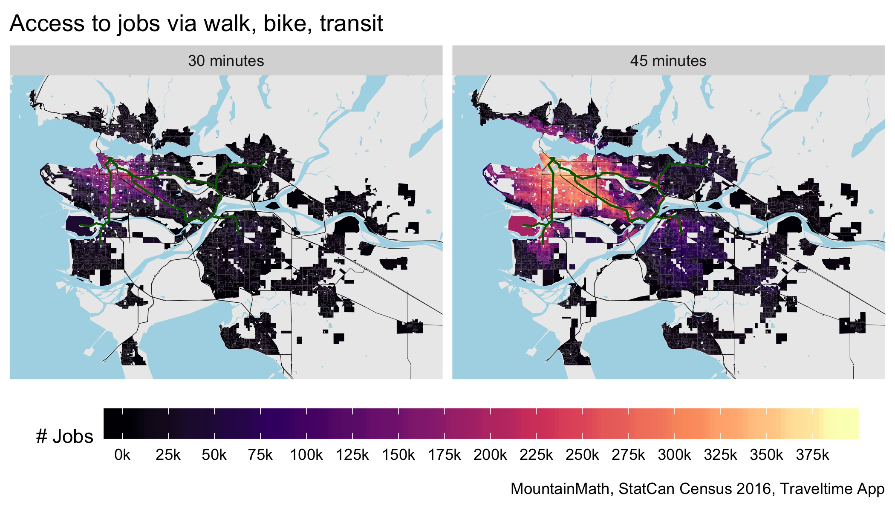

```{r setup, include=FALSE}
knitr::opts_chunk$set(
	echo = FALSE,
	message = FALSE,
	warning = FALSE,
	cache = TRUE,
	dev = "svg"
)
options(htmltools.dir.version = FALSE)
options(servr.daemon = TRUE)
library(tidyverse)
#library(tibbletime)
library(cansim)
library(sf)
library(statcanXtabs)
library(cancensus)
library(cmhc)
library(mountainmathHelpers)
```
```{r xaringanExtra, echo=FALSE}
xaringanExtra::use_xaringan_extra(c("broadcast"))
```
```{r broadcast, echo=FALSE}
xaringanExtra::use_broadcast() 
```

## Housing supply
When talking about adequacy of **housing supply** we need to pay attention to
* overall quantity of housing supply and
* location of housing supply

--

Broadly we have two types of housing:
* Market housing -- allocated via money
* Non-market housing -- allocated via wait lists


It's hard to solve aspects of a housing crisis under the backdrop of an overall shortage.

Geographic misallocation of housing accelerates exclusion/segregation in central ares and adds to commute pressure. 

---
## How do we know if we have enough housing?

```{r}
vacancy_rent_table_for <- function(GeoUID){
  region_params=cmhc_region_params_from_census(as.character(GeoUID))
  params=cmhc_timeseries_params(table_id = cmhc_table_list["Rms Vacancy Rate Time Series"],region=region_params)
  dat_vacancy <- get_cmhc(params) %>% 
    rename(Year=X1) %>%
    mutate(Series="Vacancy rate")
  
  params=cmhc_timeseries_params(table_id = cmhc_table_list["Rms Rent Change Time Series"],region=region_params)
  dat_rent_change <- get_cmhc(params) %>%
    rename(Year=X1) %>%
    mutate(Series="Rent change")
 
  if (!(GeoUID %in% c("24433")) && nchar(GeoUID)==5){
    average_condo_rents <- get_cmhc(cmhc_timeseries_params(table_id = "4.4.2", region=region_params)) %>%
      rename(Year=X1) %>%
      mutate(Series="Condo rents") %>%
      select(-X7)
    average_other_secondary_rents <-   get_cmhc(cmhc_timeseries_params(table_id = "4.6.2", region=region_params)) %>%
      rename(Year=X1) %>%
      select(Year,Total,X5) %>%
      mutate(Series="Other secondary rents")
    params=cmhc_timeseries_params(table_id = cmhc_table_list["Srms Vacancy Rate Time Series"],region=region_params)
    condo_vacancy <- get_cmhc(params) %>% 
      rename(Year=X1) %>%
      select(Year,Total,X5) %>%
      mutate(Series="Condo vacancy rate")
  
    average_rents <- bind_rows(average_condo_rents,average_other_secondary_rents) %>%
      group_by(Series) %>%
      mutate(Total=(Total/lag(Total,order_by = Year)-1)*100)
  } else {
    average_rents=NULL
    condo_vacancy=NULL
  }
  dat=bind_rows(dat_vacancy,condo_vacancy,dat_rent_change,average_rents)
  return(dat)
}

regions <- tibble(GeoUID=c("59933","5915022"),name=c("Metro Vancouver","City of Vancouver"))


inflation <- get_cansim_vector("v108785713","1990-01-01") %>%
  normalize_cansim_values() %>%
  rename(CPI=VALUE) %>%
  select(Date,CPI) %>%
  mutate(CPI=CPI/100)

data <- seq_len(nrow(regions)) %>% lapply(function(i){
  r=regions[i,]
  #print(r$name)
  #print(r$GeoUID)
    vacancy_rent_table_for(r$GeoUID) %>%
     mutate(name=r$name)
}) %>% bind_rows %>%
  mutate(Date=as.Date(paste0(gsub(" October","",Year),"-10-01"))) %>%
  gather(key="Bedrooms",value="Value",matches("Bedroom|Total|Bachel")) %>%
  mutate(Value=Value/100) %>%
  left_join(inflation,by="Date") 
  #bind_rows((.) %>% select(Date,CPI,name,Year) %>% mutate(Total=CPI,Series="CPI"))

paired_colors <- RColorBrewer::brewer.pal(6,"Paired")[c(1,2,5,6)]
series_names <- data$Series %>% unique
series_colors <- c("Vacancy rate"=paired_colors[1], "Rent change" = paired_colors[3])
series_labels <- c("Vacancy rate"="Primary vacancy rate", "Rent Change" = "Fixed sample rent change\n(inflation adjusted)" )
color_labels <- c()
color_labels[paired_colors[1]]="Primary vacancy rate"
color_labels[paired_colors[3]] = "Fixed sample rent change (inflation adjusted)"
#color_labels[paired_colors[2]]="Primary vacancy rate"
#color_labels[paired_colors[4]] = "Fixed sample rent change\n(inflation adjusted)"
vrc_caption="Data: CMHC Rms & StatCan v108785713"


```

.pull-left[
#### Main signals
* For market housing, we have rents, home prices, vacancy rates as our main indicators of adequacy of supply. CACs are a direct measure of housing scarcity.
* For non-market housing we have wait lists

#### Other indicators
We don't have enough housing if
* upzoning leads to large land lift
* FSR gets maxed out on every project
* Most (non-single family) projects require rezoning or conditional zoning to get built
]
.pull-right[
```{r fig.height=5, fig.width=5}
vacancy_cutoff=0.03
bedroom_levels <- c("Bachelor","1 Bedroom",   "2 Bedroom" ,  "3 Bedroom +" ,"Total")

plot_data <- data %>% 
  mutate(Year=gsub(" October","",Year)) %>%
  mutate(Bedrooms=factor(Bedrooms,levels=bedroom_levels)) %>%
  #filter(Bedrooms=="Total") %>%
  filter(Series %in% c("Rent change","Vacancy rate")) %>%
  filter(!is.na(Value)) %>%
  mutate(Value=ifelse(Series=="Rent change",Value-CPI,Value)) %>%
  group_by(Series,name,Bedrooms) %>%
  mutate(Next=lead(Value,order_by = Date)) %>%
  ungroup %>%
  mutate(color=ifelse(Series=="Vacancy rate",
                      ifelse(Value>=vacancy_cutoff,paired_colors[2],paired_colors[1]),
                      ifelse(Value<=0,paired_colors[4],paired_colors[3]))) %>%
  mutate(line_color=ifelse(Series=="Vacancy rate",
                      ifelse(Value>=vacancy_cutoff & (is.na(Next) | Next>=vacancy_cutoff),paired_colors[2],paired_colors[1]),
                      ifelse(Value<=0 & (is.na(Next) | Next <=0),paired_colors[4],paired_colors[3])))

plot_data %>%
  filter(name=="Metro Vancouver",Bedrooms != "3 Bedroom +") %>%
ggplot(aes(x=Date,y=Value,color=Series,group=Series))+
  geom_hline(yintercept = 0,size=0.5,color="#aa6666") +
  geom_hline(yintercept = vacancy_cutoff,color="#6666aa",size=0.5) +
  geom_line(aes(color=line_color),size=1) +
  theme_bw() +
  scale_y_continuous(labels = scales::percent) +
  scale_color_identity(labels=color_labels,breaks=as.character(series_colors),guide = "legend") +
  #facet_grid(Bedrooms~name) +
  facet_wrap("Bedrooms") +
  theme(legend.position = "bottom") +
  geom_point(size=1.2,aes(color=color)) +
  labs(title="Metro Vancouver vacancy rate & rent change",
       caption=vrc_caption,
       #subtitle="(CMAs with highest purpose-built rental stock, ordered by share of renters in purpose-built)",
       x="",y="")
```
]

---
## Economic indicators
```{r}
data <- get_cansim("14-10-0325") %>%
  normalize_cansim_values() %>%
  mutate(Year=substr(Date,1,4),
         Month=substr(Date,6,7)) %>%
  mutate(Quarter=(Month %>% as.integer -1)/3 +1) %>%
  mutate(name=gsub(", .+$","",GEO)) %>%
  mutate(Date=DescTools::AddMonths(Date,1))

attribution_theme <- list(
  labs(caption="MountainMath, StatCan table 14-10-0325"),
  theme_light()
)
report_theme <- list(
  scale_shape_discrete(labels=c("A"="Excellent","B"="Very good","C"="Good","D"="Acceptable","E"="Use with caution")),
  scale_fill_discrete(guide=FALSE),
  theme_light(),
  labs(caption="MountainMath, StatCan table 14-10-0325")
)
newest_date <- data$Date %>% max
jvr <- data %>% filter(Statistics=="Job vacancy rate")
jv <- data %>% filter(Statistics=="Job vacancies")
pe <- data %>% filter(Statistics=="Payroll employees")
max_date <- jvr$Date %>% max
max_date_string <- jvr %>% 
  filter(Date==max_date) %>% 
  mutate(date_string=paste0(Year," Q",Quarter)) %>% 
  pull(date_string) %>% 
  unique
large_employees <- pe %>% filter(Date==max_date,VALUE>=50000)
top_er <- large_employees %>% filter(name!=GEO| name=="Canada") %>% top_n(5,VALUE) %>% arrange(-VALUE) %>% pull(name)

economic_regions <-  mountainmathHelpers::simpleCache(mountainmathHelpers::simpleCache(
  mountainmathHelpers::get_shapefile("http://www12.statcan.gc.ca/census-recensement/2011/geo/bound-limit/files-fichiers/2016/ler_000b16a_e.zip"),
  "economic_regions_2016") %>% 
  rmapshaper::ms_simplify(0.05), "simple_economic_regions_2016")

plot_data <-  left_join(economic_regions,jvr %>% filter(Date==max_date),by=c("ERUID"="GeoUID"))
g1<-ggplot(plot_data,aes(fill=VALUE)) +
  geom_sf(size=0.25) +
  coord_sf(datum=NA) +
  attribution_theme +
  theme(legend.position = "bottom",legend.key.width = unit(1.5, "cm")) +
  scale_fill_viridis_c(labels=function(d)scales::percent(d,accuracy=0.1)) +
  labs(title=paste0("Job Vacancy rate ",max_date_string),fill=NULL)

highlight_regions <- c(top_er)#,"Vancouver Island and Coast","Kootenay","Thompson-Okanagan")
jvr_plot_data <- jvr %>% 
  filter(name %in% highlight_regions,!is.na(VALUE)) %>%
  mutate(name=factor(name,levels=highlight_regions))

g2<-ggplot(jvr_plot_data,aes(x=Date,y=VALUE,color=name,shape=STATUS,group=name)) +
  #geom_line(alpha=0.3) +
  geom_point(alpha=1) +
  #scale_color_brewer(palette = "Spectral") +
  report_theme +
  scale_color_brewer(palette = "Dark2") +
  theme(legend.direction = "vertical", 
        legend.position = "bottom",
        legend.box = "horizontal"
        ) +
  geom_smooth(se=FALSE,span=0.3) +
  scale_y_continuous(labels=scales::percent) +
  labs(title="Job Vacancy rate by economic region",x=NULL,y=NULL,color=NULL,shape="Data Quality")
```

```{r fig.height=4, fig.width=9}
library(cowplot)
plot_grid(g1, g2,rel_widths=c(0.44,0.56))
```

Our economic region, Lower-Mainland Southwest, has has consistently high labour force participation, low unemployment and high job vacancy rates. We don't have enough housing to satisfy the labour demand. The lack of housing is a drag on employment growth and our economy. Resulting income/wealth-sorting creates social pressures.

???
Supply shortfall is evident from low vacancy rates, to various forms of co-habitation and crowding, to inability to fill vacant jobs. 
---
## Location of housing supply
Location of housing supply is to a large extent determined by planning, and not by people's preferences.

.pull-left[

]
.pull-right[

]

If we don't create space in central areas, people get pushed further out and into longer commutes. Working age people are systematically excluded from some central areas.

---
## Vancouver area commute patterns
<iframe width="900px" height="530px" src="https://flowmap.blue/13Q-xsfL59XXPw7-3ue_9G9xab9FtYiL3S9vOZp-yJyY/embed?v=49.223692,-122.941214,9.39&a=1&b=1&c=1&d=1&lt=1&col=Default&f=45" frameborder="0" allowfullscreen></iframe>


---
## What are cities about?
Focus on opportunity, cities are match-makers between people, jobs and amenities. Resist fragmenting the labour market even more.


???
We need to stop trying to fragment the region's labour market and work toward increasing opportunity and access to amenities and jobs across the region.

---
## Key barriers to new housing supply in urban centers in BC?
<iframe width="900px" height="530px" src="https://mountainmath.ca/zoning_map" frameborder="0" allowfullscreen></iframe>


---
## What can be built?

```{r fig.height=5, fig.width=8}
residential_uses <-  c("Single/Duplex",
                       "Townhouse",
                       "Low-Rise",
                       "High-Rise",
                       "Mixed Low-Rise",
                       "Mixed High-Rise")

zoning_data <- simpleCache(read_sf("https://s3.ca-central-1.amazonaws.com/mountainmath/cmhc/metro_van_zoning_parcel_clean.geojson.gz"),"metro_van_zoning_fabric")

zoning_data %>% st_drop_geometry() %>%
  filter(m=="City of Vancouver") %>%
  filter(zc %in% residential_uses) %>%
  filter(!grepl("^CD",z)) %>%
  filter(!is.na(fsr_outright),fsr_outright>0) %>%
  group_by(z) %>%
  summarize_at(vars(matches("fsr")),mean,na.rm=TRUE,.groups="drop") %>%
  mutate(`Outright FSR`=fsr_outright,`Max Conditional FSR`=fsr_max-fsr_outright) %>%
  mutate(z=factor(z,levels=arrange(.,fsr_outright,fsr_max,z) %>% pull(z))) %>%
  mutate(type=case_when(grepl("^RS|^RT|^FSHC|^RA",z) ~ "Single/Duplex",
                        grepl("^RM",z) ~ "Multi family",
                        #grepl("^C",z) ~ "Commerical",
                        TRUE ~ "Other")) %>%
  pivot_longer(matches(" FSR$")) %>%
  mutate(type=factor(type,levels=c("Single/Duplex","Multi family","Other"))) %>%
  ggplot(aes(x=z,y=value,fill=name)) +
  geom_bar(stat="identity")+
  coord_flip() +
  theme(legend.position = "bottom") +
  scale_fill_manual(values=sanzo::duos$c095) +
  facet_wrap(~type,scales="free_y",nrow=1) +
  labs(title="City of Vancouver residential zoning",
       fill=NULL,y="FSR",x=NULL,
       caption="Metro Vancouver Zoning Project")
  

```

---
## Land value capture and CACs
.pull-left[

Land values are residuals, it's what people are willing to pay beyond the value of the structure.

High land values in itself aren't a problem. High land values relative to the values of a structure are the problem. When land values are high relative to buildings, we need to allow denser housing.

CACs are a direct measure of housing scarcity. We need policies that aim to drive the scarcity permium to zero.
]
.pull-right[
Restricting land use in face up increasing land values has [unproductive consequences](https://mountainmath.ca/teardowns).

[](https://mountainmath.ca/teardowns)
]


---
## What kind of housing do we need?


.center[
### All kinds of housing!!!
]

--

Housing is a system. If we think of all new housing needing to be targeted to specific segments we will fail.

>    <span style="font-size: 24pt;">"If we believe that cheap housing matters and expensive housing doesn’t, and we act on that belief, our primary accomplishment will be to make our cheap housing expensive."</span> ([Michael Manville](https://www.lewis.ucla.edu/research/value-capture-reconsidered/))


--
We need both, more market housing and more non-market housing. Focusing on just one of these will serve to increase inequities.

???


